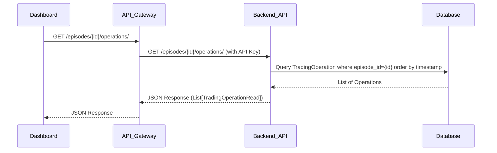

+++
id = "TASK-BE-LEAD-20250505-122100"
title = "Create API Endpoint for Trading Operations per Episode"
status = "🟢 Done"
type = "🌟 Feature"
priority = "🔼 High" # High priority as it blocks frontend work
created_date = "2025-05-05"
updated_date = "2025-05-05" # Completion date
# due_date = ""
# estimated_effort = ""
assigned_to = "lead-backend"
# reporter = "TASK-CMD-20250505-122000"
parent_task = "" # Or link to a higher-level dashboard feature task if exists
depends_on = ["TASK-PY-DEV-20250505-111800"] # Depends on the DB model being created
related_docs = [
    "reinforcestrategycreator/db_models.py",
    "reinforcestrategycreator/api/routers/episodes.py",
    ".ruru/tasks/DASHBOARD_OPERATIONS/TASK-PY-DEV-20250505-111800.md"
    ]
tags = ["backend", "api", "fastapi", "sqlalchemy", "database", "dashboard", "operations"]
template_schema_doc = ".ruru/templates/toml-md/01_mdtm_feature.README.md" # Link to schema documentation
# ai_prompt_log = """"""
# review_checklist = []
# reviewed_by = ""
# key_learnings = ""
+++

# Create API Endpoint for Trading Operations per Episode

## Description ✍️

*   **What is this feature?** A new FastAPI API endpoint to retrieve all trading operations recorded for a specific training episode.
*   **Why is it needed?** To provide the necessary data for the frontend dashboard to visualize trading entry/exit points on a price chart for a selected episode.
*   **Scope:** Create the GET endpoint, associated Pydantic schema, database query logic, and integrate it into the existing API structure.
*   **Links:** `reinforcestrategycreator/db_models.py` (defines `TradingOperation`)

## Acceptance Criteria ✅

*   - [✅] Endpoint `GET /api/v1/episodes/{episode_id}/operations/` is created and functional.
*   - [✅] Endpoint returns a paginated list of `TradingOperation` objects for the specified `episode_id`.
*   - [✅] A Pydantic schema (e.g., `TradingOperationRead`) is created in `reinforcestrategycreator/api/schemas/` for the response model.
*   - [✅] The schema includes all relevant fields from the `TradingOperation` model (`operation_id`, `step_id`, `timestamp`, `operation_type`, `size`, `price`).
*   - [✅] Endpoint handles `episode_id` not found errors gracefully (e.g., HTTP 404).
*   - [✅] Pagination query parameters (`page`, `page_size`) are implemented and functional.
*   - [✅] The endpoint is added to the appropriate FastAPI router (likely `reinforcestrategycreator/api/routers/episodes.py`).
*   - [✅] Database query efficiently retrieves operations for the given episode, ordered by timestamp.
*   - [✅] Endpoint is protected by the existing API key dependency (`api_key: APIKey = Depends(get_api_key)`).
*   - [✅] Basic API documentation (Swagger/OpenAPI) is automatically generated for the new endpoint.

## Implementation Notes / Sub-Tasks 📝

*   - [✅] Create `TradingOperationRead` schema in a relevant file (e.g., `reinforcestrategycreator/api/schemas/operations.py` or add to `metrics.py` if small). Ensure `operation_type` uses the `OperationType` enum. (Delegated: TASK-FASTAPI-DEV-20250505-122200-Schema)
*   - [✅] Add the new route function (e.g., `read_episode_operations`) to `reinforcestrategycreator/api/routers/episodes.py`. (Delegated: TASK-FASTAPI-DEV-20250505-122400-Endpoint)
*   - [✅] Implement the database query logic within the route function using the injected SQLAlchemy session. Use `offset()` and `limit()` for pagination. (Delegated: TASK-FASTAPI-DEV-20250505-122400-Endpoint)
*   - [✅] Add appropriate response model (`response_model=List[TradingOperationRead]`) and status codes to the route decorator. (Delegated: TASK-FASTAPI-DEV-20250505-122400-Endpoint)
*   - [✅] Consider adding an index to `trading_operations` table on `(episode_id, timestamp)` if performance becomes an issue (DB Lead to advise if needed, basic indices already added in previous task). (Index exists from TASK-DB-LEAD-20250504000430)

## Diagrams 📊 (Optional)

## AI Prompt Log 🤖 (Optional)

*   (Log key prompts and AI responses)

## Review Notes 👀 (For Reviewer)

*   Check pagination logic.
*   Verify correct schema usage and data returned.
*   Ensure error handling for non-existent episodes.
*   Confirm API key protection is applied.

## Key Learnings 💡 (Optional - Fill upon completion)

*   (Summarize discoveries)