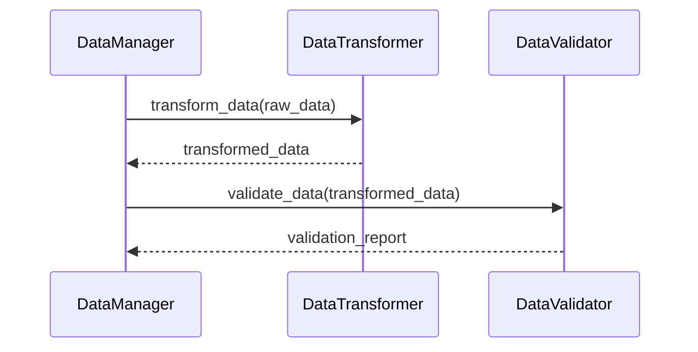

+++
id = "TASK-DEVPY-20250529-125500-DataTransformVal"
title = "Implement Data Transformation & Validation"
status = "🟢 Done"
type = "🌟 Feature"
priority = "▶️ High"
created_date = "2025-05-29"
updated_date = "2025-05-29"
assigned_to = "dev-python"
coordinator = "roo-commander"
RooComSessionID = "SESSION-AnalyzeDocTestModelSelectionPy-2505281202"
depends_on = ["TASK-DEVPY-250529102900-DataManagerCore"]
related_docs = [
    ".ruru/planning/model_pipeline_implementation_plan_v1.md",
    ".ruru/tasks/DEV_PYTHON/TASK-DEVPY-250529102900-DataManagerCore.md",
    "reinforcestrategycreator_pipeline/src/data/manager.py"
]
tags = ["python", "pipeline", "data-management", "feature-engineering", "validation", "transformation"]
template_schema_doc = ".ruru/templates/toml-md/01_mdtm_feature.README.md"
effort_estimate_dev_days = "2-3 days"
+++

# Implement Data Transformation & Validation

## Description ✍️

*   **What is this feature?** Implement data preprocessing, feature engineering, and validation components for the ML pipeline. This includes creating a `DataTransformer` and a `DataValidator`.
*   **Why is it needed?** To prepare raw data for model training by cleaning, transforming, creating new features, and ensuring data quality. This is a crucial step in the ML pipeline.
*   **Scope:**
    *   Port existing feature engineering logic from the original test script (`test_model_selection_improvements.py`).
    *   Implement technical indicator calculations.
    *   Develop data quality checks (missing data, outliers).
    *   Create data splitting utilities.
    *   Ensure transformations are reproducible.
*   **Links:**
    *   Project Plan: [`.ruru/planning/model_pipeline_implementation_plan_v1.md#task-32-data-transformation--validation`](.ruru/planning/model_pipeline_implementation_plan_v1.md:159)
    *   Data Manager Core Task: [`.ruru/tasks/DEV_PYTHON/TASK-DEVPY-250529102900-DataManagerCore.md`](.ruru/tasks/DEV_PYTHON/TASK-DEVPY-250529102900-DataManagerCore.md)

## Acceptance Criteria ✅

*   - [✅] `DataTransformer` class is implemented and handles feature engineering tasks.
*   - [✅] `DataValidator` class is implemented and performs data quality checks.
*   - [✅] Technical indicator calculations are correctly implemented.
*   - [✅] Data splitting utilities (e.g., train/test/validation) are available.
*   - [✅] Transformations are reproducible and can be configured.
*   - [✅] Unit tests are written for all new components, achieving >80% coverage (Achieved 95% overall via sub-task TASK-DEVPY-20250529-130600-TestDataTransformVal).
*   - [✅] An example script demonstrating the usage of `DataTransformer` and `DataValidator` is created.

## Implementation Notes / Sub-Tasks 📝

*   - [✅] Design the `DataTransformer` interface and base class.
*   - [✅] Implement specific transformation methods (e.g., scaling, encoding, technical indicators).
*   - [✅] Port feature engineering logic from `test_model_selection_improvements.py`.
*   - [✅] Design the `DataValidator` interface and base class.
*   - [✅] Implement validation checks (e.g., missing values, outlier detection, type checks).
*   - [✅] Implement data splitting utilities.
*   - [✅] Write comprehensive unit tests for `DataTransformer` (Completed via sub-task TASK-DEVPY-20250529-130600-TestDataTransformVal).
*   - [✅] Write comprehensive unit tests for `DataValidator` (Completed via sub-task TASK-DEVPY-20250529-130600-TestDataTransformVal).
*   - [✅] Create an example script in `reinforcestrategycreator_pipeline/examples/` demonstrating usage.

## Diagrams 📊 (Optional)

## AI Prompt Log 🤖 (Optional)

*   (Log key prompts and AI responses)

## Review Notes 👀 (For Reviewer)

*   (Space for feedback)

## Key Learnings 💡 (Optional - Fill upon completion)

*   (Summarize discoveries)
## Log Entries 🪵

*   2025-05-29T12:55:00 - Task created by roo-commander.
*   2025-05-29T13:04:00 - Implemented core components:
    - Created `reinforcestrategycreator_pipeline/src/data/transformer.py` with `TransformerBase`, `TechnicalIndicatorTransformer`, `ScalingTransformer`, and `DataTransformer` classes
    - Created `reinforcestrategycreator_pipeline/src/data/validator.py` with `ValidatorBase`, `MissingValueValidator`, `OutlierValidator`, `DataTypeValidator`, `RangeValidator`, and `DataValidator` classes
    - Created `reinforcestrategycreator_pipeline/src/data/splitter.py` with `DataSplitter` class supporting multiple splitting strategies
    - Updated `reinforcestrategycreator_pipeline/src/data/__init__.py` to export new classes
    - Added `TransformationConfig` and `ValidationConfig` to `reinforcestrategycreator_pipeline/src/config/models.py`
    - Updated `reinforcestrategycreator_pipeline/src/config/__init__.py` to export new config classes
    - Created `reinforcestrategycreator_pipeline/examples/data_transformation_example.py` demonstrating usage
    - Note: Unit tests still need to be written to achieve >80% coverage
*   2025-05-29T13:05:00 - Roo Commander received implementation update. Core components for Data Transformation, Validation, and Splitting are implemented. Example script created. Unit tests are pending.
*   2025-05-29T15:07:00 - Unit tests completed via sub-task TASK-DEVPY-20250529-130600-TestDataTransformVal. All acceptance criteria met. Task is now complete.