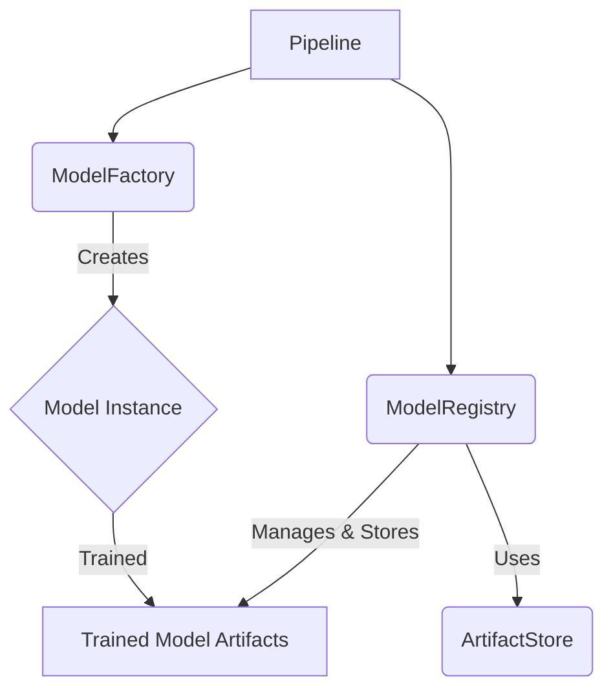

+++
id = "TASK-DEVPY-20250529-151000-ModelFactoryRegistry"
title = "Implement Task 4.1: Model Factory & Registry"
status = "🟢 Done"
type = "🌟 Feature"
priority = "▶️ High"
created_date = "2025-05-29"
updated_date = "2025-05-29T15:26:00"
assigned_to = "dev-python"
coordinator = "roo-commander"
RooComSessionID = "SESSION-AnalyzeDocTestModelSelectionPy-2505281202" # From previous related tasks
depends_on = ["TASK-DEVPY-250529095400-ArtifactStore"] # Task 1.4
related_docs = [
    ".ruru/planning/model_pipeline_implementation_plan_v1.md#task-41-model-factory--registry",
    "reinforcestrategycreator_pipeline/src/artifact_store/"
]
tags = ["python", "pipeline", "model-management", "factory", "registry", "mlops"]
template_schema_doc = ".ruru/templates/toml-md/01_mdtm_feature.README.md"
effort_estimate_dev_days = "L (3-5 days)"
+++

# Implement Task 4.1: Model Factory & Registry

## Description ✍️

*   **What is this feature?** This task is to implement **Task 4.1: Model Factory & Registry** as defined in the Model Pipeline Implementation Plan ([`.ruru/planning/model_pipeline_implementation_plan_v1.md`](.ruru/planning/model_pipeline_implementation_plan_v1.md:177)). The objective is to create a system for model creation, management, and tracking within the pipeline.
*   **Why is it needed?** To provide a standardized way to instantiate, configure, store, and retrieve machine learning models, facilitating experimentation and reproducibility.
*   **Scope (from Implementation Plan - Task 4.1):**
    *   Implement a `ModelFactory` for creating model instances.
    *   Implement a `ModelRegistry` for tracking model versions and metadata.
    *   Develop a model configuration system.
    *   Implement base versions of RL models (e.g., DQN, PPO, A2C), porting from existing implementations if applicable.
*   **Links:**
    *   Project Plan: [`.ruru/planning/model_pipeline_implementation_plan_v1.md#task-41-model-factory--registry`](.ruru/planning/model_pipeline_implementation_plan_v1.md:177)
    *   Artifact Store Task (Dependency): [`.ruru/tasks/DEV_PYTHON/TASK-DEVPY-250529095400-ArtifactStore.md`](.ruru/tasks/DEV_PYTHON/TASK-DEVPY-250529095400-ArtifactStore.md)

## Acceptance Criteria ✅

(Derived from Implementation Plan - Task 4.1 Deliverables & Details)
*   - [✅] `ModelFactory` class is implemented, capable of creating specified model types based on configuration.
*   - [✅] `ModelRegistry` class is implemented for tracking model versions, metadata, and associated artifacts (e.g., weights, configuration) using the `ArtifactStore`.
*   - [✅] A clear system for configuring models (e.g., hyperparameters, architecture) is defined and integrated with the factory and registry.
*   - [✅] Base implementations for key RL models (e.g., DQN, PPO, A2C) are created or ported, adhering to a standardized model interface.
*   - [✅] Models can be serialized (saved) and deserialized (loaded) via the registry, likely leveraging the `ArtifactStore`.
*   - [✅] The model registry supports storing and retrieving metadata for each model version (e.g., training parameters, performance metrics, parent model).
*   - [✅] Unit tests are provided for the `ModelFactory`, `ModelRegistry`, and base model implementations.

## Implementation Notes / Sub-Tasks 📝

*   - [✅] Design the interface for models (e.g., `ModelBase` class with `train`, `predict`, `save`, `load` methods).
*   - [✅] Implement the `ModelFactory` to instantiate models based on name/type and configuration.
*   - [✅] Design and implement the `ModelRegistry`, considering how it will interact with the `ArtifactStore` for persistence.
*   - [✅] Define the schema for model configuration files/objects.
*   - [✅] Port or implement base RL models (DQN, PPO, A2C), ensuring they conform to the `ModelBase` interface.
*   - [✅] Implement model serialization/deserialization logic.
*   - [✅] Define metadata to be stored in the registry (e.g., creation date, version, parameters, associated dataset version).
*   - [✅] Write unit tests for all new components.

## Diagrams 📊 (Optional)

## AI Prompt Log 🤖 (Optional)

*   (Log key prompts and AI responses)

## Review Notes 👀 (For Reviewer)

*   (Space for feedback)

## Key Learnings 💡 (Optional - Fill upon completion)

*   Implemented a clean separation between model interface (`ModelBase`), factory pattern for creation, and registry for versioning/tracking
*   The factory automatically discovers and registers implementations from the `implementations` module
*   Model state serialization uses a combination of JSON (for config/metadata) and pickle (for weights/state)
*   Registry leverages the ArtifactStore for persistence, treating models as versioned artifacts
*   Simplified RL model implementations (DQN, PPO, A2C) demonstrate the interface without requiring heavy ML frameworks

## Log Entries 🪵

*   2025-05-29T15:10:00 - Task created by roo-commander.
*   2025-05-29T15:11:00 - Started implementation by creating `ModelBase` abstract class
*   2025-05-29T15:12:00 - Implemented `ModelFactory` with auto-discovery of model implementations
*   2025-05-29T15:13:00 - Created `ModelRegistry` integrated with ArtifactStore
*   2025-05-29T15:14:00 - Implemented simplified DQN model
*   2025-05-29T15:16:00 - Implemented simplified PPO model
*   2025-05-29T15:18:00 - Implemented simplified A2C model
*   2025-05-29T15:19:00 - Updated module __init__ files for proper exports
*   2025-05-29T15:23:00 - Created comprehensive unit tests for ModelFactory
*   2025-05-29T15:24:00 - Created comprehensive unit tests for ModelRegistry
*   2025-05-29T15:26:00 - Created unit tests for model implementations
*   2025-05-29T15:26:00 - Task completed successfully