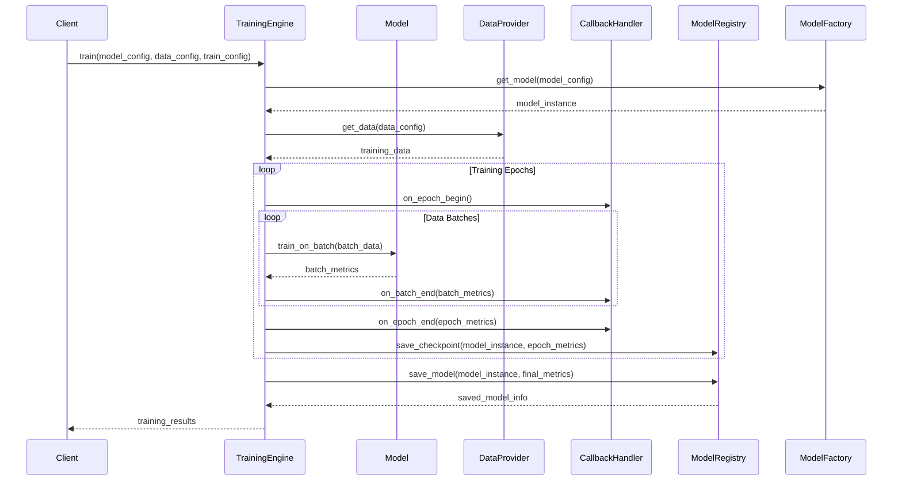

+++
id = "TASK-DEVPY-20250529-152800-TrainingEngineCore"
title = "Implement Task 4.2: Training Engine Core"
status = "🟢 Done"
type = "🌟 Feature"
priority = "▶️ High"
created_date = "2025-05-29"
updated_date = "2025-05-29T15:48:00"
assigned_to = "dev-python"
coordinator = "roo-commander"
RooComSessionID = "SESSION-AnalyzeDocTestModelSelectionPy-2505281202"
depends_on = [
    "TASK-DEVPY-20250529-151000-ModelFactoryRegistry", # Task 4.1
    "TASK-DEVPY-20250529-125500-DataTransformVal"      # Task 3.2
]
related_docs = [
    ".ruru/planning/model_pipeline_implementation_plan_v1.md#task-42-training-engine-core",
    "reinforcestrategycreator_pipeline/src/models/",
    "reinforcestrategycreator_pipeline/src/data/"
]
tags = ["python", "pipeline", "training-engine", "mlops", "reinforcement-learning"]
template_schema_doc = ".ruru/templates/toml-md/01_mdtm_feature.README.md"
effort_estimate_dev_days = "L (3-5 days)"
+++

# Implement Task 4.2: Training Engine Core

## Description ✍️

*   **What is this feature?** This task is to implement **Task 4.2: Training Engine Core** as defined in the Model Pipeline Implementation Plan ([`.ruru/planning/model_pipeline_implementation_plan_v1.md`](.ruru/planning/model_pipeline_implementation_plan_v1.md:193)). The objective is to create the system responsible for executing the training process for machine learning models.
*   **Why is it needed?** To provide a robust and configurable engine for training models, managing training loops, handling callbacks, and collecting metrics.
*   **Scope (from Implementation Plan - Task 4.2):**
    *   Implement a `TrainingEngine` main class.
    *   Develop a system for training callbacks (e.g., for logging, early stopping, model checkpointing).
    *   Implement checkpoint management for saving and resuming training.
    *   Integrate training metrics collection.
*   **Links:**
    *   Project Plan: [`.ruru/planning/model_pipeline_implementation_plan_v1.md#task-42-training-engine-core`](.ruru/planning/model_pipeline_implementation_plan_v1.md:193)
    *   Model Factory & Registry Task (Dependency): [`.ruru/tasks/DEV_PYTHON/TASK-DEVPY-20250529-151000-ModelFactoryRegistry.md`](.ruru/tasks/DEV_PYTHON/TASK-DEVPY-20250529-151000-ModelFactoryRegistry.md)
    *   Data Transformation & Validation Task (Dependency): [`.ruru/tasks/DEV_PYTHON/TASK-DEVPY-20250529-125500-DataTransformVal.md`](.ruru/tasks/DEV_PYTHON/TASK-DEVPY-20250529-125500-DataTransformVal.md)

## Acceptance Criteria ✅

(Derived from Implementation Plan - Task 4.2 Deliverables & Details)
*   - [✅] `TrainingEngine` class is implemented, capable of managing the training loop for a given model and dataset.
*   - [✅] A flexible callback system is in place, allowing custom actions at various points in the training loop (e.g., `on_epoch_begin`, `on_epoch_end`, `on_batch_end`).
*   - [✅] Model checkpointing (saving model state periodically and at the end of training) is implemented, leveraging the `ModelRegistry` and `ArtifactStore`.
*   - [✅] Functionality to resume training from a checkpoint is available.
*   - [✅] Training metrics (e.g., loss, rewards, custom metrics) are collected during training and can be logged or stored.
*   - [✅] The `TrainingEngine` integrates with the `ModelFactory` to obtain model instances and the `DataManager` (or equivalent data access mechanism) for training data.
*   - [✅] Unit tests are provided for the `TrainingEngine` and callback system.

## Implementation Notes / Sub-Tasks 📝

*   - [✅] Design the `TrainingEngine` class structure and its main `train()` method.
*   - [✅] Define the interface for training callbacks (e.g., `CallbackBase` class).
*   - [✅] Implement common callbacks:
    *   - [✅] Logging callback (for console and/or file).
    *   - [✅] Model checkpointing callback.
    *   - [✅] Early stopping callback (optional, based on a monitored metric).
*   - [✅] Integrate metrics collection within the training loop.
*   - [✅] Ensure the engine can handle different model types provided by the `ModelFactory`.
*   - [✅] Implement logic for saving and loading training state for resumption.
*   - [✅] Write unit tests, including tests for callback interactions and checkpointing/resuming.

## Diagrams 📊 (Optional)

## AI Prompt Log 🤖 (Optional)

*   (Log key prompts and AI responses)

## Review Notes 👀 (For Reviewer)

*   (Space for feedback)

## Key Learnings 💡 (Optional - Fill upon completion)

*   Implemented a flexible callback system that allows for easy extension and customization of training behavior
*   The training engine successfully integrates with ModelFactory, ModelRegistry, ArtifactStore, and DataManager
*   Checkpoint/resume functionality enables robust long-running training workflows
*   The callback pattern provides clean separation of concerns for logging, checkpointing, and early stopping

## Implementation Summary 📝

Successfully implemented the Training Engine Core with the following components:

1. **TrainingEngine** (`src/training/engine.py`):
   - Main training loop management
   - Integration with ModelFactory for model creation
   - Integration with DataManager for data loading
   - Support for checkpoint/resume functionality
   - Comprehensive error handling and state management

2. **Callback System** (`src/training/callbacks.py`):
   - `CallbackBase`: Abstract base class for all callbacks
   - `CallbackList`: Container for managing multiple callbacks
   - `LoggingCallback`: Logs training progress to console/file
   - `ModelCheckpointCallback`: Saves model checkpoints with optional registry integration
   - `EarlyStoppingCallback`: Stops training based on metric monitoring

3. **Features Implemented**:
   - Flexible training configuration
   - Automatic default callbacks (logging, checkpointing)
   - Training history tracking
   - Metrics collection and aggregation
   - Support for validation data
   - Integration with artifact storage for model versioning

4. **Testing**:
   - Comprehensive unit tests for callbacks (`tests/unit/test_training_callbacks.py`)
   - Comprehensive unit tests for training engine (`tests/unit/test_training_engine.py`)
   - Example usage scripts (`examples/training_engine_example.py`)

The implementation provides a robust foundation for training machine learning models with full support for monitoring, checkpointing, and resumption.

## Log Entries 🪵

*   2025-05-29T15:28:00 - Task created by roo-commander.
*   2025-05-29T15:29:00 - Started implementation by examining existing model and data structures.
*   2025-05-29T15:41:44 - Implemented callback system with base class and common callbacks.
*   2025-05-29T15:43:45 - Implemented TrainingEngine class with full training workflow.
*   2025-05-29T15:43:57 - Updated training module exports.
*   2025-05-29T15:45:02 - Created comprehensive unit tests for callbacks.
*   2025-05-29T15:46:24 - Created comprehensive unit tests for training engine.
*   2025-05-29T15:48:56 - Created example usage scripts and completed implementation.