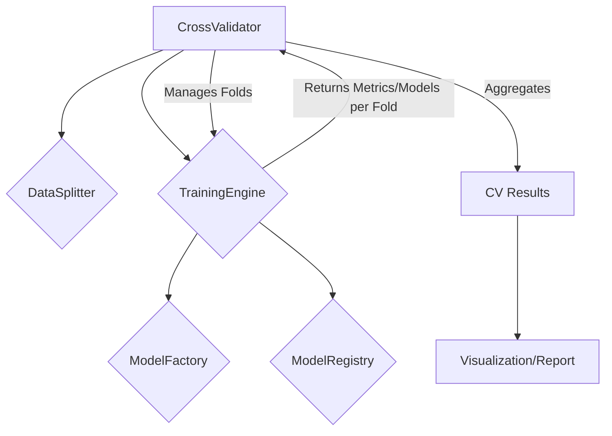

+++
id = "TASK-DEVPY-20250529-155200-CrossValidationEnhancement"
title = "Implement Task 4.3: Cross-Validation Enhancement"
status = "🟢 Done"
type = "🌟 Feature"
priority = "▶️ High"
created_date = "2025-05-29"
updated_date = "2025-05-29T17:03:00"
assigned_to = "dev-python"
coordinator = "roo-commander"
RooComSessionID = "SESSION-AnalyzeDocTestModelSelectionPy-2505281202"
depends_on = ["TASK-DEVPY-20250529-152800-TrainingEngineCore"] # Task 4.2
related_docs = [
    ".ruru/planning/model_pipeline_implementation_plan_v1.md#task-43-cross-validation-enhancement",
    "reinforcestrategycreator_pipeline/src/training/engine.py",
    "reinforcestrategycreator_pipeline/src/evaluation/" # Placeholder, evaluation components might be relevant
]
tags = ["python", "pipeline", "cross-validation", "mlops", "model-evaluation"]
template_schema_doc = ".ruru/templates/toml-md/01_mdtm_feature.README.md"
effort_estimate_dev_days = "M (2-3 days)"
+++

# Implement Task 4.3: Cross-Validation Enhancement

## Description ✍️

*   **What is this feature?** This task is to implement **Task 4.3: Cross-Validation Enhancement** as defined in the Model Pipeline Implementation Plan ([`.ruru/planning/model_pipeline_implementation_plan_v1.md`](.ruru/planning/model_pipeline_implementation_plan_v1.md:209)). The objective is to enhance the existing cross-validation system to be more robust, flexible, and integrated with the new pipeline.
*   **Why is it needed?** To provide reliable model performance estimates and facilitate better model selection by evaluating models across different data folds.
*   **Scope (from Implementation Plan - Task 4.3):**
    *   Enhance the `CrossValidator` class.
    *   Support selection based on multiple metrics.
    *   Implement or improve parallel fold execution.
    *   Provide tools for results aggregation and visualization.
*   **Links:**
    *   Project Plan: [`.ruru/planning/model_pipeline_implementation_plan_v1.md#task-43-cross-validation-enhancement`](.ruru/planning/model_pipeline_implementation_plan_v1.md:209)
    *   Training Engine Core Task (Dependency): [`.ruru/tasks/DEV_PYTHON/TASK-DEVPY-20250529-152800-TrainingEngineCore.md`](.ruru/tasks/DEV_PYTHON/TASK-DEVPY-20250529-152800-TrainingEngineCore.md)

## Acceptance Criteria ✅

(Derived from Implementation Plan - Task 4.3 Deliverables & Details)
*   - [✅] An enhanced `CrossValidator` class is implemented, integrating with the new `TrainingEngine` and `ModelFactory`.
*   - [✅] The `CrossValidator` supports different splitting strategies provided by the `DataSplitter` (e.g., KFold, TimeSeriesSplit, StratifiedKFold).
*   - [✅] The system allows for model evaluation using multiple metrics during cross-validation, and selection of the best model/hyperparameters can be based on a primary metric or a combination.
*   - [✅] Parallel execution of training/evaluation across different folds is implemented or significantly improved to speed up the cross-validation process.
*   - [✅] Results from all folds (e.g., metrics, trained model references) are aggregated and can be easily analyzed.
*   - [✅] Basic visualization or reporting tools for cross-validation results are available (e.g., box plots of metric distributions, summary tables).
*   - [✅] Unit tests are provided for the `CrossValidator` and its key functionalities.

## Implementation Notes / Sub-Tasks 📝

*   - [✅] Review the existing `CrossValidator` (if any from the original `test_model_selection_improvements.py`) and plan enhancements.
*   - [✅] Design the `CrossValidator` class to work with the `TrainingEngine`, `ModelFactory`, `ModelRegistry`, and `DataSplitter`.
*   - [✅] Implement logic for iterating through data folds and running training/evaluation for each.
*   - [✅] Integrate support for multiple evaluation metrics.
*   - [✅] Explore and implement parallel fold execution (e.g., using `multiprocessing` or `joblib`).
*   - [✅] Develop methods for aggregating results across folds (e.g., mean/std of metrics, collecting all model artifacts).
*   - [✅] Create utility functions or classes for visualizing/reporting CV results.
*   - [✅] Write unit tests, including tests for parallel execution and results aggregation.

## Diagrams 📊 (Optional)

## AI Prompt Log 🤖 (Optional)

*   (Log key prompts and AI responses)

## Review Notes 👀 (For Reviewer)

*   (Space for feedback)

## Key Learnings 💡 (Optional - Fill upon completion)

*   **Modular Design**: The `CrossValidator` was designed to work seamlessly with the existing `TrainingEngine`, `ModelFactory`, and `DataSplitter` components, demonstrating good separation of concerns.
*   **Parallel Execution**: Implemented both threading and multiprocessing options for parallel fold execution, with proper handling of futures and result collection.
*   **Comprehensive Results**: Created `CVResults` and `CVFoldResult` dataclasses to provide structured, serializable results with both detailed fold-level and aggregated metrics.
*   **Visualization Suite**: Developed a separate `CVVisualizer` class with multiple plot types (fold metrics, distributions, train/val comparison, learning curves) and report generation capabilities.
*   **Flexible Metrics**: The system supports multiple metrics evaluation with configurable scoring metric and mode (min/max) for best fold selection.
*   **Data Format Agnostic**: The implementation handles both pandas DataFrames and numpy arrays, with appropriate subsetting logic for each.
## Log Entries 🪵

*   2025-05-29T15:52:00 - Task created by roo-commander.
*   2025-05-29T17:03:00 - Task completed by dev-python. Implemented CrossValidator with all required features including parallel execution, multi-metric support, visualization tools, and comprehensive unit tests.