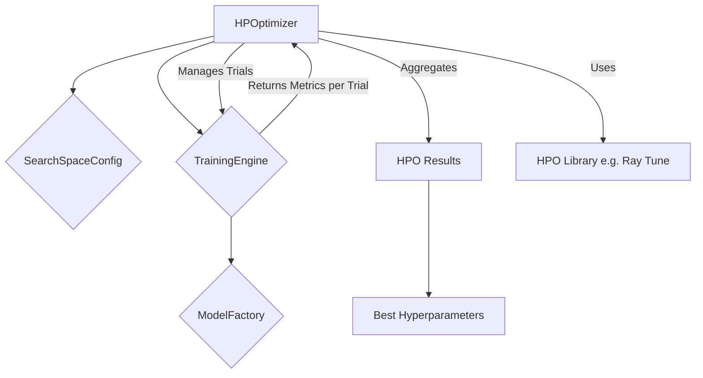

+++
id = "TASK-DEVPY-20250529-170600-HPOIntegration"
title = "Implement Task 4.4: Hyperparameter Optimization Integration"
status = "🟢 Done"
type = "🌟 Feature"
priority = "▶️ High"
created_date = "2025-05-29"
updated_date = "2025-05-29"
assigned_to = "dev-python" # Plan specifies dev-python with Ray experience
coordinator = "roo-commander"
RooComSessionID = "SESSION-AnalyzeDocTestModelSelectionPy-2505281202"
depends_on = ["TASK-DEVPY-20250529-152800-TrainingEngineCore"] # Task 4.2
related_docs = [
    ".ruru/planning/model_pipeline_implementation_plan_v1.md#task-44-hyperparameter-optimization-integration",
    "reinforcestrategycreator_pipeline/src/training/engine.py",
    "reinforcestrategycreator_pipeline/src/training/hpo_optimizer.py",
    "reinforcestrategycreator_pipeline/src/training/hpo_visualization.py",
    "reinforcestrategycreator_pipeline/src/training/README_HPO.md"
]
tags = ["python", "pipeline", "hpo", "hyperparameter-optimization", "ray-tune", "mlops"]
template_schema_doc = ".ruru/templates/toml-md/01_mdtm_feature.README.md"
effort_estimate_dev_days = "L (3-5 days)"
+++

# Implement Task 4.4: Hyperparameter Optimization Integration

## Description ✍️

*   **What is this feature?** This task is to implement **Task 4.4: Hyperparameter Optimization Integration** as defined in the Model Pipeline Implementation Plan ([`.ruru/planning/model_pipeline_implementation_plan_v1.md`](.ruru/planning/model_pipeline_implementation_plan_v1.md:225)). The objective is to integrate hyperparameter optimization (HPO) capabilities, likely using Ray Tune, into the new ML pipeline.
*   **Why is it needed?** To automate the process of finding optimal hyperparameters for models, improving model performance and reducing manual tuning efforts.
*   **Scope (from Implementation Plan - Task 4.4):**
    *   Implement an `HPOptimizer` class, potentially wrapping Ray Tune.
    *   Define a system for search space configuration.
    *   Implement trial management and tracking.
    *   Provide tools for analyzing HPO results.
*   **Links:**
    *   Project Plan: [`.ruru/planning/model_pipeline_implementation_plan_v1.md#task-44-hyperparameter-optimization-integration`](.ruru/planning/model_pipeline_implementation_plan_v1.md:225)
    *   Training Engine Core Task (Dependency): [`.ruru/tasks/DEV_PYTHON/TASK-DEVPY-20250529-152800-TrainingEngineCore.md`](.ruru/tasks/DEV_PYTHON/TASK-DEVPY-20250529-152800-TrainingEngineCore.md)

## Acceptance Criteria ✅

(Derived from Implementation Plan - Task 4.4 Deliverables & Details)
*   - [✅] An `HPOptimizer` class is implemented, integrating with a chosen HPO library (e.g., Ray Tune, Optuna).
*   - [✅] The system allows defining search spaces for hyperparameters for different models.
*   - [✅] The `HPOptimizer` integrates with the `TrainingEngine` to run training trials with different hyperparameter configurations.
*   - [✅] Trial management is implemented, including starting, stopping, and tracking the status of HPO trials.
*   - [✅] Results from HPO runs (e.g., best hyperparameters, performance metrics for each trial) are collected and can be easily analyzed.
*   - [✅] The system supports different search algorithms and schedulers provided by the HPO library.
*   - [✅] Unit tests are provided for the `HPOptimizer` and its integration points.
*   - [✅] An example script demonstrating HPO usage is created.

## Implementation Notes / Sub-Tasks 📝

*   - [✅] Research and select/confirm the HPO library (Ray Tune is suggested in the plan).
*   - [✅] Design the `HPOptimizer` class and its interface.
*   - [✅] Implement the integration with the `TrainingEngine`, ensuring the engine can be called with varying hyperparameter sets.
*   - [✅] Develop a way to define and parse search space configurations (e.g., from YAML or Python dicts).
*   - [✅] Implement trial execution logic, including parallel trial execution if supported by the library.
*   - [✅] Implement results collection and storage (potentially using `ArtifactStore` or HPO library's native capabilities).
*   - [✅] Create utility functions or classes for analyzing HPO results (e.g., finding best trial, plotting performance).
*   - [✅] Write unit tests, focusing on the `HPOptimizer`'s logic and its interaction with the `TrainingEngine`.
*   - [✅] Create an example script in `reinforcestrategycreator_pipeline/examples/` demonstrating HPO.

## Diagrams 📊 (Optional)

## AI Prompt Log 🤖 (Optional)

*   (Log key prompts and AI responses)

## Review Notes 👀 (For Reviewer)

*   (Space for feedback)

## Key Learnings 💡 (Optional - Fill upon completion)

*   Ray Tune provides a powerful and flexible framework for hyperparameter optimization with support for various search algorithms and schedulers.
*   The integration with Optuna as an alternative search algorithm provides additional flexibility for Bayesian optimization approaches.
*   Implementing proper parameter mapping allows for complex nested configuration structures while keeping the HPO interface simple.
*   The visualization module significantly enhances the ability to analyze and understand HPO results.
*   Using YAML configuration for search spaces makes it easy to maintain and modify HPO settings without code changes.

## Implementation Summary 📋

Successfully implemented a comprehensive Hyperparameter Optimization (HPO) integration for the ML pipeline:

### Core Components:
1. **HPOptimizer Class** (`src/training/hpo_optimizer.py`):
   - Full integration with Ray Tune
   - Support for multiple search algorithms (Random, Optuna)
   - Advanced schedulers (ASHA, PBT)
   - Parallel trial execution with resource management
   - Results persistence and analysis

2. **Configuration System** (`configs/base/hpo.yaml`):
   - Predefined search spaces for PPO, DQN, and A2C models
   - Parameter mapping for complex configurations
   - Experiment presets (quick_test, standard, extensive, production)

3. **Visualization Module** (`src/training/hpo_visualization.py`):
   - Optimization history plots
   - Parameter importance analysis
   - Parallel coordinates visualization
   - Parameter distribution plots
   - Comprehensive report generation

4. **Testing** (`tests/unit/test_hpo_optimizer.py`):
   - Comprehensive unit tests covering all major functionality
   - Mock-based testing for Ray Tune integration
   - Edge case handling

5. **Documentation**:
   - Detailed README with usage examples
   - API reference
   - Best practices and troubleshooting guide

6. **Example Script** (`examples/hpo_example.py`):
   - Basic HPO demonstration
   - Advanced usage with Optuna and ASHA
   - Experiment presets usage
   - Results analysis and visualization

### Key Features:
- Seamless integration with TrainingEngine
- Support for various parameter types (uniform, loguniform, choice, etc.)
- Flexible search space definition (programmatic or YAML-based)
- Comprehensive results analysis and visualization
- Resource-aware parallel execution
- Artifact store integration for results persistence

## Log Entries 🪵

*   2025-05-29T17:06:00 - Task created by roo-commander.
*   2025-05-29T17:15:32 - Task completed by dev-python. Implemented full HPO integration with Ray Tune, including optimizer class, visualization tools, configuration system, unit tests, and comprehensive documentation.