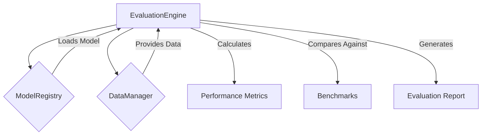

+++
id = "TASK-DEVPY-20250529-172000-EvaluationEngine"
title = "Implement Task 5.1: Evaluation Engine"
status = "🟢 Done"
type = "🌟 Feature"
priority = "▶️ High"
created_date = "2025-05-29"
updated_date = "2025-05-29T17:30:00"
assigned_to = "dev-python"
coordinator = "roo-commander"
RooComSessionID = "SESSION-AnalyzeDocTestModelSelectionPy-2505281202"
depends_on = ["TASK-DEVPY-20250529-151000-ModelFactoryRegistry"] # Task 4.1
related_docs = [
    ".ruru/planning/model_pipeline_implementation_plan_v1.md#task-51-evaluation-engine",
    "reinforcestrategycreator_pipeline/src/models/",
    "reinforcestrategycreator_pipeline/src/data/"
]
tags = ["python", "pipeline", "evaluation-engine", "metrics", "benchmarking", "mlops"]
template_schema_doc = ".ruru/templates/toml-md/01_mdtm_feature.README.md"
effort_estimate_dev_days = "M (2-3 days)"
+++

# Implement Task 5.1: Evaluation Engine

## Description ✍️

*   **What is this feature?** This task is to implement **Task 5.1: Evaluation Engine** as defined in the Model Pipeline Implementation Plan ([`.ruru/planning/model_pipeline_implementation_plan_v1.md`](.ruru/planning/model_pipeline_implementation_plan_v1.md:243)). The objective is to create a system for comprehensive model evaluation, including metric calculation, benchmark comparisons, and report generation.
*   **Why is it needed?** To systematically assess the performance of trained models, compare them against benchmarks, and generate standardized reports to inform model selection and deployment decisions.
*   **Scope (from Implementation Plan - Task 5.1):**
    *   Implement an `EvaluationEngine` main class.
    *   Support multi-metric evaluation.
    *   Enable comparisons against benchmarks.
    *   Generate performance reports.
*   **Links:**
    *   Project Plan: [`.ruru/planning/model_pipeline_implementation_plan_v1.md#task-51-evaluation-engine`](.ruru/planning/model_pipeline_implementation_plan_v1.md:243)
    *   Model Factory & Registry Task (Dependency): [`.ruru/tasks/DEV_PYTHON/TASK-DEVPY-20250529-151000-ModelFactoryRegistry.md`](.ruru/tasks/DEV_PYTHON/TASK-DEVPY-20250529-151000-ModelFactoryRegistry.md)

## Acceptance Criteria ✅

(Derived from Implementation Plan - Task 5.1 Deliverables & Details)
*   - [✅] An `EvaluationEngine` class is implemented, capable of evaluating a trained model on a given dataset.
*   - [✅] The engine supports calculation and reporting of multiple performance metrics relevant to reinforcement learning and trading (e.g., Sharpe ratio, Sortino ratio, max drawdown, total return, win rate, average profit/loss per trade).
*   - [✅] The system allows for comparing model performance against predefined benchmarks (e.g., buy-and-hold, random strategy).
*   - [✅] Standardized performance reports (e.g., JSON, Markdown, or HTML summaries) can be generated.
*   - [✅] The `EvaluationEngine` integrates with the `ModelRegistry` to load models and the `DataManager` (or equivalent) for evaluation data.
*   - [✅] Metrics calculation logic is ported from existing implementations or newly developed.
*   - [✅] Unit tests are provided for the `EvaluationEngine` and key metric calculations.
*   - [✅] An example script demonstrating evaluation engine usage is created.

## Implementation Notes / Sub-Tasks 📝

*   - [✅] Design the `EvaluationEngine` class structure and its main `evaluate()` method.
*   - [✅] Define a clear way to specify which metrics to calculate.
*   - [✅] Implement or port calculation functions for various financial and RL metrics.
*   - [✅] Implement logic for running benchmark strategies and calculating their metrics.
*   - [✅] Design the structure and format for performance reports.
*   - [✅] Ensure the engine can handle models loaded via the `ModelRegistry`.
*   - [✅] Write unit tests for metric calculations and the overall evaluation workflow.
*   - [✅] Create an example script in `reinforcestrategycreator_pipeline/examples/` demonstrating model evaluation.

## Diagrams 📊 (Optional)

## AI Prompt Log 🤖 (Optional)

*   (Log key prompts and AI responses)

## Review Notes 👀 (For Reviewer)

*   (Space for feedback)

## Key Learnings 💡 (Optional - Fill upon completion)

*   (Summarize discoveries)
## Log Entries 🪵

*   2025-05-29T17:20:00 - Task created by roo-commander.
*   2025-05-29T17:30:00 - Task completed by dev-python. Implemented comprehensive evaluation engine with:
    - EvaluationEngine class in `src/evaluation/engine.py` with multi-metric evaluation, benchmark comparison, and report generation
    - MetricsCalculator in `src/evaluation/metrics.py` with 15+ financial and RL metrics
    - BenchmarkEvaluator and strategies (Buy & Hold, SMA, Random) in `src/evaluation/benchmarks.py`
    - Complete unit tests for engine and metrics in `tests/unit/test_evaluation_*.py`
    - Example script in `examples/evaluation_engine_example.py`
    - Added EVALUATION artifact type to support result persistence