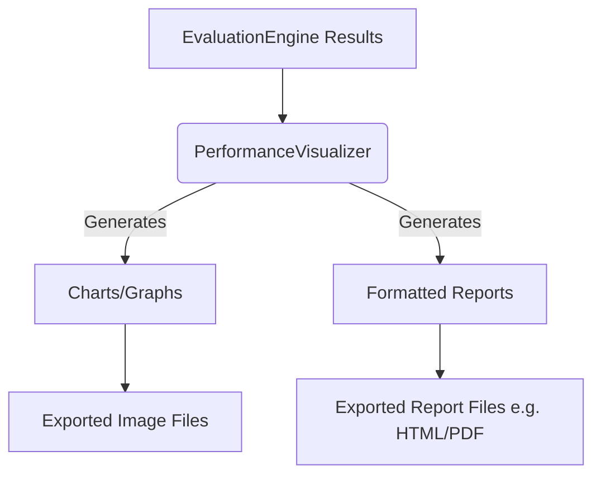

+++
id = "TASK-DEVPY-20250529-173300-VisualizationReporting"
title = "Implement Task 5.2: Visualization & Reporting"
status = "🟢 Done"
type = "🌟 Feature"
priority = "▶️ High"
created_date = "2025-05-29"
updated_date = "2025-05-29T17:43:00"
assigned_to = "dev-python" # Plan also mentions design-d3, but dev-python for integration
coordinator = "roo-commander"
RooComSessionID = "SESSION-AnalyzeDocTestModelSelectionPy-2505281202"
depends_on = ["TASK-DEVPY-20250529-172000-EvaluationEngine"] # Task 5.1
related_docs = [
    ".ruru/planning/model_pipeline_implementation_plan_v1.md#task-52-visualization--reporting",
    "reinforcestrategycreator_pipeline/src/evaluation/engine.py"
]
tags = ["python", "pipeline", "visualization", "reporting", "matplotlib", "seaborn", "plotly", "mlops"]
template_schema_doc = ".ruru/templates/toml-md/01_mdtm_feature.README.md"
effort_estimate_dev_days = "M (2-3 days)"
+++

# Implement Task 5.2: Visualization & Reporting

## Description ✍️

*   **What is this feature?** This task is to implement **Task 5.2: Visualization & Reporting** as defined in the Model Pipeline Implementation Plan ([`.ruru/planning/model_pipeline_implementation_plan_v1.md`](.ruru/planning/model_pipeline_implementation_plan_v1.md:259)). The objective is to create tools for visualizing model performance and generating comprehensive reports.
*   **Why is it needed?** To provide clear, insightful visualizations and standardized reports that help in understanding model behavior, comparing different models/runs, and communicating results effectively.
*   **Scope (from Implementation Plan - Task 5.2):**
    *   Implement a `PerformanceVisualizer` class.
    *   Develop report generation templates.
    *   Consider interactive dashboards (optional, based on complexity).
    *   Implement export capabilities for reports and visualizations.
*   **Links:**
    *   Project Plan: [`.ruru/planning/model_pipeline_implementation_plan_v1.md#task-52-visualization--reporting`](.ruru/planning/model_pipeline_implementation_plan_v1.md:259)
    *   Evaluation Engine Task (Dependency): [`.ruru/tasks/DEV_PYTHON/TASK-DEVPY-20250529-172000-EvaluationEngine.md`](.ruru/tasks/DEV_PYTHON/TASK-DEVPY-20250529-172000-EvaluationEngine.md)

## Acceptance Criteria ✅

(Derived from Implementation Plan - Task 5.2 Deliverables & Details)
*   - [✅] A `PerformanceVisualizer` class (or equivalent module/functions) is implemented for generating various performance charts and graphs.
*   - [✅] Visualizations for key metrics are available (e.g., learning curves, P&L curves, drawdown plots, metric comparison charts).
*   - [✅] Report generation templates (e.g., Markdown, HTML) are created to produce standardized evaluation reports.
*   - [✅] Reports include both summary statistics and relevant visualizations.
*   - [✅] Visualizations and reports can be exported to common formats (e.g., PNG, PDF, HTML).
*   - [✅] The visualization tools integrate with the `EvaluationEngine`'s output.
*   - [✅] Unit tests are provided for the visualization and reporting components.
*   - [✅] An example script demonstrating the generation of visualizations and reports is created.

## Implementation Notes / Sub-Tasks 📝

*   - [✅] Design the `PerformanceVisualizer` class or module structure.
*   - [✅] Select appropriate Python visualization libraries (e.g., Matplotlib, Seaborn, Plotly).
*   - [✅] Implement functions to generate common performance plots:
    *   - [✅] Cumulative returns / P&L curve.
    *   - [✅] Drawdown plot.
    *   - [✅] Metrics bar charts (e.g., comparing models or benchmarks).
    *   - [✅] Learning curves (if training history is available).
*   - [✅] Design report templates (e.g., using Jinja2 for HTML, or direct Markdown generation).
*   - [✅] Implement logic to populate report templates with data from the `EvaluationEngine`.
*   - [✅] Implement export functionality for charts (e.g., `savefig`) and reports.
*   - [✅] Write unit tests for plotting functions and report generation.
*   - [✅] Create an example script in `reinforcestrategycreator_pipeline/examples/` demonstrating visualization and reporting.

## Diagrams 📊 (Optional)

## AI Prompt Log 🤖 (Optional)

*   (Log key prompts and AI responses)

## Review Notes 👀 (For Reviewer)

*   (Space for feedback)

## Key Learnings 💡 (Optional - Fill upon completion)

*   (Summarize discoveries)
## Log Entries 🪵

*   2025-05-29T17:33:00 - Task created by roo-commander.
*   2025-05-29T17:43:00 - Task completed by dev-python. Implemented:
    - Created `PerformanceVisualizer` class with methods for various plots (cumulative returns, drawdown, metrics comparison, learning curves, risk-return scatter, performance dashboard)
    - Created `ReportGenerator` class with support for Markdown, HTML, and PDF report generation
    - Integrated visualization and reporting into the `EvaluationEngine`
    - Added comprehensive unit tests for both components
    - Created example script demonstrating all functionality
    - Updated requirements.txt with necessary dependencies