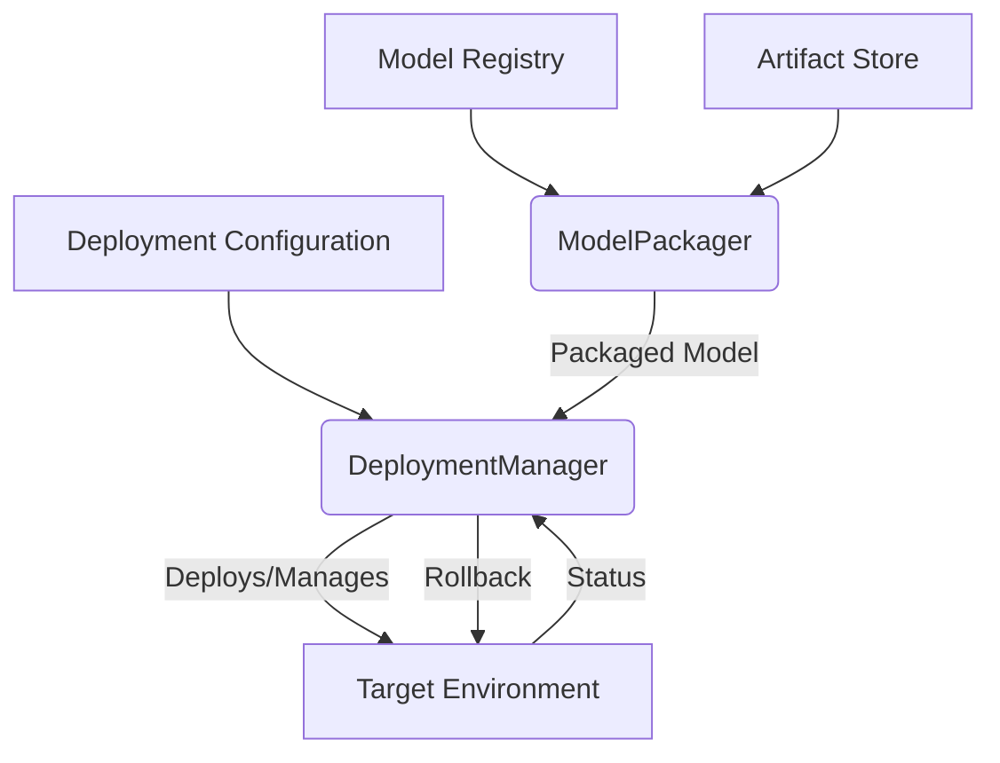

+++
id = "TASK-DEVPY-20250529-174800-DeploymentManager"
title = "Implement Task 6.1: Deployment Manager"
status = "🟢 Done"
type = "🌟 Feature"
priority = "▶️ High"
created_date = "2025-05-29"
updated_date = "2025-05-29T17:56:00"
assigned_to = "dev-python" # Plan also mentions lead-devops for consultation
coordinator = "roo-commander"
RooComSessionID = "SESSION-AnalyzeDocTestModelSelectionPy-2505281202"
depends_on = [
    "TASK-DEVPY-20250529-151000-ModelFactoryRegistry.md", # Task 4.1
    "Task 1.4: Artifact Store Implementation (from plan)" # Actual MDTM ID for Task 1.4 to be confirmed if needed
]
related_docs = [
    ".ruru/planning/model_pipeline_implementation_plan_v1.md#task-61-deployment-manager",
    "reinforcestrategycreator_pipeline/src/models/factory.py",
    "reinforcestrategycreator_pipeline/src/artifact_store/base.py"
]
tags = ["python", "pipeline", "deployment", "mlops", "artifact-management"]
template_schema_doc = ".ruru/templates/toml-md/01_mdtm_feature.README.md"
effort_estimate_dev_days = "L (3-5 days)"
+++

# Implement Task 6.1: Deployment Manager

## Description ✍️

*   **What is this feature?** This task is to implement **Task 6.1: Deployment Manager** as defined in the Model Pipeline Implementation Plan ([`.ruru/planning/model_pipeline_implementation_plan_v1.md`](.ruru/planning/model_pipeline_implementation_plan_v1.md:277)). The objective is to create a robust system for deploying trained models into various environments.
*   **Why is it needed?** To enable the transition of validated models from the research/development phase to operational environments, such as paper trading or live trading, in a controlled and repeatable manner.
*   **Scope (from Implementation Plan - Task 6.1):**
    *   Implement a `DeploymentManager` main class.
    *   Implement a `ModelPackager` for creating deployment artifacts (bundling model, configurations, dependencies).
    *   Develop a deployment configuration system (e.g., specifying target environment, version).
    *   Implement or consider basic rollback capabilities.
*   **Links:**
    *   Project Plan: [`.ruru/planning/model_pipeline_implementation_plan_v1.md#task-61-deployment-manager`](.ruru/planning/model_pipeline_implementation_plan_v1.md:277)
    *   Model Factory & Registry (Dependency): [`.ruru/tasks/DEV_PYTHON/TASK-DEVPY-20250529-151000-ModelFactoryRegistry.md`](.ruru/tasks/DEV_PYTHON/TASK-DEVPY-20250529-151000-ModelFactoryRegistry.md)
    *   Artifact Store (Dependency - conceptual from plan): `reinforcestrategycreator_pipeline/src/artifact_store/base.py`

## Acceptance Criteria ✅

(Derived from Implementation Plan - Task 6.1 Deliverables & Details)
*   - [✅] A `DeploymentManager` main class is implemented and handles the deployment lifecycle.
*   - [✅] A `ModelPackager` class/module is implemented to create self-contained deployment artifacts.
*   - [✅] The deployment system supports configuration for different target environments.
*   - [✅] Basic rollback capabilities (e.g., deploying a previous version) are implemented or a strategy is defined.
*   - [✅] Deployed models can be listed and their status checked.
*   - [✅] Unit tests are provided for the `DeploymentManager` and `ModelPackager`.
*   - [✅] An example script demonstrating the packaging and deployment of a model is created in `reinforcestrategycreator_pipeline/examples/`.

## Implementation Notes / Sub-Tasks 📝

*   - [✅] Design the `DeploymentManager` class interface and its core methods (e.g., `deploy`, `rollback`, `status`, `list_deployments`).
*   - [✅] Design the `ModelPackager` to bundle the trained model, necessary configurations, version information, and potentially a minimal execution environment or dependency list.
*   - [✅] Define the schema for deployment configurations (e.g., YAML files specifying target, model version, deployment strategy).
*   - [✅] Implement the logic within `DeploymentManager` to interpret deployment configurations and execute deployment steps (e.g., copying files, updating symlinks, registering with a serving layer).
*   - [✅] Implement mechanisms for versioning deployed models.
*   - [✅] Implement a simple rollback strategy (e.g., pointing to a previously deployed version's artifacts).
*   - [✅] Ensure interaction with the `ArtifactStore` for retrieving model artifacts to be packaged.
*   - [✅] Ensure interaction with the `ModelRegistry` for fetching metadata about models to be deployed.
*   -   `lead-devops` should be consulted regarding production deployment strategies and best practices.
*   - [✅] Write unit tests for all new components and functionalities.
*   - [✅] Create an example script in `reinforcestrategycreator_pipeline/examples/` demonstrating model packaging and deployment.

## Diagrams 📊 (Optional)

## AI Prompt Log 🤖 (Optional)

*   (Log key prompts and AI responses)

## Review Notes 👀 (For Reviewer)

*   (Space for feedback)

## Key Learnings 💡 (Optional - Fill upon completion)

*   (Summarize discoveries)
## Log Entries 🪵

*   2025-05-29T17:48:00 - Task created by roo-commander.
*   2025-05-29T17:56:00 - Task completed by dev-python. Implemented DeploymentManager and ModelPackager classes with full functionality including deployment strategies, rollback capabilities, and comprehensive unit tests.