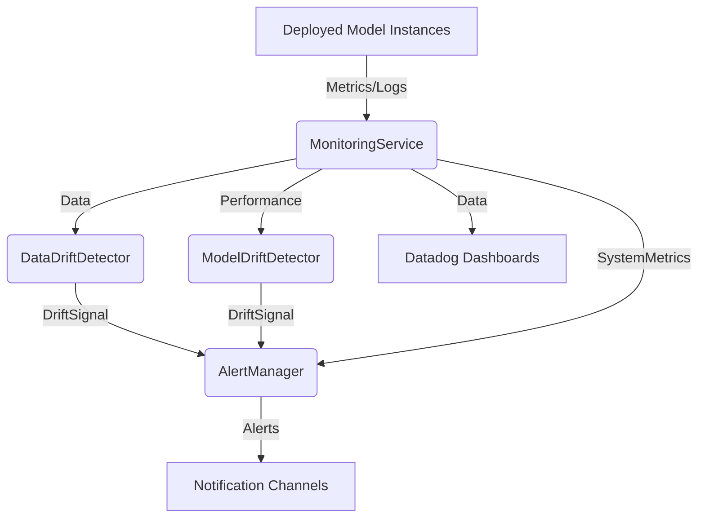

+++
id = "TASK-INFRA-20250529-180900-ProductionMonitoring"
title = "Implement Task 6.3: Production Monitoring"
status = "🟢 Done"
type = "🌟 Feature"
priority = "▶️ High"
created_date = "2025-05-29"
updated_date = "2025-05-29T19:43:00"
assigned_to = "infra-specialist" # Plan also mentions dev-python for support
coordinator = "roo-commander"
RooComSessionID = "SESSION-AnalyzeDocTestModelSelectionPy-2505281202"
depends_on = [
    "TASK-DEVPY-20250529-174800-DeploymentManager.md", # Task 6.1
    "Task 1.3: Logging & Monitoring Foundation (MDTM ID to be confirmed)"
]
related_docs = [
    ".ruru/planning/model_pipeline_implementation_plan_v1.md#task-63-production-monitoring",
    "reinforcestrategycreator_pipeline/src/deployment/manager.py" # From Task 6.1
    # Add path to MonitoringService if/when Task 1.3 MDTM is found
]
tags = ["python", "pipeline", "monitoring", "production", "mlops", "datadog", "drift-detection", "alerts"]
template_schema_doc = ".ruru/templates/toml-md/01_mdtm_feature.README.md"
effort_estimate_dev_days = "L (3-5 days)"
+++

# Implement Task 6.3: Production Monitoring

## Description ✍️

*   **What is this feature?** This task is to implement **Task 6.3: Production Monitoring** as defined in the Model Pipeline Implementation Plan ([`.ruru/planning/model_pipeline_implementation_plan_v1.md`](.ruru/planning/model_pipeline_implementation_plan_v1.md:309)). The objective is to establish robust monitoring for models running in production environments.
*   **Why is it needed?** To ensure the ongoing health, performance, and reliability of deployed models, detect issues like data/model drift, and provide insights for maintenance and improvement.
*   **Scope (from Implementation Plan - Task 6.3):**
    *   Enhance the existing `MonitoringService` (from Task 1.3).
    *   Implement data and model drift detection mechanisms.
    *   Develop an alert management system.
    *   Create Datadog dashboard templates for visualization.
*   **Links:**
    *   Project Plan: [`.ruru/planning/model_pipeline_implementation_plan_v1.md#task-63-production-monitoring`](.ruru/planning/model_pipeline_implementation_plan_v1.md:309)
    *   Deployment Manager (Dependency): [`.ruru/tasks/DEV_PYTHON/TASK-DEVPY-20250529-174800-DeploymentManager.md`](.ruru/tasks/DEV_PYTHON/TASK-DEVPY-20250529-174800-DeploymentManager.md)
    *   Logging & Monitoring Foundation (Dependency): Task 1.3 (MDTM ID to be confirmed)

## Acceptance Criteria ✅

(Derived from Implementation Plan - Task 6.3 Deliverables & Details)
*   - [✅] The `MonitoringService` is enhanced to support production monitoring requirements.
*   - [✅] Mechanisms for detecting data drift (changes in input data distributions) are implemented.
*   - [✅] Mechanisms for detecting model drift (degradation in model performance over time) are implemented.
*   - [✅] An alert management system is in place to notify relevant personnel of critical issues (e.g., high drift, performance drops, system errors).
*   - [✅] Datadog (or chosen monitoring tool) dashboard templates are created for visualizing key production metrics.
*   - [✅] Monitoring integrates with the `DeploymentManager` to track deployed model versions.
*   - [✅] Unit tests are provided for new monitoring components and drift detection logic.
*   - [✅] `dev-python` should provide support for integrating Python-based monitoring components.

## Implementation Notes / Sub-Tasks 📝

*   - [✅] Review and extend the existing `MonitoringService` (from Task 1.3) to accommodate production needs.
*   - [✅] Research and select appropriate techniques/libraries for data drift detection (e.g., statistical tests, distribution comparisons).
*   - [✅] Implement data drift detection on incoming prediction request data and/or training data.
*   - [✅] Research and select appropriate techniques for model drift detection (e.g., monitoring prediction confidence, error rates, concept drift algorithms).
*   - [✅] Implement model drift detection based on ongoing performance metrics.
*   - [✅] Design and implement an alert system (e.g., integration with PagerDuty, Slack, email) with configurable alert thresholds and routing.
*   - [✅] Design Datadog dashboard templates to display:
    *   - [✅] Real-time model performance metrics (e.g., accuracy, P&L if applicable).
    *   - [✅] Data drift indicators.
    *   - [✅] Model drift indicators.
    *   - [✅] System health metrics (e.g., request latency, error rates).
*   - [✅] Ensure monitoring data is collected per deployed model instance/version.
*   - [✅] `dev-python` to assist with any Python-specific implementations or integrations required by `infra-specialist`.
*   - [✅] Write unit tests for drift detection algorithms and alerting logic.
*   - [✅] Document the monitoring setup, alert configurations, and dashboard usage.

## Diagrams 📊 (Optional)

## AI Prompt Log 🤖 (Optional)

*   (Log key prompts and AI responses)

## Review Notes 👀 (For Reviewer)

*   (Space for feedback)

## Key Learnings 💡 (Optional - Fill upon completion)

*   (Summarize discoveries)
## Log Entries 🪵

*   2025-05-29T18:09:00 - Task created by roo-commander.
*   2025-05-29T18:17:30 - `infra-specialist` created and delegated sub-task `TASK-DEVPT-20250529-181700-MonitoringLogic` to `dev-python` for implementation of Python-based drift detection and alert dispatching logic.
*   2025-05-29T19:43:00 - Task completed by infra-specialist. Summary of work:
    - Enhanced MonitoringService with deployment tracking.
    - Integrated DataDriftDetector and ModelDriftDetector (Python components by dev-python).
    - Configured drift detection methods (PSI, KS test, Chi-squared, performance degradation, prediction confidence).
    - Integrated AlertManager with Email, Slack, PagerDuty, and Datadog Events channels.
    - Implemented alert rules with deduplication and severity.
    - Created 4 Datadog dashboard templates (Production Monitoring, Model Performance, Drift Detection, System Health).
    - Documented dashboard setup, usage, metric conventions, and import instructions.
    - Relevant files: `reinforcestrategycreator_pipeline/src/monitoring/service.py`, `drift_detection.py`, `alerting.py`, `datadog_dashboards/`, `reinforcestrategycreator_pipeline/src/config/models.py` (extended).