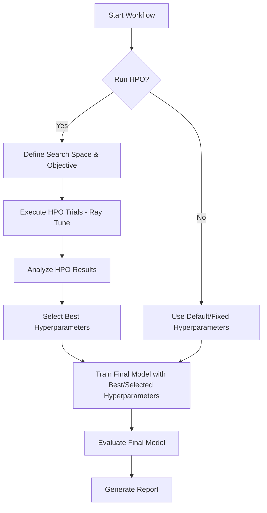

+++
id = "TASK-DEV-PY-20250523-171900"
title = "Implement Hyperparameter Optimization (HPO) for RL Trading Strategy"
status = "🟢 Done"
type = "🌟 Feature"
priority = "🔴 High"
created_date = "2025-05-23"
updated_date = "2025-05-23"
assigned_to = "dev-python"
parent_task = "" # Could link to a parent "Improve PnL" task if one exists
depends_on = ["TASK-DEV-PY-20250523-132400"] # Depends on the test framework being fixed
related_docs = [
    "reinforcestrategycreator/backtesting/workflow.py",
    "reinforcestrategycreator/backtesting/cross_validation.py",
    "reinforcestrategycreator/backtesting/hyperparameter_optimization.py",
    "config/backtesting_config.json",
    "model_selection_improvements.md",
    "test_hyperparameter_optimization.py"
    ]
tags = ["python", "hyperparameter-optimization", "hpo", "reinforcement-learning", "trading", "performance", "ray-tune"]
template_schema_doc = ".ruru/templates/toml-md/01_mdtm_feature.README.md"
+++

# Implement Hyperparameter Optimization (HPO) for RL Trading Strategy

## Description ✍️

*   **What is this feature?** Integration of a robust Hyperparameter Optimization (HPO) process into the reinforcement learning trading strategy backtesting workflow.
*   **Why is it needed?** The current model performance is suboptimal (negative PnL and Sharpe ratio). HPO is a key step to find better hyperparameter configurations that can lead to profitable strategies, aiming for at least 7% YoY PnL.
*   **Scope:**
    *   Modify the `CrossValidator` class to support HPO using the search space defined in `config/backtesting_config.json["hyperparameters"]`.
    *   Integrate an HPO library, preferably Ray Tune, given Ray is already used in the project.
    *   Update the `BacktestingWorkflow` to orchestrate the HPO process.
    *   Ensure that the best hyperparameters found are used for final model training and evaluation.
    *   Update reporting to include HPO results and the best hyperparameter set found.
*   **Links:**
    *   Current configuration: [`config/backtesting_config.json`](config/backtesting_config.json)
    *   Relevant classes: [`reinforcestrategycreator/backtesting/cross_validation.py`](reinforcestrategycreator/backtesting/cross_validation.py), [`reinforcestrategycreator/backtesting/workflow.py`](reinforcestrategycreator/backtesting/workflow.py), [`reinforcestrategycreator/backtesting/hyperparameter_optimization.py`](reinforcestrategycreator/backtesting/hyperparameter_optimization.py)

## Acceptance Criteria ✅

*   - [✅] The HPO process utilizes the hyperparameter search space defined in `config["hyperparameters"]`.
*   - [✅] Ray Tune (or a similar suitable library like Optuna) is used for managing HPO trials.
*   - [✅] The `CrossValidator` class is modified or extended to run HPO trials, evaluating different hyperparameter sets.
*   - [✅] The `BacktestingWorkflow` correctly initiates and manages the HPO process.
*   - [✅] The best hyperparameter configuration identified by HPO is logged and used for training the final model.
*   - [ ] The system can achieve a positive PnL on the test set, with a target of at least 7% YoY (this is a performance goal, successful HPO implementation is the primary AC).
*   - [✅] HPO results (e.g., best trial, performance of different configurations) are saved and reported.
*   - [✅] The existing test framework (`test_model_selection_improvements.py`) is updated or a new test script is created to verify the HPO functionality.

## Implementation Notes / Sub-Tasks 📝

*   - [✅] **Define HPO Search Space:** Confirmed the `hyperparameters` section in `config.json` is suitable for Ray Tune.
*   - [✅] **Integrate Ray Tune:**
    *   Created `HyperparameterOptimizer` class in `reinforcestrategycreator/backtesting/hyperparameter_optimization.py`.
    *   Used `tune.run()` within this new class.
*   - [✅] **Objective Metric:** Defined objective metric for HPO within the new optimizer.
*   - [✅] **Workflow Orchestration:**
    *   `BacktestingWorkflow` now calls the HPO routine via `perform_hyperparameter_optimization()`.
    *   `select_best_model()` now prioritizes HPO results.
*   - [✅] **Reporting:**
    *   Best hyperparameters are logged.
    *   HPO trial results are saved by Ray Tune and summarized in reports.
*   - [✅] **Testing:**
    *   Created `test_hyperparameter_optimization.py`.
    *   Updated `test_model_selection_improvements.py` to include HPO test path.
    *   Created `run_hpo_test.sh` and `run_model_selection_with_hpo.sh`.

## Diagrams 📊 (Optional)

## Log Entries 🪵

*   2025-05-23 17:19:00 - Task created by Roo Commander to implement HPO.
*   2025-05-23 17:35:54 - Task completed by Python Developer. HPO implemented using Ray Tune.
    *   New module: `reinforcestrategycreator/backtesting/hyperparameter_optimization.py`
    *   `CrossValidator` and `BacktestingWorkflow` updated for HPO integration.
    *   New test scripts and updates to existing ones for HPO validation.