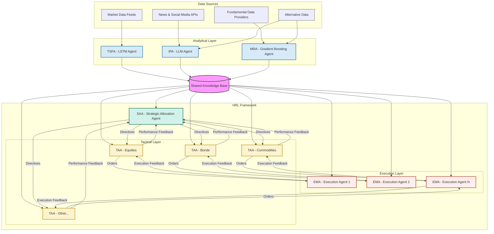
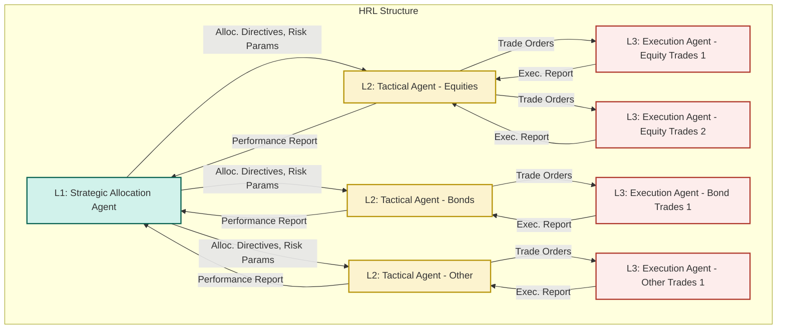

# An Advanced Multi-Agent Hierarchical Reinforcement Learning System for Sophisticated Market Analysis and Automated Trading Execution

## 1. Abstract

This paper proposes an innovative, advanced multi-agent trading system designed for sophisticated market analysis and automated trading execution. The system's architecture integrates diverse machine learning methodologies: an LSTM-based agent for time-series forecasting of asset prices and volatility; a Large Language Model (LLM) agent for processing and interpreting financial news, social media sentiment, and economic reports to derive market insights; and a Gradient Boosting agent for identifying market regimes and predicting discrete events based on technical and fundamental features. These analytical agents provide crucial intelligence to a hierarchical reinforcement learning (HRL) framework. The HRL component features a top-level strategic RL agent determining overall capital allocation, risk exposure, and long-term portfolio strategy; mid-level tactical RL agents focusing on asset class or sector-specific strategies; and low-level execution RL agents optimizing trade execution and responding to micro-market dynamics. This synergistic integration aims to create a robust, adaptive, and highly autonomous trading system capable of navigating complex financial markets. The anticipated contributions include enhanced predictive accuracy through multi-modal data fusion, improved strategic decision-making via hierarchical task decomposition, and optimized trade execution, ultimately leading to superior risk-adjusted returns.

## 2. Introduction

Algorithmic trading has fundamentally transformed financial markets, enabling high-speed execution and the systematic implementation of complex trading strategies. However, modern markets present significant challenges, including high volatility, non-stationarity, information overload from diverse sources, and the intricate interplay of micro and macro-economic factors. Traditional algorithmic trading systems often struggle to adapt to these dynamic conditions and effectively synthesize the vast amounts of structured and unstructured data available.

This paper introduces a novel multi-agent system leveraging a Hierarchical Reinforcement Learning (HRL) framework to address these challenges. The core rationale for this approach lies in its ability to:
1.  **Decompose Complexity:** Break down the multifaceted problem of trading into manageable sub-problems, each handled by specialized agents.
2.  **Integrate Diverse Intelligence:** Combine the strengths of different machine learning paradigms – time-series forecasting (LSTM), natural language understanding (LLM), and pattern recognition in structured data (Gradient Boosting) – to create a holistic market view.
3.  **Learn Adaptive Strategies:** Employ reinforcement learning to enable agents to learn and adapt their strategies based on market feedback and interactions, optimizing for long-term objectives.
4.  **Facilitate Scalability and Modularity:** Allow for easier development, testing, and upgrading of individual components within the larger system.

The objectives of this paper are to:
*   Propose a detailed architecture for an advanced multi-agent HRL trading system.
*   Describe the roles and interactions of specialized analytical and decision-making agents.
*   Outline a high-level mathematical formulation for the system's components.
*   Discuss practical implementation concepts, potential challenges, and future research directions.

This work aims to provide a blueprint for a next-generation trading system capable of sophisticated market analysis and autonomous, intelligent trading execution.

## 3. Related Work

The proposed system draws inspiration from several research areas:

*   **Multi-Agent Systems (MAS) in Finance:** MAS have been explored for simulating market dynamics, understanding agent interactions, and developing collaborative trading strategies. Works by Tesfatsion (Agent-based Computational Economics) and research in agent-based modeling of financial markets provide foundational concepts. The idea of specialized agents collaborating towards a common goal is central to our proposal.

*   **LSTM for Time-Series Forecasting:** Long Short-Term Memory (LSTM) networks, a type of Recurrent Neural Network (RNN), have demonstrated significant success in modeling sequential data, including financial time series. Studies by Fischer and Krauss (2018) on deep learning for stock price prediction, and various applications in volatility forecasting, highlight LSTMs' capability to capture temporal dependencies and non-linear patterns in market data.

*   **LLMs for Financial NLP:** Large Language Models (LLMs) like BERT, GPT, and their derivatives have revolutionized Natural Language Processing. Their application in finance includes sentiment analysis of news and social media (e.g., Ding et al., 2015, on using deep learning for event-driven stock prediction), information extraction from financial reports, and generating market summaries. These models can process vast amounts of textual data to uncover insights relevant to market movements.

*   **Gradient Boosting Machines in Trading:** Gradient Boosting algorithms (e.g., XGBoost, LightGBM, CatBoost) are powerful ensemble learning methods widely used for classification and regression tasks on structured data. In finance, they have been applied for predicting market direction, identifying trading signals based on technical and fundamental indicators, and classifying market regimes (e.g., Gu, Kelly, and Xiu, 2020, on empirical asset pricing via machine learning).

*   **Hierarchical Reinforcement Learning (HRL):** HRL addresses the challenge of learning in complex environments with sparse rewards by decomposing tasks into hierarchies of sub-tasks or sub-goals. Seminal works by Sutton, Precup, and Singh (on options framework) and Dietterich (MAXQ value function decomposition) laid the groundwork. In finance, HRL has been proposed for portfolio management where high-level agents set asset allocation goals and lower-level agents handle execution (e.g., research by Deng et al., 2017, on HRL for financial portfolio management). Our system extends this by integrating diverse analytical inputs into a multi-level HRL decision structure.

While individual components have been researched, the synergistic integration of specialized LSTM, LLM, and Gradient Boosting analytical agents into a comprehensive, multi-layered HRL framework for trading represents a novel approach aimed at achieving a higher degree of autonomy and market adaptability.

## 4. Proposed System Architecture

The proposed system is a multi-agent architecture composed of specialized analytical agents and a Hierarchical Reinforcement Learning (HRL) framework for decision-making and execution.

### 4.1 Analytical Agents

These agents are responsible for processing specific types of data and generating predictive insights.

*   **A1: LSTM-based Time-Series Forecasting Agent (TSFA)**
    *   **Role:** Predicts future asset prices, price ranges, and volatility measures.
    *   **Responsibilities:** Ingest historical and real-time market data (OHLCV, order book snapshots if available), preprocess time-series data, train and maintain LSTM models.
    *   **Input Data:** Historical and streaming price/volume data for various assets, relevant economic indicators with temporal characteristics.
    *   **Internal Model Logic (Conceptual):** Employs deep LSTM networks (potentially with attention mechanisms) to capture temporal dependencies. May use variants like stacked LSTMs, Bi-LSTMs, or encoder-decoder architectures for sequence-to-sequence predictions.
    *   **Output Signals:** Forecasted price series (e.g., next N periods), predicted volatility (e.g., GARCH-like forecasts from LSTM residuals or direct volatility prediction), confidence intervals for predictions.

*   **A2: LLM-based Information Processing Agent (IPA)**
    *   **Role:** Extracts actionable insights from unstructured textual data.
    *   **Responsibilities:** Monitor and process financial news articles, social media feeds (e.g., Twitter, Reddit), company filings, economic reports, and analyst commentaries.
    *   **Input Data:** Real-time streams of textual data from various sources (News APIs, social media APIs, SEC EDGAR, etc.).
    *   **Internal Model Logic (Conceptual):** Utilizes pre-trained LLMs fine-tuned for financial domain tasks such as sentiment analysis (positive, negative, neutral market/asset sentiment), named entity recognition (identifying companies, people, events), event extraction (e.g., earnings announcements, M&A news, regulatory changes), topic modeling, and question answering against financial documents.
    *   **Output Signals:** Structured sentiment scores (per asset, sector, market), summaries of key news events, identified risk factors or opportunities from text, relevance scores of information to specific assets.

*   **A3: Gradient Boosting Market Regime Agent (MRA)**
    *   **Role:** Identifies current market regimes and predicts discrete market events.
    *   **Responsibilities:** Analyze a broad set of technical indicators, fundamental data, and outputs from TSFA and IPA to classify market conditions.
    *   **Input Data:** Historical and real-time technical indicators (e.g., moving averages, RSI, MACD, ADX), fundamental data (e.g., P/E ratios, interest rates, inflation), volatility measures from TSFA, sentiment scores from IPA.
    *   **Internal Model Logic (Conceptual):** Employs Gradient Boosting Machines (e.g., XGBoost, LightGBM) trained to classify market states (e.g., bull trend, bear trend, consolidation, high volatility, low volatility) or predict probabilities of specific events (e.g., likelihood of a market correction, probability of a sector rotation).
    *   **Output Signals:** Current market regime classification (e.g., "Bullish-HighVol"), probability distributions for future regimes, predictions of discrete events (e.g., "High probability of short squeeze for asset X").

### 4.2 Hierarchical Reinforcement Learning (HRL) Framework

The HRL framework consists of multiple layers of RL agents, each operating at different temporal and strategic scales.

*   **HRL-L1: Strategic Allocation Agent (SAA)**
    *   **Role:** Top-level agent determining overall capital allocation across broad asset classes or market segments, setting long-term portfolio strategy, and managing overall risk exposure.
    *   **Goal:** Maximize long-term risk-adjusted portfolio return.
    *   **Input Data:** Macroeconomic indicators, long-term forecasts from TSFA, broad market sentiment from IPA, market regime classifications from MRA, current overall portfolio composition and performance.
    *   **Actions:** Define target allocation percentages for different asset classes (e.g., 60% equities, 30% bonds, 10% commodities), set overall portfolio risk limits (e.g., maximum VaR, target volatility), adjust strategic beta exposures.
    *   **Output Signals:** High-level allocation directives and risk parameters passed to HRL-L2 agents. Operates on a longer time horizon (e.g., weekly, monthly).

*   **HRL-L2: Tactical Asset Agents (TAA) (Multiple Instances)**
    *   **Role:** Mid-level agents, each focusing on a specific asset class (e.g., US Equities TAA, Fixed Income TAA) or sector (e.g., Technology Sector TAA). They implement the SAA's directives by selecting specific assets or sub-strategies within their domain.
    *   **Goal:** Maximize risk-adjusted return within their assigned domain, subject to SAA's constraints.
    *   **Input Data:** SAA directives, asset-specific forecasts from TSFA, asset/sector-specific sentiment from IPA, relevant event predictions from MRA, current holdings and performance within their domain.
    *   **Actions:** Select specific assets to invest in, determine position sizing for individual assets, choose sub-strategies (e.g., momentum, value within equities), set tactical risk limits for their sub-portfolio.
    *   **Output Signals:** Target positions or trading signals for specific assets passed to HRL-L3 agents. Operates on a medium time horizon (e.g., daily, weekly).

*   **HRL-L3: Execution & Micro-Response Agents (EMA) (Multiple Instances)**
    *   **Role:** Low-level agents responsible for optimizing trade execution for specific orders received from TAAs and responding to short-term micro-market dynamics.
    *   **Goal:** Minimize transaction costs (slippage, commissions) and market impact while achieving target execution prices; react to immediate market opportunities or risks.
    *   **Input Data:** TAA orders (asset, quantity, direction, target price/time), real-time order book data, tick data, short-term volatility forecasts from TSFA, immediate market event flags from MRA.
    *   **Actions:** Break down large orders into smaller pieces, choose order types (limit, market, TWAP, VWAP), dynamically adjust order parameters based on market liquidity and momentum, execute hedging actions.
    *   **Output Signals:** Executed trades, updates on order status. Operates on a very short time horizon (e.g., seconds, minutes).

### 4.3 Inter-Agent Communication and Coordination

*   **Shared Knowledge Base (SKB):** A centralized repository (e.g., a distributed database or a specialized data fabric) where analytical agents publish their outputs (forecasts, sentiment scores, regime classifications) with timestamps and confidence levels. HRL agents subscribe to relevant information from the SKB.
*   **Message Passing Protocols:** Directives from higher-level HRL agents to lower-level agents are passed via a defined messaging system (e.g., using message queues like Kafka or gRPC calls). This ensures clear command flow and feedback.
*   **Feedback Loops:** Performance metrics and execution results from lower-level EMAs are fed back to TAAs, and TAA performance is fed back to the SAA, allowing for continuous learning and adaptation across the hierarchy.

### 4.4 System Diagrams (Mermaid)

*Diagram 1: Overall Multi-Agent System Architecture and Data Flow.*

*Diagram 2: Structure of Hierarchical RL Agents and Command/Feedback Flow.*

## 5. Mathematical Formulation (High-Level)

This section provides a conceptual mathematical framework for the agents and the HRL system.

### 5.1 Analytical Agents' Objectives

*   **LSTM-based Time-Series Forecasting Agent (TSFA):**
    Let $y_t$ be the true price/volatility at time $t$, and $\hat{y}_t(\theta_{LSTM})$ be the LSTM's prediction with parameters $\theta_{LSTM}$. The objective is to minimize a loss function, e.g., Mean Squared Error (MSE):
    $L_{LSTM}(\theta_{LSTM}) = \frac{1}{T} \sum_{t=1}^{T} (y_t - \hat{y}_t(\theta_{LSTM}))^2$

*   **LLM-based Information Processing Agent (IPA):**
    For sentiment analysis, let $s_i$ be the true sentiment (e.g., positive, negative, neutral) of document $i$, and $\hat{s}_i(\theta_{LLM})$ be the LLM's predicted sentiment. The objective is to maximize accuracy or minimize cross-entropy loss:
    $L_{LLM}(\theta_{LLM}) = -\frac{1}{N} \sum_{i=1}^{N} \sum_{c \in C} s_{i,c} \log(\hat{s}_{i,c}(\theta_{LLM}))$
    For information extraction, the objective might be maximizing F1-score for identifying relevant entities or events.

*   **Gradient Boosting Market Regime Agent (MRA):**
    Let $r_j$ be the true market regime for observation $j$, and $\hat{r}_j(\theta_{GB})$ be the Gradient Boosting model's prediction. For classification, the objective could be maximizing accuracy or F1-score, or minimizing a loss function like log-loss.
    $L_{GB}(\theta_{GB}) = \text{LossFunction}(r, \hat{r}(\theta_{GB}))$

### 5.2 Hierarchical Reinforcement Learning (HRL) Framework

We define a semi-Markov Decision Process (SMDP) for each level of the hierarchy. An option $o = \langle I, \pi, \beta \rangle$ consists of an initiation set $I$, a policy $\pi: S \times A \rightarrow [0,1]$, and a termination condition $\beta: S \rightarrow [0,1]$.

*   **State Space ($S_k$):** The state for an agent at level $k$ includes relevant market information from the SKB, its current holdings/position, and directives from level $k-1$.
*   **Action Space ($A_k$):** Actions at level $k$ can be primitive actions (for EMAs) or options (sub-goals) for agents at level $k+1$.
*   **Reward Function ($R_k$):**
    *   **HRL-L3 (EMAs):** Rewards based on execution quality, e.g., $R_{EMA} = -(\text{slippage} + \text{commission}) + \text{bonus_for_price_improvement}$.
    *   **HRL-L2 (TAAs):** Rewards based on the performance of their sub-portfolio relative to benchmarks or targets set by SAA, adjusted for risk. $R_{TAA} = \alpha \cdot \text{PnL}_{sub-portfolio} - \lambda \cdot \text{Risk}_{sub-portfolio} + \text{IntrinsicRewardFromSAA}$.
    *   **HRL-L1 (SAA):** Rewards based on overall long-term portfolio growth and risk-adjusted return (e.g., change in Sharpe ratio of the total portfolio). $R_{SAA} = \Delta \text{PortfolioValue} - \gamma \cdot \text{PortfolioRisk}$.

The objective for each RL agent is to learn a policy $\pi_k^*$ that maximizes the expected discounted cumulative reward:
$\pi_k^* = \arg\max_{\pi_k} E \left[ \sum_{t=0}^{\infty} \gamma^t R_{k,t+1} | S_{k,0}, \pi_k \right]$
This can be solved using various RL algorithms like Policy Gradients (e.g., A2C, PPO) or Q-learning variants adapted for HRL (e.g., Feudal RL, Options framework). The Bellman equation for an option $o$ at level $k$ can be written as:
$Q_k(s, o) = E \left[ \sum_{t=0}^{\tau-1} \gamma^t R_{k,t+1} + \gamma^{\tau} \max_{o'} Q_k(s', o') | s_0=s, o \text{ taken} \right]$
where $\tau$ is the duration of option $o$.

### 5.3 Overall System Objective

The overarching goal is to maximize a utility function $U$ that balances expected portfolio return $E[R_P]$ and portfolio risk $\text{Risk}_P$ (e.g., VaR, CVaR, volatility):
$\max U(E[R_P], \text{Risk}_P) = E[R_P] - \lambda_U \cdot \text{Risk}_P$
where $\lambda_U$ is a risk aversion coefficient.

### 5.4 Risk Management Integration

Risk management is integrated at multiple levels:
*   SAA sets overall risk limits (e.g., max drawdown, VaR constraints).
*   TAAs operate within these risk limits for their sub-portfolios.
*   EMAs manage execution risk (e.g., by limiting market impact).
*   The reward functions explicitly penalize excessive risk-taking.
*   Constraints can be added to the RL optimization problem, e.g., $\text{VaR}(\text{Portfolio}) \leq \text{VaR}_{max}$.

## 6. Practical Implementation Concepts

*   **Data Sources:**
    *   **Market Data:** Real-time and historical data from exchanges (e.g., via FIX protocol, WebSocket APIs from brokers like Interactive Brokers, Alpaca) or data vendors (e.g., Refinitiv, Bloomberg, Polygon.io, IEX Cloud).
    *   **News & Sentiment:** APIs from news providers (e.g., Reuters, Dow Jones News API, NewsAPI.org), social media platforms (Twitter API), financial forums.
    *   **Fundamental Data:** Providers like FactSet, S&P Capital IQ, or public sources like SEC EDGAR.
    *   **Alternative Data:** Satellite imagery, credit card transaction data, shipping data, etc., from specialized providers.

*   **Technology Stack (High-Level):**
    *   **Programming Language:** Python (dominant for ML/RL due to its extensive libraries).
    *   **ML/DL Libraries:** TensorFlow, PyTorch for LSTM, LLM, and RL model development. Scikit-learn, XGBoost, LightGBM for Gradient Boosting.
    *   **RL Libraries:** Ray RLlib, Stable Baselines3, TF-Agents.
    *   **NLP Libraries:** Hugging Face Transformers for LLMs.
    *   **Data Processing & Storage:** Pandas, NumPy, Dask for large datasets. SQL/NoSQL databases (e.g., PostgreSQL, MongoDB, TimescaleDB) for storing market data, model outputs, and trade logs.
    *   **Messaging & Streaming:** Apache Kafka or RabbitMQ for inter-agent communication and data streams.
    *   **Distributed Computing:** Ray, Dask, or Spark for distributed training and data processing if needed.
    *   **Containerization & Orchestration:** Docker, Kubernetes for deployment and scaling.

*   **Backtesting and Simulation Strategy:**
    *   Develop a high-fidelity, event-driven backtesting engine that accurately simulates order execution, transaction costs, slippage, and market impact.
    *   Use historical data covering various market regimes.
    *   Employ walk-forward optimization and out-of-sample testing to prevent overfitting.
    *   Simulate the entire multi-agent system, including communication delays and asynchronous updates.
    *   Perform sensitivity analysis on key parameters and model assumptions.
    *   Use Monte Carlo simulations to assess robustness under different market scenarios.

*   **Deployment, Monitoring, and Adaptation:**
    *   **Phased Deployment:** Start with paper trading, then move to live trading with small capital.
    *   **Continuous Monitoring:** Track model performance, prediction accuracy, agent behavior, system health, and risk exposure in real-time using dashboards (e.g., Grafana, Kibana).
    *   **Drift Detection:** Implement mechanisms to detect concept drift in market data or model performance degradation.
    *   **Online Learning & Retraining:** Periodically retrain analytical models and RL agents with new data. The HRL framework should allow for online fine-tuning or adaptation of policies.
    *   **Kill Switches & Failsafes:** Implement robust risk management overlays and manual override capabilities.

## 7. Potential Challenges and Future Research Directions

*   **Model Interpretability and Explainability (XAI):** Understanding why the HRL agents make certain strategic or tactical decisions is crucial for trust and debugging, especially with complex deep learning components. Research in XAI for RL is ongoing.
*   **Non-Stationarity of Markets:** Financial markets are constantly evolving. Ensuring the system remains adaptive and robust to regime changes is a major challenge. Continual learning and adaptive model components are key.
*   **Computational Complexity:** Training and running a large-scale multi-agent system with deep learning models can be computationally intensive, requiring significant hardware resources.
*   **Data Quality and Availability:** Access to high-quality, clean, and synchronized data from diverse sources is critical and can be costly.
*   **Reward Function Design for HRL:** Crafting appropriate reward functions for each level of the hierarchy that align with the overall system goal without leading to unintended behaviors is complex.
*   **Credit Assignment in HRL:** Determining which agent or which action at which level contributed to an overall outcome (profit or loss) is a persistent challenge in HRL.
*   **Scalability of Inter-Agent Communication:** Ensuring efficient and low-latency communication as the number of agents and the volume of data grow.
*   **Future Research:**
    *   Incorporating causal inference to better understand market relationships.
    *   Developing more sophisticated meta-learning approaches for faster adaptation to new market conditions or assets.
    *   Exploring the use of graph neural networks (GNNs) to model inter-asset relationships or information flow.
    *   Advanced techniques for multi-agent coordination and emergent behavior analysis.
    *   Integrating quantum computing concepts for specific optimization tasks (long-term).

## 8. Conclusion

This paper has proposed a novel and comprehensive multi-agent trading system architecture centered around a Hierarchical Reinforcement Learning framework, informed by specialized analytical agents leveraging LSTM, LLM, and Gradient Boosting methodologies. By decomposing the complex trading problem into a hierarchy of manageable tasks and integrating diverse sources of market intelligence, the system aims to achieve a new level of sophistication in automated trading. The proposed architecture offers potential for enhanced predictive power, adaptive strategic decision-making, and optimized execution, ultimately targeting superior risk-adjusted returns. While significant challenges in implementation and research remain, this framework provides a robust conceptual blueprint for developing next-generation intelligent trading systems capable of navigating the intricacies of modern financial markets.