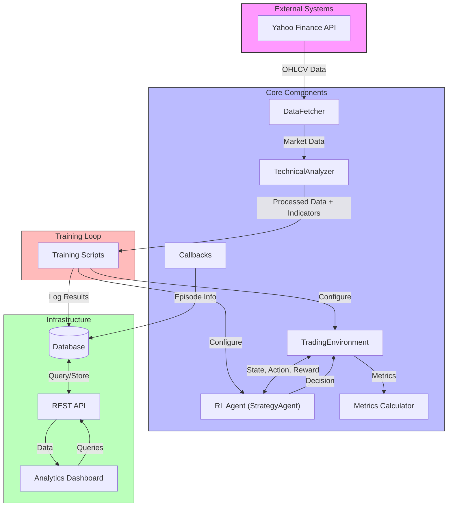
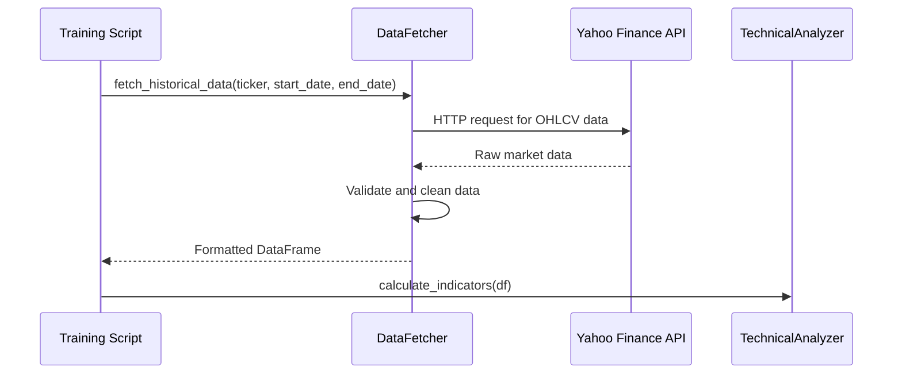
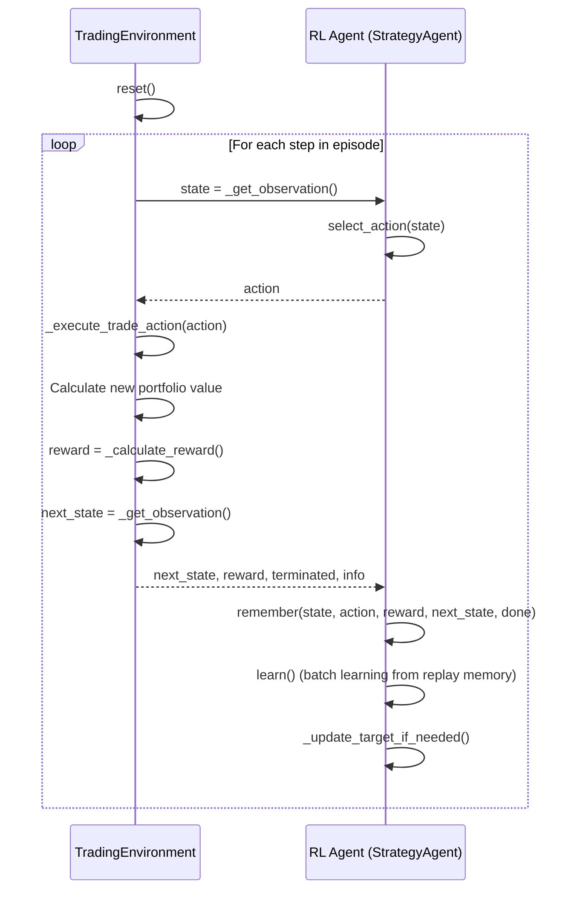
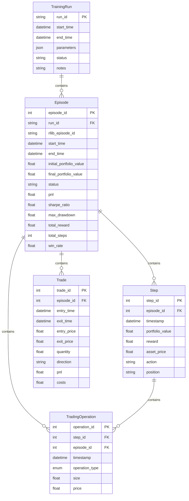
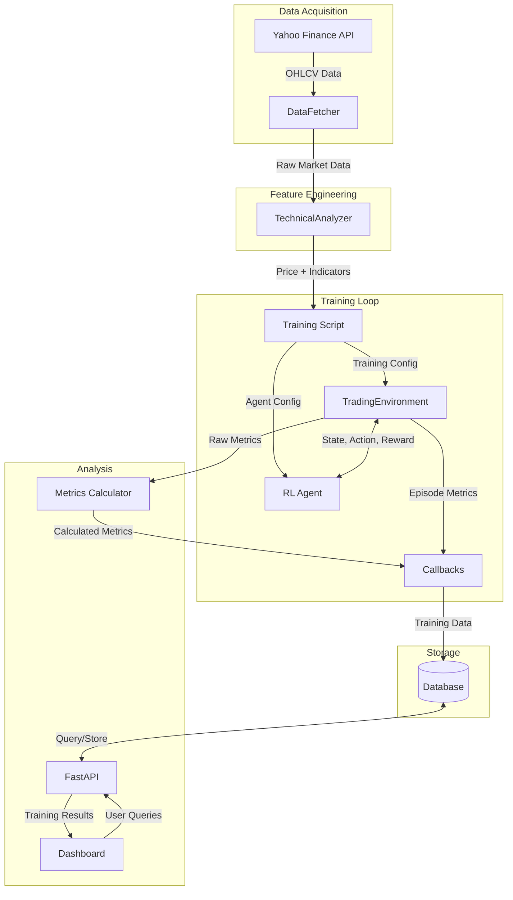

# ReinforceStrategyCreatorV2: System Architecture

## High-Level Architecture

The ReinforceStrategyCreatorV2 is a comprehensive reinforcement learning (RL) framework for developing, training, and evaluating automated trading strategies. The system architecture follows a modular design pattern with clear separation of concerns across components.

### System Overview Diagram

### Architecture Description

ReinforceStrategyCreatorV2 follows a modular, service-oriented architecture designed around the reinforcement learning workflow. The system is composed of:

1. **Data Pipeline**: Responsible for acquiring and preprocessing financial data.
2. **RL Core**: The reinforcement learning implementation including environment and agent.
3. **Storage Layer**: Database models and persistence capabilities.
4. **API Layer**: RESTful API for retrieving training results and metrics.
5. **Visualization Layer**: Dashboard for analyzing agent performance.

The architecture is designed to be both scalable and extensible, allowing for:
- Addition of new data sources beyond Yahoo Finance
- Integration of different ML/RL algorithms 
- Extension with new technical indicators
- Deployment of successful strategies to production environments

## Components and Modules

### Data Fetcher

The Data Fetcher module is responsible for retrieving historical financial data from external sources.

**Key Responsibilities:**
- Fetch OHLCV (Open, High, Low, Close, Volume) data from Yahoo Finance
- Handle request errors and network issues gracefully
- Validate and clean retrieved data

**Key Functions:**
- `fetch_historical_data(ticker, start_date, end_date)`: Retrieves market data for a specific ticker and date range

**Interactions:**
- Inputs data to the Technical Analyzer for feature engineering
- Provides raw data for the Trading Environment

### Technical Analyzer

The Technical Analyzer processes raw market data and calculates a variety of technical indicators that serve as inputs to the reinforcement learning agent.

**Key Responsibilities:**
- Calculate standard technical indicators (RSI, MACD, Bollinger Bands, etc.)
- Handle data normalization for machine learning consumption
- Calculate volatility metrics

**Key Functions:**
- `calculate_indicators(data)`: Processes raw OHLCV data and adds calculated technical indicators

**Technical Indicators Implemented:**
- RSI (Relative Strength Index)
- MACD (Moving Average Convergence Divergence)
- Bollinger Bands
- ADX (Average Directional Index)
- Aroon Indicators
- ATR (Average True Range)
- Historical Volatility

### Trading Environment

The Trading Environment module is a Gymnasium-compatible environment that simulates market interactions for reinforcement learning.

**Key Responsibilities:**
- Implement the OpenAI Gym interface (`reset()`, `step()`, etc.)
- Simulate market interactions with realistic constraints
- Calculate rewards based on trading performance
- Track portfolio metrics during episodes
- Handle position sizing and risk management

**Key Functions:**
- `reset()`: Initialize or reset the environment state
- `step(action)`: Execute trading action and return new state, reward, and termination status
- `_execute_trade_action(action)`: Handle the mechanics of executing trades
- `_calculate_reward()`: Calculate the agent's reward based on trading performance
- `_get_observation()`: Construct the state observation for the agent

**Core Features:**
- Support for different position sizing methods (fixed fractional, all-in)
- Implementation of stop-loss and take-profit mechanisms
- Transaction fees and slippage simulation
- Support for different reward functions (P&L, Sharpe ratio)

### RL Agent (StrategyAgent)

The StrategyAgent is the reinforcement learning agent responsible for learning and implementing trading strategies.

**Key Responsibilities:**
- Implement a Deep Q-Network (DQN) for trading decision making
- Provide mechanisms for exploration and exploitation
- Process observations and select actions
- Learn from experiences through replay memory

**Key Functions:**
- `select_action(state)`: Choose an action based on the current state using epsilon-greedy policy
- `learn()`: Sample from replay memory and update the Q-network
- `remember(state, action, reward, next_state, done)`: Store experiences in replay memory
- `update_target_model()`: Sync target network with main network

**Core Features:**
- Experience replay for more stable learning
- Target network for reducing overoptimistic value estimates
- Epsilon-greedy exploration strategy
- Neural network architecture for approximating Q-values

### API Layer

The API layer exposes training results and metrics through a RESTful interface.

**Key Responsibilities:**
- Provide access to training run data
- Expose episode metrics and details
- Enable querying and filtering of training results

**Key Components:**
- FastAPI framework for RESTful endpoints
- Router modules for organizing endpoint groups
- Dependency injection for database sessions
- Pydantic schemas for data validation and serialization

**Main Endpoints:**
- `/api/v1/episodes/{episode_id}`: Get details for a specific episode
- `/api/v1/episodes/{episode_id}/steps/`: Get steps for a specific episode
- `/api/v1/episodes/{episode_id}/trades/`: Get trades for a specific episode
- `/api/v1/episodes/{episode_id}/operations/`: Get trading operations for a specific episode
- `/api/v1/episodes/{episode_id}/model/`: Get model parameters for a specific episode

### Dashboard

The Dashboard provides a visual interface for analyzing agent performance and trade decisions.

**Key Responsibilities:**
- Visualize trading performance and metrics
- Display decision-making patterns
- Analyze trade outcomes
- Compare different strategies

**Key Components:**
- Streamlit-based interactive web interface
- Performance metrics visualization
- Price and operation charts
- Decision analysis tools
- Model management capabilities

**Main Features:**
- Episode selection and comparison
- Trading operations visualization
- Portfolio performance tracking
- Action distribution analysis
- Reward analysis

### Database Integration

The system uses an SQLAlchemy-based database model for storing training runs, episodes, steps, trades, and operations.

**Key Responsibilities:**
- Define database schema
- Handle database connections
- Provide ORM for data access
- Support logging and querying of training results

**Core Components:**
- SQLAlchemy ORM models
- Database session management
- Transaction handling

## Technology Stack

### Programming Languages
- **Python 3.12**: Primary language for all components

### Machine Learning / RL Frameworks
- **PyTorch**: Deep learning framework for neural network implementation
- **Ray/RLlib**: Distributed reinforcement learning framework
- **Gymnasium**: Environment interface for reinforcement learning

### Data Processing
- **Pandas**: Data manipulation and analysis
- **NumPy**: Numerical computing
- **pandas-ta**: Technical analysis library
- **ta**: Additional technical indicators library

### API Framework
- **FastAPI**: Modern, high-performance web framework for building APIs
- **Uvicorn**: ASGI server for FastAPI

### Database
- **PostgreSQL**: Main database system (via SQLAlchemy)
- **SQLAlchemy**: ORM for database operations

### Dashboard/Visualization
- **Streamlit**: Interactive dashboard framework
- **Plotly**: Interactive visualization library
- **Matplotlib**: Static visualization library

### Data Sources
- **yfinance**: Yahoo Finance API client

### Development and Testing
- **pytest**: Testing framework
- **ruff**: Linting and code formatting
- **httpx**: HTTP client for API testing

## Data Models and Data Flow

### Database Schema

The system uses a relational database model implemented with SQLAlchemy:

### Data Flow Diagram

The following diagram illustrates the primary data flow within the system:

## External System Integrations

### Yahoo Finance API
- **Purpose**: Fetch historical price and volume data for financial assets
- **Integration Method**: Via the `yfinance` Python library
- **Data Retrieved**: OHLCV (Open, High, Low, Close, Volume) data
- **Interaction Pattern**: Pull-based, fetched at the beginning of each training run

## Dependencies

The system relies on the following key dependencies as defined in `pyproject.toml`:

### Core Dependencies
- **Python**: ^3.12
- **yfinance**: ^0.2.58 - Yahoo Finance API wrapper
- **requests**: ^2.32.3 - HTTP library
- **pandas**: ^2.2.3 - Data manipulation and analysis
- **pandas-ta**: ^0.3.14b0 - Technical analysis library
- **ta**: ^0.11.0 - Additional technical indicators
- **numpy**: ^1.26.0 - Numerical computing
- **gymnasium**: ^1.0.0 - RL environment interface
- **matplotlib**: ^3.8.4 - Plotting results
- **streamlit**: ^1.34.0 - Dashboard
- **sqlalchemy**: ^2.0.30 - Database ORM
- **psycopg2-binary**: ^2.9.9 - PostgreSQL driver
- **fastapi**: ^0.115.12 - API framework
- **uvicorn**: ^0.34.2 - ASGI server
- **scikit-learn**: ^1.6.1 - Machine learning utilities
- **plotly**: ^6.0.1 - Interactive visualization
- **python-dotenv**: ^1.0.1 - Environment variable management
- **torch**: ^2.3.0 - Deep learning framework
- **torchvision**: ^0.18.0 - PyTorch computer vision
- **torchaudio**: ^2.3.0 - PyTorch audio processing
- **ray**: ^2.46.0 (with rllib extras) - Distributed RL framework
- **protobuf**: ~3.20.0 - Protocol buffers

### Development Dependencies
- **pytest**: ^8.2.2 - Testing framework
- **ruff**: ^0.4.4 - Linting and formatting
- **httpx**: ^0.28.1 - HTTP client for testing

## Deployment Architecture

The system is primarily designed for research and development environments, with components that can be deployed in various configurations:

1. **Local Development**:
   - All components run on a single machine
   - Database can be SQLite or local PostgreSQL
   - Dashboard and API run on local ports

2. **Research Environment**:
   - Training components run on high-performance compute resources
   - Results stored in a central database
   - Dashboard and API deployed as web services for team access

3. **Production Deployment** (for executing trained models):
   - Trained models exported to production environment
   - API deployed as a service for integration with trading platforms
   - Database focused on logging live trading actions and performance