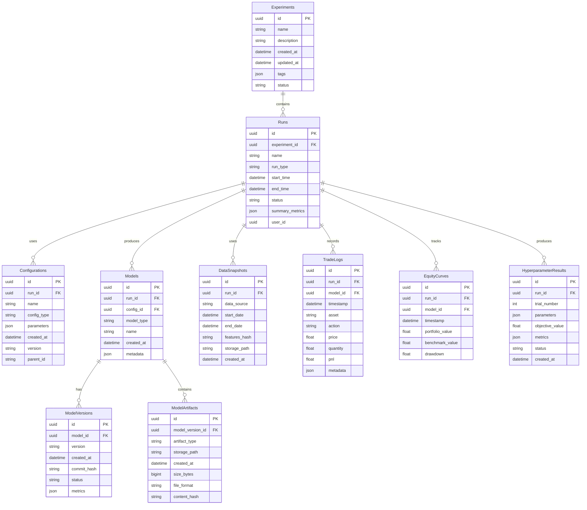

# Results Database Infrastructure: Implementation Specification

## 1. Overview

This document specifies the implementation details for the Results Database Infrastructure of the Trading Model Optimization Pipeline. It defines the database schema, access patterns, versioning strategy, and migration approach for storing experiment results, model artifacts, performance metrics, and related metadata.

## 2. Component Responsibilities

The Results Database Infrastructure is responsible for:

- Storing experiment configurations, results, and metadata
- Maintaining versioned history of models and their performance
- Tracking relationships between experiments, runs, models, and data snapshots
- Providing efficient query capabilities for analysis and comparison
- Supporting data migrations and schema evolution
- Ensuring data integrity and consistency
- Managing large binary artifacts (model weights, data snapshots)

## 3. Architecture

### 3.1 Overall Architecture

The database infrastructure follows a layered architecture:

```
┌───────────────────────┐
│    Repository Layer   │  High-level interface for other components
├───────────────────────┤
│      Model Layer      │  ORM models and business logic
├───────────────────────┤
│  Data Access Layer    │  Database connection and query execution
└───────────────────────┘
```

### 3.2 Directory Structure

```
trading_optimization/
└── db/
    ├── __init__.py
    ├── models.py           # ORM model definitions
    ├── repository.py       # Repository pattern implementations
    ├── connectors.py       # Database connection management
    ├── migrations/         # Database migration scripts
    │   ├── __init__.py
    │   └── versions/       # Individual migration versions
    ├── seeders/            # Initial data seeders
    │   ├── __init__.py
    │   └── default_data.py # Default data population
    └── utils.py            # Database utility functions
```

## 4. Database Schema

### 4.1 Entity Relationship Diagram



### 4.2 Table Definitions

#### 4.2.1 Experiments

Stores high-level experiment information.

| Column | Type | Description |
|--------|------|-------------|
| id | UUID | Primary key |
| name | String | Experiment name |
| description | String | Experiment description |
| created_at | DateTime | Creation timestamp |
| updated_at | DateTime | Last update timestamp |
| tags | JSON | Experiment tags for categorization |
| status | String | Experiment status (e.g., 'active', 'completed', 'failed') |

#### 4.2.2 Runs

Stores individual execution runs within experiments.

| Column | Type | Description |
|--------|------|-------------|
| id | UUID | Primary key |
| experiment_id | UUID | Foreign key to Experiments |
| name | String | Run name |
| run_type | String | Type of run (e.g., 'training', 'evaluation', 'hyperparameter_tuning') |
| start_time | DateTime | Run start timestamp |
| end_time | DateTime | Run end timestamp |
| status | String | Run status (e.g., 'running', 'completed', 'failed') |
| summary_metrics | JSON | Summary of key performance metrics |
| user_id | UUID | ID of the user who created the run |

#### 4.2.3 Configurations

Stores versioned configurations used in runs.

| Column | Type | Description |
|--------|------|-------------|
| id | UUID | Primary key |
| run_id | UUID | Foreign key to Runs |
| name | String | Configuration name |
| config_type | String | Type of configuration (e.g., 'model', 'training', 'data') |
| parameters | JSON | Configuration parameters |
| created_at | DateTime | Creation timestamp |
| version | String | Configuration version |
| parent_id | String | ID of parent configuration (for tracking evolution) |

#### 4.2.4 Models

Stores model metadata.

| Column | Type | Description |
|--------|------|-------------|
| id | UUID | Primary key |
| run_id | UUID | Foreign key to Runs |
| config_id | UUID | Foreign key to Configurations |
| model_type | String | Type of model (e.g., 'dqn', 'a3c', 'ppo') |
| name | String | Model name |
| created_at | DateTime | Creation timestamp |
| metadata | JSON | Additional model metadata |

#### 4.2.5 ModelVersions

Stores versioned information about models.

| Column | Type | Description |
|--------|------|-------------|
| id | UUID | Primary key |
| model_id | UUID | Foreign key to Models |
| version | String | Model version |
| created_at | DateTime | Creation timestamp |
| commit_hash | String | Git commit hash for code reproducibility |
| status | String | Version status (e.g., 'draft', 'production', 'archived') |
| metrics | JSON | Performance metrics for this version |

#### 4.2.6 ModelArtifacts

Stores model binary artifacts.

| Column | Type | Description |
|--------|------|-------------|
| id | UUID | Primary key |
| model_version_id | UUID | Foreign key to ModelVersions |
| artifact_type | String | Type of artifact (e.g., 'weights', 'checkpoint', 'optimizer_state') |
| storage_path | String | Path to the stored artifact |
| created_at | DateTime | Creation timestamp |
| size_bytes | BigInt | Size of the artifact in bytes |
| file_format | String | Format of the stored file (e.g., 'pt', 'onnx', 'h5') |
| content_hash | String | Hash of file contents for integrity verification |

#### 4.2.7 DataSnapshots

Stores data snapshots used for reproducibility.

| Column | Type | Description |
|--------|------|-------------|
| id | UUID | Primary key |
| run_id | UUID | Foreign key to Runs |
| data_source | String | Source of the data |
| start_date | DateTime | Start date of the data range |
| end_date | DateTime | End date of the data range |
| features_hash | String | Hash of feature set for reproducibility |
| storage_path | String | Path to the stored data snapshot |
| created_at | DateTime | Creation timestamp |

#### 4.2.8 TradeLogs

Stores individual trading actions.

| Column | Type | Description |
|--------|------|-------------|
| id | UUID | Primary key |
| run_id | UUID | Foreign key to Runs |
| model_id | UUID | Foreign key to Models |
| timestamp | DateTime | When the trade occurred |
| asset | String | Asset traded |
| action | String | Action taken (e.g., 'buy', 'sell') |
| price | Float | Trade price |
| quantity | Float | Trade quantity |
| pnl | Float | Profit/loss for this trade |
| metadata | JSON | Additional trade metadata |

#### 4.2.9 EquityCurves

Stores portfolio value over time.

| Column | Type | Description |
|--------|------|-------------|
| id | UUID | Primary key |
| run_id | UUID | Foreign key to Runs |
| model_id | UUID | Foreign key to Models |
| timestamp | DateTime | Point in time |
| portfolio_value | Float | Portfolio value at this time |
| benchmark_value | Float | Benchmark value for comparison |
| drawdown | Float | Drawdown at this point |

#### 4.2.10 HyperparameterResults

Stores hyperparameter optimization trial results.

| Column | Type | Description |
|--------|------|-------------|
| id | UUID | Primary key |
| run_id | UUID | Foreign key to Runs |
| trial_number | Integer | Trial number within optimization |
| parameters | JSON | Hyperparameters used |
| objective_value | Float | Optimization objective value |
| metrics | JSON | Additional performance metrics |
| status | String | Trial status (e.g., 'completed', 'pruned') |
| created_at | DateTime | Creation timestamp |

## 5. ORM Implementation

The database will be accessed using SQLAlchemy ORM. Here's a sample implementation of the core model classes:

### 5.1 Base Models

```python
# models.py
from sqlalchemy import Column, String, DateTime, Float, Integer, ForeignKey, Text, BigInteger
from sqlalchemy.dialects.postgresql import UUID, JSONB
from sqlalchemy.ext.declarative import declarative_base
from sqlalchemy.orm import relationship
import uuid
from datetime import datetime

Base = declarative_base()

class Experiment(Base):
    __tablename__ = 'experiments'
    
    id = Column(UUID(as_uuid=True), primary_key=True, default=uuid.uuid4)
    name = Column(String(255), nullable=False)
    description = Column(Text)
    created_at = Column(DateTime, default=datetime.utcnow)
    updated_at = Column(DateTime, default=datetime.utcnow, onupdate=datetime.utcnow)
    tags = Column(JSONB)
    status = Column(String(50))
    
    runs = relationship("Run", back_populates="experiment")
    
    def __repr__(self):
        return f"<Experiment(name='{self.name}')>"


class Run(Base):
    __tablename__ = 'runs'
    
    id = Column(UUID(as_uuid=True), primary_key=True, default=uuid.uuid4)
    experiment_id = Column(UUID(as_uuid=True), ForeignKey('experiments.id'))
    name = Column(String(255))
    run_type = Column(String(50))
    start_time = Column(DateTime, default=datetime.utcnow)
    end_time = Column(DateTime)
    status = Column(String(50))
    summary_metrics = Column(JSONB)
    user_id = Column(UUID(as_uuid=True))
    
    experiment = relationship("Experiment", back_populates="runs")
    configurations = relationship("Configuration", back_populates="run")
    models = relationship("Model", back_populates="run")
    data_snapshots = relationship("DataSnapshot", back_populates="run")
    trade_logs = relationship("TradeLog", back_populates="run")
    equity_curves = relationship("EquityCurve", back_populates="run")
    hyperparameter_results = relationship("HyperparameterResult", back_populates="run")
    
    def __repr__(self):
        return f"<Run(name='{self.name}', status='{self.status}')>"
```

### 5.2 Additional Models

Additional model classes would be defined for each table in the schema, following the same pattern demonstrated above.

## 6. Repository Pattern

The repository pattern will be used to abstract database operations and provide a clean interface for other components:

```python
# repository.py
from typing import List, Optional, Dict, Any, TypeVar, Generic
from sqlalchemy.orm import Session
from .models import Experiment, Run, Model

T = TypeVar('T')

class BaseRepository(Generic[T]):
    """Base repository with common CRUD operations"""
    
    def __init__(self, session: Session, model_class: T):
        self.session = session
        self.model_class = model_class
    
    def get_by_id(self, id) -> Optional[T]:
        return self.session.query(self.model_class).filter(self.model_class.id == id).first()
    
    def list(self, limit: int = 100, offset: int = 0) -> List[T]:
        return self.session.query(self.model_class).limit(limit).offset(offset).all()
    
    def create(self, **kwargs) -> T:
        instance = self.model_class(**kwargs)
        self.session.add(instance)
        self.session.commit()
        return instance
    
    def update(self, id, **kwargs) -> Optional[T]:
        instance = self.get_by_id(id)
        if instance:
            for key, value in kwargs.items():
                setattr(instance, key, value)
            self.session.commit()
        return instance
    
    def delete(self, id) -> bool:
        instance = self.get_by_id(id)
        if instance:
            self.session.delete(instance)
            self.session.commit()
            return True
        return False


class ExperimentRepository(BaseRepository[Experiment]):
    """Repository for experiment operations"""
    
    def __init__(self, session: Session):
        super().__init__(session, Experiment)
    
    def find_by_tags(self, tags: List[str]) -> List[Experiment]:
        """Find experiments with specific tags"""
        # PostgreSQL specific JSONB query
        return self.session.query(Experiment).filter(
            Experiment.tags.has_any(tags)
        ).all()
    
    def get_active_experiments(self) -> List[Experiment]:
        """Get all active experiments"""
        return self.session.query(Experiment).filter(
            Experiment.status == 'active'
        ).all()


class RunRepository(BaseRepository[Run]):
    """Repository for run operations"""
    
    def __init__(self, session: Session):
        super().__init__(session, Run)
    
    def find_by_experiment(self, experiment_id) -> List[Run]:
        """Find runs for a specific experiment"""
        return self.session.query(Run).filter(
            Run.experiment_id == experiment_id
        ).all()
    
    def find_recent_runs(self, limit: int = 10) -> List[Run]:
        """Find most recent runs"""
        return self.session.query(Run).order_by(
            Run.start_time.desc()
        ).limit(limit).all()
```

## 7. Database Connector

The database connector provides connection management and session handling:

```python
# connectors.py
from sqlalchemy import create_engine
from sqlalchemy.orm import sessionmaker, scoped_session
from contextlib import contextmanager
from typing import Generator
import os

class DatabaseConnector:
    """Manages database connections and provides session factory"""
    
    _instance = None
    
    @classmethod
    def instance(cls):
        """Singleton pattern to ensure only one connector exists"""
        if cls._instance is None:
            cls._instance = cls()
        return cls._instance
    
    def __init__(self):
        """Initialize the database connector with connection details from config"""
        from trading_optimization.config import ConfigManager
        
        config = ConfigManager.instance()
        db_config = config.get('database', {})
        
        # Build connection string
        engine_type = db_config.get('engine', 'postgresql')
        host = db_config.get('host', 'localhost')
        port = db_config.get('port', '5432')
        db_name = db_config.get('name', 'trading_optimization')
        username = db_config.get('username', 'postgres')
        password = db_config.get('password', '')
        
        conn_str = f"{engine_type}://{username}:{password}@{host}:{port}/{db_name}"
        
        # Create engine with appropriate settings
        self.engine = create_engine(
            conn_str,
            pool_size=5,
            max_overflow=10,
            pool_recycle=3600,  # Recycle connections after 1 hour
            pool_pre_ping=True  # Check connection liveness
        )
        
        self.session_factory = sessionmaker(
            autocommit=False,
            autoflush=False,
            bind=self.engine
        )
        
        # Create a scoped session for thread safety
        self.scoped_session = scoped_session(self.session_factory)
    
    @contextmanager
    def session(self) -> Generator:
        """Context manager for database sessions"""
        session = self.scoped_session()
        try:
            yield session
            session.commit()
        except Exception as e:
            session.rollback()
            raise e
        finally:
            session.close()
```

## 8. Migration Strategy

### 8.1 Migration Framework

The database migration will be handled using Alembic, which integrates well with SQLAlchemy:

```python
# migrations/env.py
from alembic import context
from sqlalchemy import engine_from_config, pool
from logging.config import fileConfig
import os
import sys

# Add the project root to the Python path
sys.path.insert(0, os.path.abspath(os.path.join(os.path.dirname(__file__), '../..')))

# Import the SQLAlchemy models
from trading_optimization.db.models import Base

# Get Alembic configuration
config = context.config

# Configure logging
fileConfig(config.config_file_name)

# Set the MetaData object for autogenerating migrations
target_metadata = Base.metadata

# Override with actual database URL from environment or config
def get_db_url():
    from trading_optimization.config import ConfigManager
    config = ConfigManager.instance()
    db_config = config.get('database', {})
    
    # Build connection string
    engine_type = db_config.get('engine', 'postgresql')
    host = db_config.get('host', 'localhost')
    port = db_config.get('port', '5432')
    db_name = db_config.get('name', 'trading_optimization')
    username = db_config.get('username', 'postgres')
    password = db_config.get('password', '')
    
    return f"{engine_type}://{username}:{password}@{host}:{port}/{db_name}"

# Functions setting up Alembic operations
def run_migrations_offline():
    url = get_db_url()
    context.configure(
        url=url,
        target_metadata=target_metadata,
        literal_binds=True,
        dialect_opts={"paramstyle": "named"},
    )

    with context.begin_transaction():
        context.run_migrations()

def run_migrations_online():
    configuration = config.get_section(config.config_ini_section)
    configuration['sqlalchemy.url'] = get_db_url()
    
    connectable = engine_from_config(
        configuration,
        prefix="sqlalchemy.",
        poolclass=pool.NullPool,
    )

    with connectable.connect() as connection:
        context.configure(
            connection=connection, 
            target_metadata=target_metadata
        )

        with context.begin_transaction():
            context.run_migrations()
```

### 8.2 Migration Commands

Migration operations will be exposed through CLI commands:

```python
# migrations/commands.py
import click
import os
import sys
import alembic.config

@click.group()
def db():
    """Database migration commands"""
    pass

@db.command()
def init():
    """Initialize database tables"""
    alembic_args = ['--raiseerr', 'stamp', 'head']
    alembic.config.main(argv=alembic_args)

@db.command()
def migrate(message=None):
    """Generate migration script from model changes"""
    alembic_args = ['--raiseerr', 'revision', '--autogenerate']
    if message:
        alembic_args.extend(['-m', message])
    alembic.config.main(argv=alembic_args)

@db.command()
def upgrade(revision='head'):
    """Update database to specified revision"""
    alembic_args = ['--raiseerr', 'upgrade', revision]
    alembic.config.main(argv=alembic_args)

@db.command()
def downgrade(revision='-1'):
    """Downgrade database to specified revision"""
    alembic_args = ['--raiseerr', 'downgrade', revision]
    alembic.config.main(argv=alembic_args)

@db.command()
def current():
    """Display current database revision"""
    alembic_args = ['--raiseerr', 'current']
    alembic.config.main(argv=alembic_args)

@db.command()
def history():
    """Display revision history"""
    alembic_args = ['--raiseerr', 'history']
    alembic.config.main(argv=alembic_args)
```

## 9. Large Binary Storage Strategy

### 9.1 Artifact Storage

Model artifacts and data snapshots are too large to store efficiently in the database. Instead:

1. **Database References**: The database stores metadata and file path references
2. **File System Storage**: Large artifacts are stored in a file system structure
3. **Cloud Storage Option**: Optionally, artifacts can be stored in S3 or similar cloud storage

```python
# utils.py
import os
import hashlib
from pathlib import Path
import shutil
from typing import Tuple, Optional
import boto3

class ArtifactStorage:
    """Manages storage and retrieval of large binary artifacts"""
    
    def __init__(self, base_path: str = None, use_cloud: bool = False):
        """
        Initialize artifact storage
        
        Args:
            base_path: Base directory for artifact storage (default: 'artifacts/')
            use_cloud: Whether to use cloud storage (default: False)
        """
        from trading_optimization.config import ConfigManager
        
        config = ConfigManager.instance()
        
        self.base_path = base_path or config.get('storage.artifacts_path', 'artifacts/')
        self.use_cloud = use_cloud or config.get('storage.use_cloud', False)
        
        if self.use_cloud:
            # Initialize cloud storage client (e.g., S3)
            self.cloud_bucket = config.get('storage.cloud_bucket', 'trading-optimization')
            self.s3_client = boto3.client('s3')
    
    def save(self, artifact_data, artifact_type: str, model_id: str) -> Tuple[str, str, int]:
        """
        Save an artifact to storage
        
        Args:
            artifact_data: Binary data or file-like object
            artifact_type: Type of artifact (e.g., 'model_weights', 'data_snapshot')
            model_id: ID of the associated model
            
        Returns:
            Tuple of (storage_path, content_hash, size_bytes)
        """
        # Create a hash of the content for integrity verification
        hasher = hashlib.sha256()
        
        # If input is a file-like object
        if hasattr(artifact_data, 'read'):
            artifact_data.seek(0)
            for chunk in iter(lambda: artifact_data.read(4096), b''):
                hasher.update(chunk)
            size_bytes = artifact_data.tell()
            artifact_data.seek(0)
        else:
            # If input is bytes
            hasher.update(artifact_data)
            size_bytes = len(artifact_data)
        
        content_hash = hasher.hexdigest()
        
        # Create directory structure: {base_path}/{artifact_type}/{model_id}/
        relative_dir = os.path.join(artifact_type, model_id)
        full_dir = os.path.join(self.base_path, relative_dir)
        os.makedirs(full_dir, exist_ok=True)
        
        # Use hash as filename to avoid collisions
        filename = f"{content_hash}.bin"
        relative_path = os.path.join(relative_dir, filename)
        full_path = os.path.join(self.base_path, relative_path)
        
        # Write to local storage
        if hasattr(artifact_data, 'read'):
            with open(full_path, 'wb') as f:
                shutil.copyfileobj(artifact_data, f)
        else:
            with open(full_path, 'wb') as f:
                f.write(artifact_data)
        
        # If cloud storage enabled, also upload to cloud
        if self.use_cloud:
            if hasattr(artifact_data, 'read'):
                artifact_data.seek(0)
                self.s3_client.upload_fileobj(
                    artifact_data,
                    self.cloud_bucket,
                    relative_path
                )
            else:
                self.s3_client.put_object(
                    Body=artifact_data,
                    Bucket=self.cloud_bucket,
                    Key=relative_path
                )
        
        return relative_path, content_hash, size_bytes
    
    def load(self, storage_path: str) -> Optional[bytes]:
        """
        Load an artifact from storage
        
        Args:
            storage_path: Path to the artifact, relative to base_path
            
        Returns:
            The artifact data as bytes, or None if not found
        """
        # Try cloud storage first if enabled
        if self.use_cloud:
            try:
                response = self.s3_client.get_object(
                    Bucket=self.cloud_bucket,
                    Key=storage_path
                )
                return response['Body'].read()
            except:
                pass  # Fall back to local storage
        
        # Load from local storage
        full_path = os.path.join(self.base_path, storage_path)
        if os.path.exists(full_path):
            with open(full_path, 'rb') as f:
                return f.read()
        
        return None
```

## 10. Database Service

A high-level service class will provide a unified interface for database operations:

```python
# db_service.py
from typing import Dict, List, Any, Optional
from uuid import UUID
import json

from trading_optimization.db.connectors import DatabaseConnector
from trading_optimization.db.repository import (
    ExperimentRepository, RunRepository, ModelRepository, 
    ConfigurationRepository, DataSnapshotRepository
)
from trading_optimization.db.models import (
    Experiment, Run, Model, Configuration, DataSnapshot
)
from trading_optimization.db.utils import ArtifactStorage

class DatabaseService:
    """High-level service for database operations"""
    
    _instance = None
    
    @classmethod
    def instance(cls):
        """Singleton pattern to ensure only one service exists"""
        if cls._instance is None:
            cls._instance = cls()
        return cls._instance
    
    def __init__(self):
        """Initialize repositories and connections"""
        self.db_connector = DatabaseConnector.instance()
        self.artifact_storage = ArtifactStorage()
    
    def start_experiment(
        self, name: str, description: str = None, tags: List[str] = None
    ) -> Dict[str, Any]:
        """
        Start a new experiment
        
        Args:
            name: Experiment name
            description: Optional description
            tags: Optional list of tags
            
        Returns:
            Dictionary with experiment details including ID
        """
        with self.db_connector.session() as session:
            repo = ExperimentRepository(session)
            experiment = repo.create(
                name=name,
                description=description,
                tags=tags or [],
                status='active'
            )
            return {
                'id': str(experiment.id),
                'name': experiment.name,
                'created_at': experiment.created_at.isoformat()
            }
    
    def start_run(
        self, experiment_id: str, name: str = None, run_type: str = 'training'
    ) -> Dict[str, Any]:
        """
        Start a new run within an experiment
        
        Args:
            experiment_id: ID of the parent experiment
            name: Optional run name
            run_type: Type of run (default: 'training')
            
        Returns:
            Dictionary with run details including ID
        """
        with self.db_connector.session() as session:
            repo = RunRepository(session)
            run = repo.create(
                experiment_id=experiment_id,
                name=name,
                run_type=run_type,
                status='running',
                summary_metrics={}
            )
            return {
                'id': str(run.id),
                'experiment_id': str(run.experiment_id),
                'start_time': run.start_time.isoformat(),
                'status': run.status
            }
    
    def save_model(
        self, run_id: str, model_data, model_type: str, 
        config_id: str, metadata: Dict[str, Any] = None
    ) -> Dict[str, Any]:
        """
        Save a model and its artifacts
        
        Args:
            run_id: ID of the run that produced this model
            model_data: Binary model data or file-like object
            model_type: Type of model (e.g., 'dqn', 'a3c')
            config_id: ID of the configuration used
            metadata: Additional model metadata
            
        Returns:
            Dictionary with model details including ID
        """
        with self.db_connector.session() as session:
            # Create model record
            model_repo = ModelRepository(session)
            model = model_repo.create(
                run_id=run_id,
                model_type=model_type,
                config_id=config_id,
                metadata=metadata or {}
            )
            
            # Create model version
            version_repo = ModelVersionRepository(session)
            version = version_repo.create(
                model_id=model.id,
                version='1.0.0',
                status='active'
            )
            
            # Save model artifact
            storage_path, content_hash, size_bytes = self.artifact_storage.save(
                model_data, 'model_weights', str(model.id)
            )
            
            # Create artifact record
            artifact_repo = ModelArtifactRepository(session)
            artifact = artifact_repo.create(
                model_version_id=version.id,
                artifact_type='weights',
                storage_path=storage_path,
                size_bytes=size_bytes,
                file_format='pt',  # Assuming PyTorch format
                content_hash=content_hash
            )
            
            return {
                'id': str(model.id),
                'version_id': str(version.id),
                'artifact_id': str(artifact.id),
                'storage_path': storage_path
            }

    # Additional methods for other operations...
```

## 11. Implementation Prerequisites

Before implementing this component, ensure:

1. Project structure is set up
2. Configuration system is implemented
3. Database driver and ORM libraries are installed (SQLAlchemy, psycopg2)
4. Migration tool is installed (Alembic)
5. Cloud storage SDK is installed if needed (boto3 for S3)

## 12. Implementation Sequence

1. Set up database models and base repository
2. Implement database connector and connection management
3. Configure Alembic and create initial migration
4. Implement artifact storage utilities
5. Create specialized repositories for each entity
6. Develop the database service layer
7. Write database migration commands
8. Create seeders for default/test data
9. Add unit and integration tests