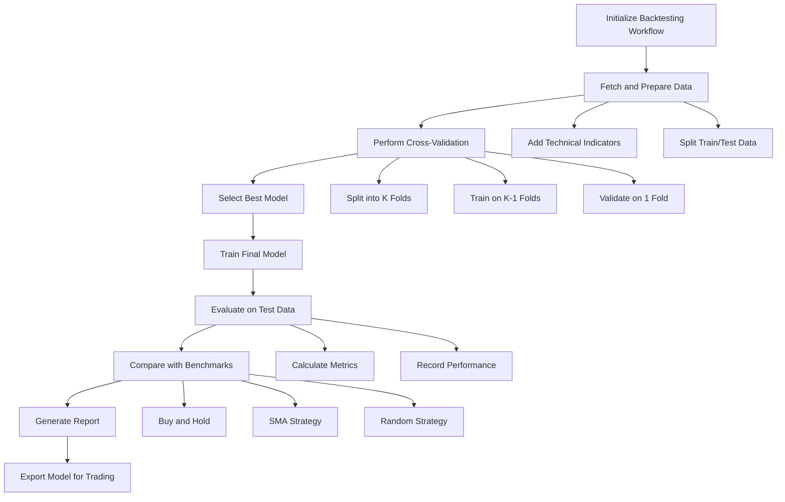
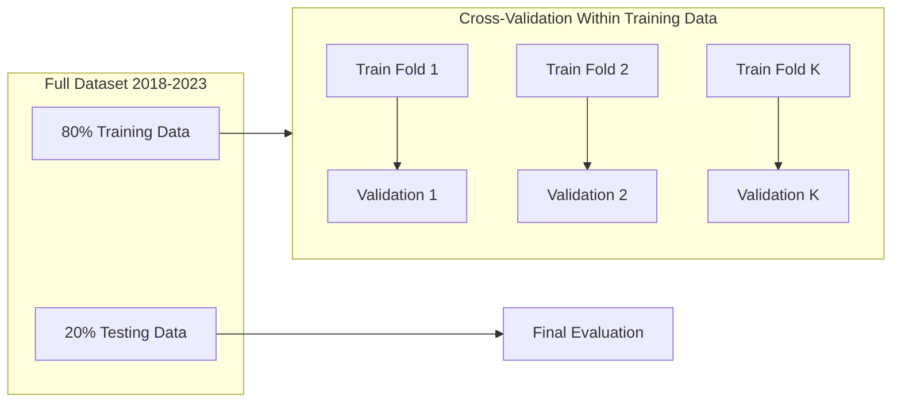
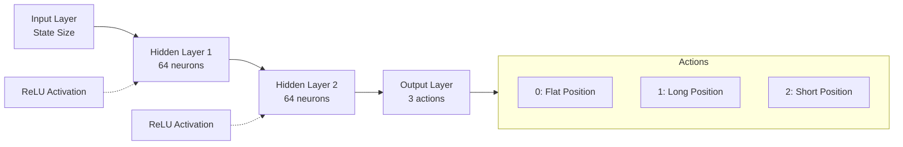
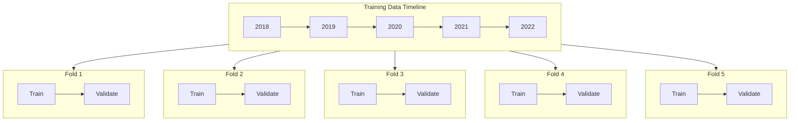

# Improved Backtesting System Documentation

This document provides a comprehensive explanation of the ReinforceStrategyCreator improved backtesting system. It covers the entire workflow from data preparation through model training, evaluation, selection, and deployment for paper trading.

## Table of Contents

1. [Overview of the Backtesting System](#1-overview-of-the-backtesting-system)
2. [Backtesting Period and Data](#2-backtesting-period-and-data)
3. [Model Architecture and Training](#3-model-architecture-and-training)
4. [Training Process](#4-training-process)
5. [Benchmarking and Model Selection](#5-benchmarking-and-model-selection)
6. [Results Visualization and Reporting](#6-results-visualization-and-reporting)
7. [Production Deployment Guide](#7-production-deployment-guide)
8. [Glossary](#8-glossary)

## 1. Overview of the Backtesting System

### 1.1 Purpose and Goals

The improved backtesting system is designed to train, validate, and evaluate reinforcement learning (RL) trading strategies in a simulated environment before deploying them for paper or live trading. The system aims to:

1. Provide a comprehensive framework for developing and testing RL-based trading strategies
2. Implement best practices for proper backtest validation, including time-series cross-validation
3. Evaluate model performance against standard benchmark strategies
4. Generate detailed reports and visualizations for performance analysis
5. Export trained models in a format ready for paper trading deployment

### 1.2 Main Components

The system consists of several modular components working together:

- **BacktestingWorkflow**: The orchestration layer that coordinates the entire process
- **DataManager**: Fetches and preprocesses market data, adding technical indicators
- **CrossValidator**: Performs time-series cross-validation to prevent data leakage
- **ModelTrainer**: Trains and evaluates reinforcement learning models
- **TradingEnvironment**: Simulates the trading environment for the RL agent
- **StrategyAgent**: The RL agent that learns trading strategies
- **BenchmarkEvaluator**: Compares RL strategy against standard trading strategies
- **ModelExporter**: Exports the trained model for paper trading deployment

### 1.3 Workflow Diagram

The following diagram illustrates the high-level workflow of the backtesting system:



## 2. Backtesting Period and Data

### 2.1 Time Period

The backtesting system uses historical market data from **January 1, 2018, to January 1, 2023** (5 years). This period was chosen to capture different market conditions, including:

- Bull markets (2019, 2021)
- Bear markets (2018, 2022)
- Periods of high volatility (March 2020)
- Different economic cycles

### 2.2 Data Splitting

The historical data is divided into training and testing sets using the following approach:

1. **Train-Test Split**: 80% of the data is used for training and 20% for final testing (controlled by the `test_ratio` parameter)
2. **Cross-Validation**: Within the training data, time-series cross-validation (with 5 folds by default) is used to prevent look-ahead bias
3. **Sequential Splits**: The splitting ensures that each test fold only contains data from periods that come after the corresponding training fold

The following diagram illustrates the data split strategy:



### 2.3 Data Sources

The system primarily uses daily OHLCV (Open, High, Low, Close, Volume) data for the specified asset(s). The default implementation focuses on SPY (S&P 500 ETF) but can be configured for other assets. Data is fetched using the `fetch_historical_data()` function, which can be connected to various data providers:

- Yahoo Finance API (default)
- Local CSV files
- Custom data providers (can be implemented by extending the data fetcher)

### 2.4 Data Preprocessing

The raw price data undergoes several preprocessing steps before being used for training:

1. **Technical Indicators**: A comprehensive set of technical indicators is calculated, including:
   - **Trend Indicators**: SMA, EMA, MACD
   - **Momentum Indicators**: RSI (14-period)
   - **Volatility Indicators**: Bollinger Bands (20,2), Historical Volatility (20-day), ATR (14)
   - **Directional Indicators**: ADX (14), Aroon (14)

2. **Missing Data Handling**: 
   - Missing values resulting from indicator calculations are dropped
   - The environment implements a system to find the first valid starting point where all indicators are available

3. **Feature Normalization**: 
   - Features are normalized using a rolling window approach to prevent look-ahead bias
   - The default normalization window is 20 days (configurable)

4. **Data Verification**: 
   - The system checks for data quality and logs warnings if issues are detected

## 3. Model Architecture and Training

### 3.1 Reinforcement Learning Model

The system implements a Deep Q-Network (DQN) reinforcement learning agent for trading:

#### Model Architecture



- **Network Structure**: A 2-layer fully-connected neural network with 64 neurons in each hidden layer
- **Activation Functions**: ReLU for hidden layers, linear activation for the output layer
- **Output**: Q-values for three possible actions (Flat, Long, Short)

### 3.2 Training Parameters

The default training parameters are designed to promote stable learning while allowing sufficient exploration:

| Parameter | Default Value | Description |
|-----------|---------------|-------------|
| `learning_rate` | 0.0005 | Learning rate for the Adam optimizer |
| `gamma` | 0.98 | Discount factor for future rewards |
| `epsilon` | 1.0 | Initial exploration rate |
| `epsilon_decay` | 0.998 | Decay rate for exploration |
| `epsilon_min` | 0.05 | Minimum exploration rate |
| `batch_size` | 64 | Mini-batch size for training |
| `memory_size` | 10000 | Replay buffer size |
| `update_target_frequency` | 10 | Steps between target network updates |
| `episodes` | 150 | Episodes for cross-validation training |
| `final_episodes` | 300 | Episodes for final model training |

These parameters can be adjusted in the `improved_config` dictionary in the main script.

### 3.3 Feature Engineering and Inputs

The model receives a state representation consisting of:

1. **Market Features**: A sliding window of the most recent price data and technical indicators
2. **Portfolio Features**: Current balance and position information

The feature set includes:

- **Price Data**: Close, High, Low, Open
- **Technical Indicators**: As described in the Data Preprocessing section
- **Account State**: Current balance, shares held, current position (0=flat, 1=long, -1=short)

### 3.4 Policies

The system implements several key reinforcement learning policies:

1. **Exploration Policy**: Epsilon-greedy approach for action selection
   - Initial high exploration rate (epsilon = 1.0) that decays over time
   - Exploration controlled by epsilon_decay parameter
   - Minimum exploration rate (epsilon_min) ensures continued exploration

2. **Experience Replay**: Experiences stored in replay buffer for more stable learning
   - Random sampling from memory to break correlations in sequential data
   - Prioritizes batch diversity over recency

3. **Target Network**: Separate network for stable Q-value targets
   - Updated periodically to reduce instability in training
   - Controlled by update_target_frequency parameter

### 3.5 Reward Function Design

The reward function is critical to guiding the agent's learning. The system uses a risk-adjusted reward function that balances profitability with risk management:

```python
def _calculate_reward(self) -> float:
    """Calculate the reward for the current step."""
    # Calculate portfolio change
    portfolio_change = self.portfolio_value - self.last_portfolio_value
    
    # Return calculation for Sharpe ratio
    if self.last_portfolio_value > 0:
        return_pct = portfolio_change / self.last_portfolio_value
        self._portfolio_returns.append(return_pct)
        self._episode_portfolio_returns.append(return_pct)
    
    # Basic reward is the portfolio change
    reward = portfolio_change
    
    # Risk-adjusted reward components
    if self.use_sharpe_ratio and len(self._portfolio_returns) > 1:
        returns_array = np.array(list(self._portfolio_returns))
        returns_mean = np.mean(returns_array)
        returns_std = np.std(returns_array)
        
        if returns_std > 1e-8:  # Avoid division by zero
            sharpe = (returns_mean - self.risk_free_rate) / returns_std
            reward += sharpe * self.sharpe_weight
    
    # Drawdown penalty
    current_drawdown = 0
    if self.max_portfolio_value > 0:
        current_drawdown = (self.max_portfolio_value - self.portfolio_value) / self.max_portfolio_value
        self.episode_max_drawdown = max(self.episode_max_drawdown, current_drawdown)
        reward -= current_drawdown * self.drawdown_penalty
    
    # Trading frequency penalty to discourage excessive trading
    if self._trade_occurred_this_step:
        reward -= self.trading_frequency_penalty
    
    return reward
```

Key reward function components:

1. **Portfolio Change**: Base reward is the change in portfolio value
2. **Sharpe Ratio**: Incorporates risk-adjusted returns (configurable weight)
3. **Drawdown Penalty**: Penalizes large drawdowns to encourage risk management
4. **Trading Frequency Penalty**: Discourages excessive trading to reduce transaction costs

### 3.6 Weights Initialization and Update Methods

The network weights are initialized using PyTorch's default initialization:

- Linear layer weights initialized from ~N(0, 1/√n) where n is the number of input features
- Bias terms initialized to zero

For optimization and weight updates:

- **Optimizer**: Adam optimizer with configurable learning rate
- **Loss Function**: Mean Squared Error (MSE) between predicted Q-values and target Q-values
- **Batching**: Mini-batch updates from random samples in the replay memory
- **Target Network**: Stabilizes training by updating target network weights periodically

## 4. Training Process

### 4.1 Time-Series Cross-Validation

To prevent data leakage and ensure reliable model validation, the system implements time-series cross-validation:



Key aspects of the cross-validation process:

1. **Sequential Splits**: Data is split into K folds (default: 5) with each validation fold containing only data that comes chronologically after its corresponding training data
2. **Performance Aggregation**: Results from all folds are aggregated to evaluate model stability across different time periods
3. **Hyperparameter Selection**: The best hyperparameters are selected based on average performance across all folds

### 4.2 Training Episodes and Iterations

The training process involves:

1. **Cross-Validation Episodes**: Default of 150 episodes per fold during cross-validation
2. **Final Training Episodes**: Default of 300 episodes for the final model
3. **Steps per Episode**: Each episode processes the entire training set sequentially

During each episode:

1. The environment is reset to an initial state
2. The agent interacts with the environment step by step
3. At each step:
   - The agent selects an action based on the current state
   - The environment executes the action and returns the next state, reward, and done flags
   - The experience is stored in the replay memory
   - The agent periodically samples from memory and updates its model

### 4.3 Training Progress Monitoring

The system includes comprehensive monitoring of the training progress:

1. **Logging**: Detailed logging at multiple levels:
   - INFO level for major steps and results
   - DEBUG level for detailed information (can be enabled for troubleshooting)

2. **Metrics Tracking**:
   - Profit and Loss (PnL)
   - Portfolio value
   - Sharpe ratio
   - Maximum drawdown
   - Win rate
   - Number of trades

3. **Cross-Validation Summary**: Summarizes performance across all folds in a JSON file

### 4.4 Stopping Criteria

The training process has multiple stopping criteria:

1. **Episode Completion**: Each training run completes the specified number of episodes
2. **Early Stopping**: The system can be extended to implement early stopping based on validation metrics (not in default implementation)
3. **Cross-Validation Completion**: All K folds must complete before selecting the best model
4. **Final Model Training**: The final model trains for the specified number of episodes (default: 300)

## 5. Benchmarking and Model Selection

### 5.1 Comparing Different Runs

The system compares different model runs and configurations based on multiple metrics:

1. **Cross-Validation Performance**: Average and standard deviation of metrics across CV folds
2. **Sharpe Ratio**: The primary metric for model selection
3. **Consistency**: How consistently the model performs across different market conditions

Different training runs can be compared by reviewing the generated reports and JSON summaries.

### 5.2 Benchmark Strategies

The reinforcement learning strategy is compared against several standard benchmark strategies:

1. **Buy and Hold Strategy**:
   - Simply buys the asset at the beginning of the period and holds until the end
   - Serves as a baseline for passive investment

2. **Simple Moving Average (SMA) Strategy**:
   - Uses crossover of short-term (15-day) and long-term (40-day) moving averages
   - Buys when short-term SMA crosses above long-term SMA, sells when it crosses below
   - Represents a basic technical trading strategy

3. **Random Strategy**:
   - Randomly decides whether to buy, sell, or hold at each step
   - Controls for luck and provides a statistical baseline

Each benchmark is implemented in the `BenchmarkStrategy` class hierarchy and executed on the same test data as the RL model.

### 5.3 Performance Metrics

Multiple performance metrics are calculated to provide a comprehensive evaluation:

| Metric | Description | Calculation |
|--------|-------------|-------------|
| PnL | Profit and Loss | Final portfolio value - Initial portfolio value |
| PnL Percentage | PnL as percentage | (PnL / Initial portfolio value) * 100% |
| Sharpe Ratio | Risk-adjusted returns | (Returns_mean - Risk_free_rate) / Returns_std |
| Maximum Drawdown | Largest peak-to-trough decline | Max((Peak_value - Current_value) / Peak_value) |
| Win Rate | Percentage of profitable trades | Number of profitable trades / Total trades |
| Number of Trades | Total trade count | Count of all trades executed |

### 5.4 Model Selection Criteria

The system selects the best model based on the following criteria:

1. **Primary Metric**: Sharpe ratio, which balances returns with risk
2. **Selection Process**:
   ```python
   # Find best model based on Sharpe ratio
   best_sharpe = -float('inf')
   best_result = None
   
   for result in self.cv_results:
       if "error" not in result:
           sharpe = result["val_metrics"]["sharpe_ratio"]
           if sharpe > best_sharpe:
               best_sharpe = sharpe
               best_result = result
   ```
3. **Validation**: The selected model's performance is validated on the test set before final acceptance

## 6. Results Visualization and Reporting

### 6.1 Generated Visualizations

The system generates several key visualizations to help understand model performance:

1. **Portfolio Value Over Time**: Shows how the portfolio value changes throughout the testing period
2. **Benchmark Comparison Chart**: Compares the RL model against benchmark strategies
3. **Metrics Summary Chart**: Visual representation of key performance metrics
4. **Cross-Validation Comparison**: Visualizes performance across different CV folds

### 6.2 HTML Reports

A comprehensive HTML report is generated at the end of the backtesting process, containing:

1. **Summary Information**:
   - Asset and time period
   - Final performance metrics
   - Training parameters

2. **Performance Charts**:
   - All visualizations described above
   - Interactive charts for detailed exploration

3. **Benchmark Comparisons**:
   - Side-by-side comparison with benchmark strategies
   - Relative performance statistics

4. **Trade Analysis**:
   - Trade distribution
   - Win/loss patterns
   - Average holding periods

The HTML report provides a user-friendly interface for exploring and sharing the backtest results.

### 6.3 Results Storage

All results and artifacts are stored in an organized directory structure:

```
results/
├── improved_backtest_[timestamp]/
│   ├── models/
│   │   ├── model_fold_0.h5
│   │   ├── model_fold_1.h5
│   │   ├── ...
│   │   └── final_model.pth
│   ├── plots/
│   │   ├── benchmark_comparison.png
│   │   ├── metrics_summary.png
│   │   └── cv_comparison.png
│   ├── reports/
│   │   └── backtest_report.html
│   ├── cv_summary.json
│   ├── test_metrics.json
│   └── benchmark_metrics.json
```

Results from different runs can be compared by examining the respective directories and JSON files.

## 7. Production Deployment Guide

### 7.1 Exporting the Model for Paper Trading

The system exports the trained model in a format suitable for paper trading:

1. **Export Process**:
   ```python
   model_path = workflow.export_for_trading()
   ```

2. **Exported Artifacts**:
   - Model weights file (`.pth`)
   - Model metadata (`.json`)
   - Inference module for prediction

3. **Export Location**: Models are exported to the `production_models` directory by default

### 7.2 Paper Trading Setup with Interactive Brokers

The exported model can be deployed for paper trading using the following steps:

1. **Prerequisites**:
   - Interactive Brokers account (paper trading account for testing)
   - Trader Workstation (TWS) or IB Gateway installed and running

2. **Configuration**:
   - Update `paper_trading_config.json` with your account details:
     ```json
     {
       "interactive_brokers": {
         "host": "127.0.0.1",
         "port": 7497,  // 7497 for TWS Paper Trading, 4002 for IB Gateway Paper Trading
         "client_id": 1,
         "account_id": "YOUR_ACCOUNT_ID",
         "timeout": 60
       }
     }
     ```

3. **Running the Paper Trading Script**:
   ```bash
   python paper_trading.py --model model_ep100_runSPY_20250518_004839
   ```

### 7.3 Paper Trading Configuration

The paper trading system provides extensive configuration options:

1. **Trading Parameters**:
   ```json
   "trading": {
     "symbol": "SPY",
     "exchange": "SMART",
     "currency": "USD",
     "historical_data_duration": "1 D",
     "bar_size": "5 mins",
     "risk_per_trade": 0.02,  // 2% of account value per trade
     "max_position_size": 0.2,  // 20% of account value
     "stop_loss_pct": 0.05,    // 5% stop loss
     "take_profit_pct": 0.1,   // 10% take profit
     "trading_hours": {
       "start": "09:30:00",
       "end": "16:00:00",
       "timezone": "America/New_York"
     },
     "trading_days": ["Monday", "Tuesday", "Wednesday", "Thursday", "Friday"]
   }
   ```

2. **Risk Management Settings**:
   - Position sizing (fixed fractional or all-in)
   - Stop-loss percentage
   - Take-profit percentage
   - Maximum position size

3. **Logging and Monitoring**:
   ```json
   "logging": {
     "log_level": "INFO",
     "log_file": "paper_trading.log",
     "trade_log_file": "trades.log"
   },
   "monitoring": {
     "email_alerts": false,
     "email_address": "",
     "performance_report_frequency": "daily"
   }
   ```

### 7.4 Monitoring and Evaluation

The paper trading system includes monitoring and evaluation capabilities:

1. **Trade Logging**: 
   - All trades are logged with timestamps, prices, and reasons
   - Performance metrics are calculated and logged periodically

2. **Performance Reports**:
   - Daily/weekly performance reports can be generated
   - Reports include key metrics like PnL, Sharpe ratio, and drawdown

3. **Alert System**:
   - Email alerts for significant events (optional)
   - Error notifications for system issues

4. **Transition to Live Trading**:
   - After successful paper trading validation, the same model and configuration can be used for live trading
   - Simply change the port number in the configuration to connect to the live trading environment

## 8. Glossary

| Term | Definition |
|------|------------|
| Backtesting | Testing a trading strategy on historical data to evaluate its potential performance |
| Cross-validation | A technique to validate models by partitioning data into training and validation sets |
| DQN | Deep Q-Network, a reinforcement learning algorithm that combines Q-learning with neural networks |
| Drawdown | A measure of the peak-to-trough decline during a specific period |
| Epsilon-greedy | An exploration strategy that selects random actions with probability ε |
| Experience replay | Storing and randomly sampling past experiences to improve RL training stability |
| Lookback bias | Using future information to make trading decisions, which would be impossible in real trading |
| PnL | Profit and Loss, the total gain or loss from trading activities |
| Sharpe ratio | A measure of risk-adjusted returns, calculated as (Returns - Risk-free rate) / Standard deviation |
| SMA | Simple Moving Average, the unweighted mean of previous n data points |
| Target network | A separate network in DQN that provides stable Q-value targets |
| Win rate | The percentage of trades that result in a profit |