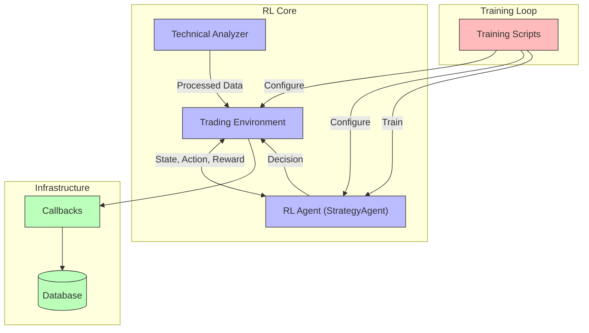

# ReinforceStrategyCreatorV2: Machine Learning Model Documentation

## Introduction

This document provides comprehensive documentation for the machine learning model used in the ReinforceStrategyCreatorV2 system. The system employs reinforcement learning (RL) to develop and optimize trading strategies for financial markets. This documentation is intended for developers, data scientists, and machine learning engineers working with or extending the system.

Reinforcement learning is particularly suitable for trading strategy development as it enables agents to learn optimal behaviors through trial and error interactions with a simulated market environment. Rather than requiring explicit programming of trading rules, RL agents can discover effective strategies by maximizing rewards over time.

### Overview of Reinforcement Learning in Trading

Reinforcement learning in trading involves:

1. **Agent**: The decision-making entity (StrategyAgent) that learns to make trading decisions 
2. **Environment**: A simulated market (TradingEnvironment) based on historical data
3. **State**: Representation of market conditions and portfolio status at each time step
4. **Actions**: Trading decisions (Flat/Long/Short positions)
5. **Rewards**: Feedback signals based on trading performance

The system aims to train an agent that can effectively navigate financial markets by learning the relationship between market states, actions, and resulting portfolio performance.

## Model Architecture

### High-Level Architecture

The machine learning component of ReinforceStrategyCreatorV2 is structured around a Deep Q-Network (DQN) reinforcement learning framework. The core components work together as follows:



### Key Components

#### 1. RL Agent (StrategyAgent)

The agent is implemented as a DQN (Deep Q-Network) agent in PyTorch. It processes state observations and learns to make optimal trading decisions through interaction with the environment.

#### 2. Trading Environment

A custom Gymnasium-compatible environment that simulates the market, processes agent actions, and provides rewards based on trading performance.

#### 3. Integration Framework

Ray/RLlib provides the distributed training framework that orchestrates the agent-environment interactions, parameter updates, and performance tracking.

## Theoretical Foundations

### RL Algorithms Implemented

The system implements a **Deep Q-Network (DQN)** algorithm, which combines Q-learning with deep neural networks to approximate value functions. This algorithm was originally introduced by [Mnih et al. (2015)](https://www.nature.com/articles/nature14236) and has become one of the foundational algorithms in deep reinforcement learning.

### Core DQN Components

1. **Q-Learning**: A model-free, value-based reinforcement learning algorithm that estimates the expected utility of taking a specific action in a specific state.

2. **Experience Replay**: Stores agent experiences `(state, action, reward, next_state, done)` in a buffer and samples from this buffer during training. This breaks correlations between consecutive experiences and stabilizes the learning process.

3. **Target Network**: Uses a separate network (target model) to generate target Q-values during training, updated less frequently than the main network to stabilize training.

4. **Epsilon-Greedy Exploration**: Balances exploration (random actions) and exploitation (best-known actions) using a decaying epsilon parameter.

### Mathematical Framework

The DQN algorithm aims to approximate the optimal action-value function:

$$Q^*(s, a) = \max_{\pi} \mathbb{E}\left[R_t \mid s_t = s, a_t = a, \pi\right]$$

Where:
- $Q^*(s, a)$ is the expected return when taking action $a$ in state $s$ and following the optimal policy thereafter
- $\pi$ is a policy mapping states to actions
- $\mathbb{E}$ denotes the expected value
- $R_t$ is the total discounted reward from time step $t$

The neural network is trained to minimize the loss function:

$$L(\theta) = \mathbb{E}[(r + \gamma \max Q(s', a'; \theta^-) \cdot (1 - done) - Q(s, a; \theta))^2]$$

Where:
- $\theta$ represents the parameters of the main network
- $\theta^-$ represents the parameters of the target network
- $\gamma$ is the discount factor
- $done$ is a binary flag indicating if the episode terminated

## Agent-Environment Interface

### State Representation

The state is represented as a vector containing:

1. **Market data features**: A sliding window of historical market data and technical indicators, normalized using z-score normalization.

2. **Account information**: Normalized balance and position value relative to the initial portfolio balance.

The observation space is defined as:

```python
self.observation_space = spaces.Box(
    low=-np.inf, high=np.inf, shape=(total_features,), dtype=np.float32
)
```

Where `total_features = (window_size * num_market_features) + num_portfolio_features`.

### Action Space

The action space is discrete with three possible actions:

- **0**: Flat (no position)
- **1**: Long position
- **2**: Short position

```python
self.action_space = spaces.Discrete(3)
```

### Reward Function Design

The reward function is designed to incentivize profitable trading while discouraging excessive risk and frequent trading:

```python
reward = risk_adjusted_return - trading_penalty - drawdown_penalty
```

Components:

1. **Risk-adjusted return**: Either Sharpe ratio (mean return divided by standard deviation) or simple percentage change in portfolio value.

2. **Trading frequency penalty**: A penalty proportional to the number of trades executed in the episode, discouraging excessive trading.

3. **Drawdown penalty**: A penalty proportional to the maximum portfolio value decline from its peak, encouraging capital preservation.

### Environment Constraints

The environment implements several realistic market constraints:

1. **Transaction fees**: Each trade incurs a percentage-based transaction fee.
2. **Stop-loss and take-profit mechanisms**: Optional automatic exit from positions when losses or gains reach certain thresholds.
3. **Position sizing**: Supports different position sizing methods (fixed fractional, all-in).
4. **Portfolio tracking**: Monitors portfolio value, balance, and position throughout the episode.

## Neural Network Structure

### Network Architecture

The RL agent uses a simple multilayer perceptron (MLP) architecture for the Q-network:

```python
def _build_model(self) -> nn.Module:
    """Builds the PyTorch model for the Q-network."""
    model = nn.Sequential(
        nn.Linear(self.state_size, 64),
        nn.ReLU(),
        nn.Linear(64, 64),
        nn.ReLU(),
        nn.Linear(64, self.action_size)  # Output layer, linear activation for Q-values
    )
    return model
```

### Layer Configurations

1. **Input Layer**: Takes in the state vector with size equal to `state_size`
2. **First Hidden Layer**: 64 neurons with ReLU activation
3. **Second Hidden Layer**: 64 neurons with ReLU activation
4. **Output Layer**: `action_size` (3) neurons with linear activation, representing the Q-values for each possible action

### Activation Functions

- **Hidden Layers**: ReLU (Rectified Linear Unit) - $f(x) = \max(0, x)$
- **Output Layer**: Linear - $f(x) = x$

ReLU activation is used for its computational efficiency and ability to mitigate the vanishing gradient problem, while linear activation is used in the output layer to produce unbounded Q-values.

### Optimization Methods

- **Optimizer**: Adam optimizer with configurable learning rate (default: 0.001)
- **Loss Function**: Mean Squared Error (MSE) between predicted Q-values and target Q-values
- **Experience Replay**: Randomly samples batches from experience buffer to break correlations between consecutive samples
- **Target Network**: Updated periodically (every `target_update_freq` steps) to stabilize learning

## Training Methodology

### Data Preprocessing

1. **Historical Data Fetching**: The system fetches OHLCV (Open, High, Low, Close, Volume) data from external sources (e.g., Yahoo Finance).

2. **Technical Indicator Calculation**: The Technical Analyzer calculates indicators such as:
   - RSI (Relative Strength Index)
   - MACD (Moving Average Convergence Divergence)
   - Bollinger Bands
   - ADX (Average Directional Index)
   - Aroon Indicators
   - ATR (Average True Range)
   - Historical Volatility

3. **Data Normalization**: Market features are normalized using a rolling z-score approach to ensure stable inputs to the neural network:
   ```python
   market_data_normalized = (market_data - current_mean.values) / current_std.values
   ```

4. **Sliding Window**: Observations include a window of historical data points to provide the agent with temporal context.

### Training Algorithms

The training process utilizes Ray/RLlib's implementation of DQN with the following key aspects:

1. **Experience Replay**: Experiences are stored in an `EpisodeReplayBuffer` with a capacity of 50,000 entries. Random sampling from this buffer helps break correlations between consecutive samples.

2. **Target Network**: A separate target network is used to generate target Q-values, updated every 500 timesteps to stabilize training.

3. **Epsilon-Greedy Exploration**: The agent uses an epsilon-greedy policy for exploration:
   - Starting epsilon: 1.0 (100% random actions)
   - Final epsilon: 0.01 (1% random actions)
   - Decay: Over 10,000 timesteps

4. **Batched Learning**: The agent learns from mini-batches of 32 experiences sampled from the replay buffer.

### Hyperparameter Selection Rationale

The system uses the following hyperparameters, chosen based on empirical performance and RL best practices:

| Hyperparameter | Value | Rationale |
|----------------|-------|-----------|
| Learning rate | 0.001 | Standard value for Adam optimizer, balances learning speed and stability |
| Gamma (discount factor) | 0.90 | Slightly lower than typical (0.99) to prioritize short-term rewards in financial markets |
| Replay buffer size | 10,000 | Large enough to break correlations while maintaining relevance to current policy |
| Batch size | 32 | Standard size for efficient GPU utilization and stable gradient updates |
| Target network update frequency | 500 timesteps | Provides stability while allowing reasonably frequent updates |
| Epsilon decay | From 1.0 to 0.01 over 10,000 timesteps | Allows sufficient exploration initially while transitioning to exploitation |
| Hidden layer size | 64 neurons | Sufficient capacity for the problem complexity while avoiding overfitting |

## Evaluation Framework

### Performance Metrics

The system tracks multiple performance metrics to evaluate the trading agent:

1. **Profit and Loss (PnL)**: The total return achieved by the agent over an episode.
   ```python
   info['pnl'] = self.portfolio_value - self.initial_balance
   ```

2. **Sharpe Ratio**: Measures risk-adjusted return by dividing mean returns by their standard deviation.
   ```python
   info['sharpe_ratio'] = (episode_returns_mean - self.risk_free_rate) / episode_returns_std
   ```

3. **Maximum Drawdown**: The largest percentage drop in portfolio value from a previous peak.
   ```python
   self.episode_max_drawdown = max(self.episode_max_drawdown, current_drawdown)
   ```

4. **Win Rate**: The percentage of trades that resulted in a profit.
   ```python
   info['win_rate'] = winning_trades / len(self._completed_trades) if len(self._completed_trades) > 0 else 0.0
   ```

5. **Total Reward**: The cumulative sum of rewards received during an episode.
   ```python
   info['total_reward'] = self._episode_total_reward
   ```

### Benchmark Comparisons

The system can be compared against:

1. **Buy-and-Hold Strategy**: A baseline strategy that buys the asset at the beginning of the testing period and holds until the end.
2. **Random Action Strategy**: A strategy that takes random actions at each step.
3. **Simple Moving Average Crossover**: A traditional algorithmic trading strategy.

### Backtesting Methodology

The backtesting process:

1. **Data Splitting**: Historical data is split into training and testing periods.
2. **Out-of-Sample Testing**: The trained model is evaluated on previously unseen market data.
3. **Walk-Forward Validation**: More advanced testing can use walk-forward analysis, where the model is periodically retrained as new data becomes available.
4. **Transaction Costs**: All backtests include realistic transaction fees.
5. **Position Sizing**: Realistic position sizing rules are applied.

## Hyperparameter Optimization Framework

To systematically improve model performance, the system now includes a comprehensive hyperparameter optimization framework that explores different configurations to find the optimal settings for trading.

### Optimization Approach

The hyperparameter optimization framework uses Ray Tune to perform a systematic search across the parameter space, evaluating each configuration based on key trading metrics:

1. **Search Space**: The framework explores a wide range of parameters including:
   - Environment parameters (transaction fees, window sizes, penalties, risk fractions)
   - Model architecture (network sizes, activation functions)
   - Training parameters (learning rates, batch sizes, discount factors)

2. **Evaluation Metrics**: Each configuration is evaluated based on:
   - Profit and Loss (PnL)
   - Sharpe Ratio
   - Maximum Drawdown
   - Win Rate

3. **Optimization Algorithm**: The framework uses the Asynchronous Successive Halving Algorithm (ASHA) to efficiently allocate resources to promising configurations.

4. **Visualization**: Results are visualized to understand parameter importance and relationships between hyperparameters and performance metrics.

### Implementation

The hyperparameter optimization is implemented in `hyperparameter_optimization.py` with the following key components:

```python
def hyperparameter_search() -> None:
    """Run hyperparameter search using Ray Tune."""
    # Define search space
    search_space = {
        "env_config": {
            "transaction_fee_percent": tune.uniform(0.0005, 0.002),
            "window_size": tune.choice([5, 10, 20]),
            # Additional environment parameters...
        },
        "model_config": {
            "fcnet_hiddens": tune.choice([
                [64, 64], [128, 128], [256, 256], [128, 64], [256, 128]
            ]),
            "fcnet_activation": tune.choice(["relu", "tanh", "sigmoid"])
        },
        "training_config": {
            "gamma": tune.uniform(0.8, 0.99),
            "lr": tune.loguniform(1e-5, 1e-3),
            # Additional training parameters...
        }
    }
    
    # Define scheduler
    scheduler = ASHAScheduler(
        metric="sharpe_ratio",
        mode="max",
        max_t=NUM_TRAINING_ITERATIONS,
        grace_period=10,
        reduction_factor=2
    )
    
    # Run hyperparameter search
    analysis = tune.run(
        train_evaluate,
        config=search_space,
        scheduler=scheduler,
        num_samples=20,
        resources_per_trial={"cpu": 4, "gpu": 0}
    )
```

## Model Evaluation System

A comprehensive model evaluation system has been implemented to assess model performance on test data and compare against benchmark strategies.

### Evaluation Methodology

The evaluation system:

1. **Test Data**: Evaluates the model on recent market data not seen during training.

2. **Multiple Episodes**: Runs multiple evaluation episodes to account for variability.

3. **Benchmark Comparison**: Compares against standard trading strategies:
   - Buy and Hold
   - Moving Average Crossover

4. **Detailed Metrics**: Calculates a comprehensive set of performance metrics:
   - Episode rewards
   - PnL distribution
   - Trade count and frequency
   - Action distribution
   - Portfolio value over time

5. **Visualization**: Creates visualizations to analyze model behavior and performance.

### Implementation

The evaluation system is implemented in `model_evaluation.py` with key functions:

```python
def evaluate_model(algo: DQN, test_data: pd.DataFrame, config: Dict[str, Any]) -> Dict[str, Any]:
    """Evaluate the model on test data."""
    # Create evaluation environment
    env = TradingEnv(env_config)
    
    # Run multiple evaluation episodes
    for episode in range(num_episodes):
        # Reset environment
        obs, _ = env.reset()
        done = False
        
        # Run episode
        while not done:
            # Get action from model
            action = algo.compute_single_action(obs, explore=False)
            
            # Step environment
            next_obs, reward, done, truncated, info = env.step(action)
            
            # Update metrics
            # ...
    
    # Calculate aggregate metrics
    metrics["mean_reward"] = np.mean(metrics["episode_rewards"])
    metrics["mean_pnl"] = np.mean(metrics["episode_pnls"])
    metrics["win_rate"] = np.mean([pnl > 0 for pnl in metrics["episode_pnls"]])
    metrics["sharpe_ratio"] = np.mean(metrics["episode_pnls"]) / (np.std(metrics["episode_pnls"]) + 1e-6)
    metrics["max_drawdown"] = np.mean(max_drawdowns)
    
    return metrics
```

## Paper Trading Integration

The system now includes a complete pipeline for exporting trained models to paper trading environments, with specific support for Interactive Brokers.

### Paper Trading Architecture

The paper trading integration consists of:

1. **Model Export**: Functionality to export trained models in a format suitable for inference:
   - PyTorch model weights
   - Model architecture configuration
   - Environment configuration

2. **Inference Module**: A standalone module for making predictions with the exported model:
   - Observation preprocessing
   - Model inference
   - Action selection

3. **Interactive Brokers Integration**: Components for connecting to Interactive Brokers:
   - Account management
   - Market data retrieval
   - Order execution
   - Position tracking

4. **Trading Logic**: Implementation of trading rules based on model predictions:
   - Position sizing
   - Risk management
   - Trading hours enforcement
   - Performance logging

### Implementation

The paper trading system is implemented across several files:

1. `export_for_paper_trading.py`: Exports models and creates the paper trading infrastructure.
2. `paper_trading.py`: Main script for running the paper trading system.
3. `ib_client.py`: Interactive Brokers client implementation.

Key components include:

```python
class PaperTradingSystem:
    def __init__(self, model_dir: str, config_file: str = "paper_trading_config.json"):
        """Initialize the paper trading system."""
        # Load model and configuration
        self.model = TradingModelInference(model_dir)
        self.ib_client = None
        
    def connect_to_ib(self) -> None:
        """Connect to Interactive Brokers."""
        ib_config = self.config["interactive_brokers"]
        self.ib_client = connect_to_ib(
            host=ib_config["host"],
            port=ib_config["port"],
            client_id=ib_config["client_id"]
        )
    
    def run_trading_loop(self, interval_seconds: int = 300) -> None:
        """Run the trading loop."""
        while True:
            # Check trading hours
            # Get market data
            df = self.get_market_data()
            
            # Prepare observation
            observation = self.prepare_observation(df)
            
            # Get model prediction
            action = self.model.predict(observation)
            
            # Execute trade
            self.execute_trade(action)
            
            # Wait for next interval
            time.sleep(interval_seconds)
```

## Limitations and Future Work

### Known Limitations

1. **Limited Market Regime Adaptation**: The current model might struggle to adapt to dramatic changes in market regimes.

2. **Fixed Action Space**: The agent can only take discrete actions (Flat/Long/Short) without position sizing flexibility.

3. **Limited Feature Engineering**: While the system includes standard technical indicators, it lacks more sophisticated features like sentiment analysis or macroeconomic indicators.

4. **Single Asset Focus**: The current implementation focuses on trading a single asset rather than managing a portfolio.

5. **GPU Utilization**: The current implementation does not fully leverage GPU acceleration for large-scale training.

6. **Paper Trading Limitations**: The current paper trading implementation has limited risk management capabilities and may require further refinement for live trading.

### Potential Improvements

1. **Advanced RL Algorithms**: Implement more sophisticated algorithms like PPO (Proximal Policy Optimization) or SAC (Soft Actor-Critic).

2. **Continuous Action Space**: Allow for more nuanced position sizing by implementing a continuous action space.

3. **Transfer Learning**: Apply transfer learning techniques to reuse knowledge across different assets or market conditions.

4. **Feature Enhancement**: Incorporate additional data sources, including:
   - Market sentiment from news and social media
   - Macroeconomic indicators
   - Order book data for higher-frequency strategies
   - Cross-asset correlations

5. **Ensemble Methods**: Combine predictions from multiple agents trained with different hyperparameters or objectives.

6. **Advanced Risk Management**: Implement more sophisticated risk management techniques in the paper trading system.

### Research Directions

1. **Multi-Agent Systems**: Develop a system where multiple specialized agents collaborate on different aspects of trading (e.g., entry timing, exit timing, position sizing).

2. **Meta-Learning**: Investigate meta-learning approaches where the agent learns to quickly adapt to new market conditions.

3. **Explainable AI**: Develop methods to interpret and explain the agent's decision-making process for greater transparency and trust.

4. **Risk Management**: Research more sophisticated risk management techniques beyond simple stop-loss mechanisms.

5. **Hierarchical RL**: Implement hierarchical approaches where high-level agents make strategic decisions and low-level agents execute tactical trades.

6. **Market Regime Detection**: Develop methods to automatically detect and adapt to different market regimes.

## Conclusion

The machine learning model in ReinforceStrategyCreatorV2 implements a DQN-based reinforcement learning system designed specifically for trading strategy development. The combination of a sophisticated trading environment, strategic reward design, and stable learning algorithms provides a solid foundation for automated trading strategy creation.

With the addition of the hyperparameter optimization framework, comprehensive model evaluation system, and paper trading integration, the system now offers a complete pipeline from model training to real-world deployment. This enables iterative improvement of trading strategies based on rigorous evaluation metrics before deploying to paper trading environments.

While the current implementation has proven effective in certain market conditions, there remain significant opportunities for enhancement and extension. The modular architecture of the system facilitates ongoing improvements and adaptations to evolving financial markets.