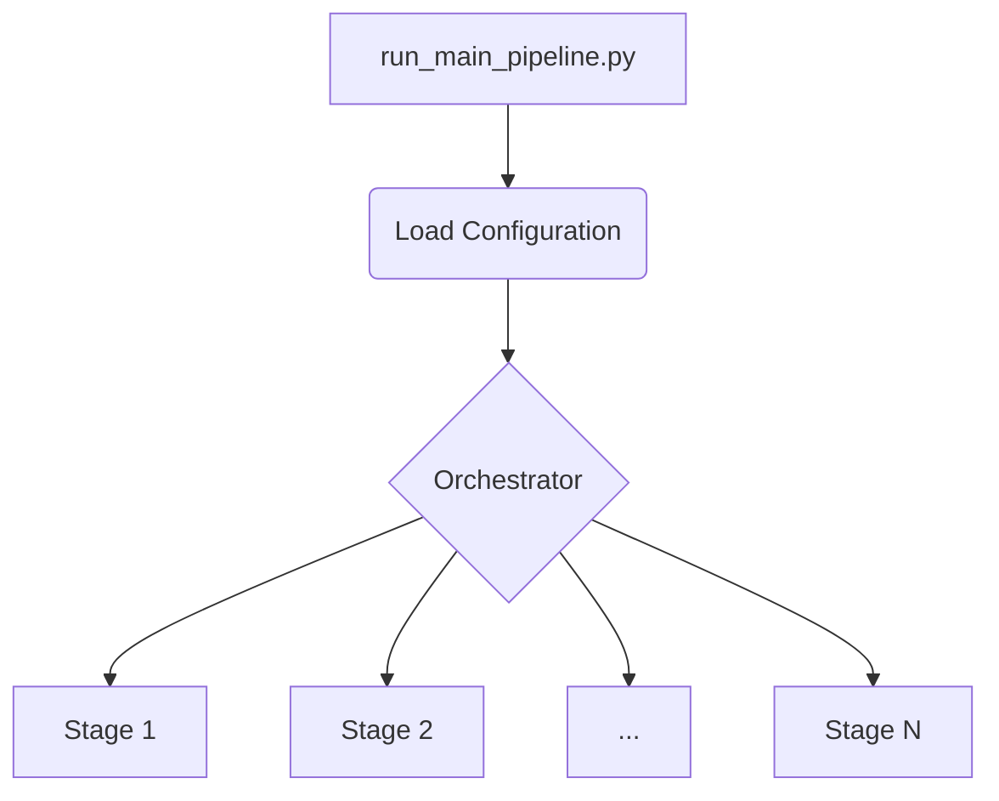

# 1. Introduction

### 1.1. Purpose of the Pipeline
The ReinforceStrategyCreator Pipeline is a production-grade, modular system designed for the comprehensive development of reinforcement learning (RL) trading strategies. Its primary purpose is to transform the existing test harness into a robust, maintainable pipeline suitable for production use and paper trading. It facilitates the training, rigorous evaluation, and deployment of RL models tailored for financial markets.
> **Note on Trading Environment:** The ReinforceStrategyCreator Pipeline is designed for **simulated paper trading**. This involves using frequently refreshed real market data for feature engineering and signal generation, with subsequent order execution simulated. It is not yet connected to a live brokerage for real-time order submission or management of a live paper trading account.

### 1.2. Target Audience
This documentation is intended for:
*   Data Scientists
*   Quant Analysts
*   ML Engineers

These professionals will find guidance on utilizing the pipeline for developing, testing, and deploying RL-based trading strategies.

### 1.3. High-Level Architecture
The pipeline follows a modular architecture, orchestrated to manage the end-to-end lifecycle of an RL trading strategy. It begins with configuration loading, followed by the execution of various stages managed by a central orchestrator.



### 1.4. Key Features
The ReinforceStrategyCreator Pipeline offers a rich set of features:
*   **Modular Architecture**: Ensures clear separation of concerns with dedicated components for data management, model training, evaluation, and deployment.
*   **Hyperparameter Optimization**: Integrated support for advanced HPO frameworks like Ray Tune and Optuna.
*   **Cross-Validation**: Provides robust model selection capabilities using multiple performance metrics.
*   **Monitoring**: Enables real-time performance tracking through Datadog integration.
*   **Deployment Ready**: Supports both paper trading and live deployment scenarios.
*   **Extensible**: Designed for easy addition of new models, data sources, and evaluation metrics.

### 1.5. Project Structure Overview
The project is organized as follows to maintain clarity and modularity:

```
reinforcestrategycreator_pipeline/
├── configs/              # Configuration files (base, environments)
├── src/                  # Source code for all pipeline components
│   ├── pipeline/         # Pipeline orchestration logic (e.g., ModelPipeline)
│   ├── data/             # Data ingestion, processing, and management
│   ├── models/           # RL model implementations and factory
│   ├── training/         # Training engine and HPO integration
│   ├── evaluation/       # Evaluation framework and metrics calculation
│   ├── deployment/       # Deployment manager for paper/live trading
│   ├── monitoring/       # Monitoring services and Datadog integration
│   ├── config/           # Configuration loading and management utilities
│   └── artifact_store/   # Artifact storage and versioning (models, data, results)
├── scripts/              # Utility scripts for various tasks
├── tests/                # Unit, integration, and end-to-end tests
├── artifacts/            # Default local storage for model artifacts and results
├── logs/                 # Application and pipeline execution logs
└── docs/                 # Project documentation