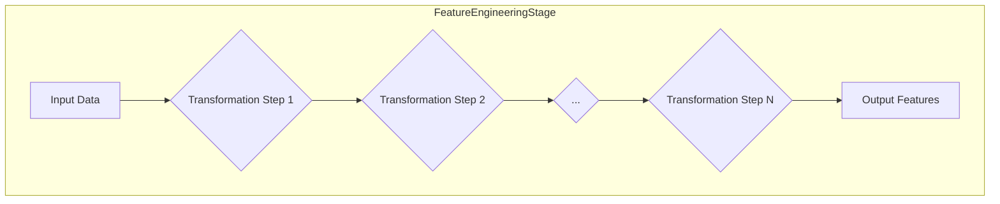
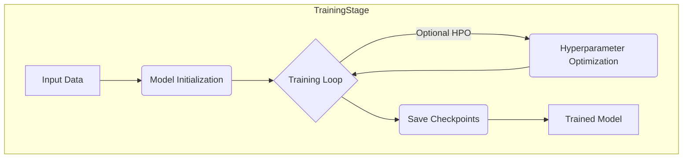

# 5. Core Pipeline Stages

The ReinforceStrategyCreator Pipeline is composed of several core stages, each responsible for a specific part of the strategy development lifecycle. These stages are defined in `pipelines_definition.yaml` and configured via `pipeline.yaml`.

### 5.1. Data Ingestion Stage (`DataIngestionStage`)
The `DataIngestionStage`, defined by the class `reinforcestrategycreator_pipeline.src.pipeline.stages.data_ingestion.DataIngestionStage`, is the first crucial step in the pipeline. It handles the retrieval, initial processing, and validation of market data.

#### 5.1.1. Responsibilities
*   **Fetching Data:** Acquiring raw financial data (e.g., price, volume) for the specified symbols and date range from configured sources.
*   **Caching Data:** Storing downloaded or processed data locally to speed up subsequent pipeline runs and reduce redundant API calls or file reads, if `data.cache_enabled` is `true`.
*   **Initial Validation:** Performing basic checks on the ingested data to ensure its integrity and suitability for downstream processing, if `data.validation_enabled` is `true`. This might include checks for missing values, correct data types, or unexpected outliers.
*   **Outputting Data:** Providing the cleaned and validated dataset to the next stage in the pipeline, typically the Feature Engineering Stage.

#### 5.1.2. Supported Data Sources
The stage supports various data sources, configured via the `data.source_type` parameter in `pipeline.yaml`:
*   **CSV Files:** When `data.source_type` is set to `"csv"`, the stage reads data from a local CSV file specified by `data.source_path`.
*   **API Endpoints:** If configured for API access (e.g., `data.source_type: "api"`), the stage would fetch data from the URL defined in `data.api_endpoint`, using credentials like `data.api_key` if necessary. (Note: The provided `pipeline.yaml` has API settings commented out, defaulting to CSV).

The specific symbols (e.g., `"AAPL"`, `"GOOGL"`) and the date range (`data.start_date`, `data.end_date`) for data ingestion are also defined in `pipeline.yaml`.

#### 5.1.3. Data Caching Mechanism
To optimize performance and reduce costs associated with data fetching, the `DataIngestionStage` implements a caching mechanism.
*   If `data.cache_enabled` is `true` in `pipeline.yaml`, successfully fetched and potentially preprocessed data for a given set of parameters (symbols, date range, source) is stored in the directory specified by `data.cache_dir`.
*   On subsequent runs with the same parameters, the stage first checks the cache. If valid cached data exists, it is loaded directly, bypassing the fetching process.

#### 5.1.4. Initial Data Validation
If `data.validation_enabled` is `true`, the stage performs initial validation checks on the raw data. These checks might include:
*   Verifying the presence of required columns (e.g., Open, High, Low, Close, Volume, Timestamp).
*   Checking for and handling missing values according to a predefined strategy (e.g., forward-fill, interpolation, or raising an error).
*   Ensuring data types are correct.
*   Identifying and potentially flagging or handling outliers.

The goal of this validation is to ensure a baseline level of data quality before it enters the more complex feature engineering and model training stages.

```mermaid
graph LR
    subgraph DataIngestionStage
        direction LR
        A[Data Sources (CSV, API)] --> B(Fetcher);
        B --> C(Cache);
        C --> D(Validator);
        D --> E[Output Data];
    end
```
### 5.2. Feature Engineering Stage (`FeatureEngineeringStage`)
Following data ingestion, the `FeatureEngineeringStage` (defined by `reinforcestrategycreator_pipeline.src.pipeline.stages.feature_engineering.FeatureEngineeringStage`) takes the processed market data and enriches it by creating new features. These features are designed to provide more relevant signals to the reinforcement learning model.

#### 5.2.1. Responsibilities
*   **Transforming Raw Data:** Applying various mathematical and statistical transformations to the input data (e.g., price series, volume).
*   **Creating New Features:** Generating new columns in the dataset that represent potentially predictive signals. This can include technical indicators, price transformations, volatility measures, etc.
*   **Handling Missing Values:** Addressing any missing values that might arise during feature calculation.
*   **Outputting Enriched Data:** Providing the dataset, now augmented with new features, to the Training Stage.

#### 5.2.2. Configurable Transformations
The specific transformations applied by this stage can be configured in the `data.transformation` section of `pipeline.yaml`.
*   **Technical Indicators:** An example configuration is `add_technical_indicators: false`. If set to `true`, the stage would likely compute a predefined set of common technical indicators (e.g., Moving Averages, RSI, MACD, Bollinger Bands). The exact list of indicators and their parameters might be further configurable within the stage's implementation or a more detailed configuration block.
*   **Other Transformations:** The stage might support other types of feature engineering, such as:
    *   Lagged features (e.g., previous day's return).
    *   Price transformations (e.g., log returns, percentage change).
    *   Volatility measures (e.g., rolling standard deviation).
    *   Interaction features.

The specific transformations available out-of-the-box would be detailed in the stage's own documentation or discoverable through its configuration options.

#### 5.2.3. Extensibility: Adding Custom Feature Transformations
A key aspect of a robust pipeline is the ability to easily add custom feature engineering logic. The `FeatureEngineeringStage` should be designed to be extensible, allowing users to:
*   Define new feature calculation functions or classes.
*   Integrate these custom transformations into the pipeline, potentially by registering them or specifying them in the configuration.
This allows data scientists and quants to experiment with novel features tailored to their specific strategies without modifying the core pipeline code extensively.


### 5.3. Training Stage (`TrainingStage`)
The `TrainingStage`, implemented by the class `reinforcestrategycreator_pipeline.src.pipeline.stages.training.TrainingStage`, is at the heart of the pipeline. It takes the feature-enriched data and uses it to train the specified reinforcement learning model.

#### 5.3.1. Responsibilities
*   **Model Initialization:** Instantiating the RL model based on the `model.model_type` (e.g., "DQN") and its `model.hyperparameters` from `pipeline.yaml`.
*   **Training Loop Execution:** Running the main training loop for the specified number of `training.episodes`. This involves agent-environment interaction, experience collection, and model updates.
*   **Hyperparameter Management:** Utilizing the configured training hyperparameters (learning rate, batch size, discount factor, exploration parameters, etc.) from the `training` section of `pipeline.yaml`.
*   **Checkpointing:** Periodically saving the model's state (weights, optimizer state, training progress) to the `model.checkpoint_dir` at the frequency defined by `model.save_frequency`. This allows for resuming training if interrupted and for saving intermediate models.
*   **Resuming Training:** Optionally loading a model from a specified `model.load_checkpoint` to continue a previous training run.
*   **Logging and Monitoring:** Logging training progress (e.g., episode rewards, loss values) and, if `training.use_tensorboard` is `true`, writing logs to `training.log_dir` for visualization in TensorBoard.
*   **Outputting Trained Model:** Providing the trained model artifact (or a reference to it) to the Evaluation Stage.

#### 5.3.2. Model Factory and Model Types
The pipeline supports various RL model types, as specified by `model.model_type` in `pipeline.yaml` (e.g., "DQN", "PPO", "A2C"). A model factory (likely located in `src/models/factory.py` or similar) is typically responsible for:
*   Registering available model implementations.
*   Instantiating the correct model class based on the `model_type` configuration.
*   Passing the `model.hyperparameters` to the model during its initialization.
This factory pattern allows for easy extension with new custom model architectures.

#### 5.3.3. Training Loop and Hyperparameters
The core of the `TrainingStage` is the training loop, which is governed by parameters in the `training` section of `pipeline.yaml`:
*   `episodes`: Total number of interactions with the environment.
*   `batch_size`: Number of experiences sampled from the replay buffer for each model update.
*   `learning_rate`: Step size for the optimizer.
*   `gamma`: Discount factor for future rewards.
*   Exploration parameters like `epsilon_start`, `epsilon_end`, and `epsilon_decay` control the balance between exploration and exploitation.
*   `replay_buffer_size`: Capacity of the buffer storing past experiences.
*   `target_update_frequency`: For models like DQN, how often the target network is updated.
*   `validation_split`: If applicable during training for early stopping or hyperparameter tuning within the training stage itself.
*   `early_stopping_patience`: Number of episodes/epochs without improvement on a validation metric before halting training.

#### 5.3.4. Checkpointing and Resuming Training
To ensure fault tolerance and allow for iterative training:
*   **Saving Checkpoints:** The stage saves model checkpoints (including model weights, optimizer state, and current episode/epoch) to the directory specified by `model.checkpoint_dir`. The `model.save_frequency` parameter determines how often these checkpoints are saved (e.g., every 10 episodes).
*   **Loading Checkpoints:** If `model.load_checkpoint` in `pipeline.yaml` is set to a valid path of a previously saved checkpoint, the `TrainingStage` will load this checkpoint and resume training from that state. If it's `null` or not provided, training starts from scratch.

#### 5.3.5. Hyperparameter Optimization (HPO) Integration
The pipeline supports Hyperparameter Optimization (HPO) to find the best set of hyperparameters for the models. The `README.md` mentions integration with **Ray Tune** and **Optuna**.
*   The `TrainingStage` would likely interact with an HPO orchestrator (which might be part of the stage itself or a separate HPO-specific stage/module).
*   The HPO process typically involves:
    *   Defining a search space for hyperparameters (e.g., ranges for learning rate, batch size, network architecture).
    *   Running multiple training trials with different hyperparameter combinations.
    *   Evaluating each trial based on a chosen metric (e.g., validation Sharpe ratio).
    *   Using an algorithm (e.g., Bayesian optimization, random search) to guide the search for optimal hyperparameters.
*   Configuration for HPO (e.g., search space, number of trials, optimization algorithm) would likely reside in a dedicated HPO section within `pipeline.yaml` or a separate HPO configuration file (e.g., `configs/base/hpo.yaml`).


### 5.4. Evaluation Stage (`EvaluationStage`)
Once a model has been trained, the `EvaluationStage` (class `reinforcestrategycreator_pipeline.src.pipeline.stages.evaluation.EvaluationStage`) is responsible for rigorously assessing its performance on unseen data. This stage provides quantitative insights into the strategy's effectiveness and robustness.

#### 5.4.1. Responsibilities
*   **Loading Trained Model:** Acquiring the trained model artifact from the Training Stage or the artifact store.
*   **Preparing Test Data:** Using a dedicated portion of the data (test set, distinct from training and validation sets) for evaluation.
*   **Running Test Episodes:** Executing the trained agent in the test environment for a specified number of `evaluation.test_episodes`.
*   **Calculating Performance Metrics:** Computing a suite of predefined performance metrics to quantify various aspects of the trading strategy.
*   **Benchmarking:** Comparing the model's performance against specified benchmark strategies or assets.
*   **Generating Reports and Visualizations:** Creating comprehensive reports and plots summarizing the evaluation results.
*   **Saving Results:** Storing the detailed evaluation outcomes and artifacts if `evaluation.save_results` is `true`.

#### 5.4.2. Evaluation Metrics
The pipeline calculates a variety of metrics as defined in the `evaluation.metrics` list within `pipeline.yaml`. Common financial and strategy-specific metrics include:
*   `sharpe_ratio`: Risk-adjusted return.
*   `total_return`: Overall percentage gain or loss.
*   `max_drawdown`: Largest peak-to-trough decline during a specific period.
*   `win_rate`: Percentage of profitable trades.
*   `profit_factor`: Gross profit divided by gross loss.
*   `pnl_percentage`: Profit and Loss percentage.
Other custom metrics relevant to RL trading strategies might also be included.

#### 5.4.3. Benchmarking
To provide context for the model's performance, the `EvaluationStage` compares it against benchmarks.
*   The `evaluation.benchmark_symbols` list in `pipeline.yaml` (e.g., `["SPY"]`) specifies assets or simple strategies (like buy-and-hold) to use for comparison.
*   The evaluation report will typically show the model's metrics alongside those of the benchmarks.

#### 5.4.4. Report Generation
Comprehensive reports are generated to summarize the evaluation findings.
*   The `evaluation.report_formats` parameter in `pipeline.yaml` (e.g., `["html", "markdown"]`) dictates the output formats for these reports.
*   Reports typically include:
    *   Summary of model and data used.
    *   Key performance metrics.
    *   Comparison against benchmarks.
    *   Visualizations (if `evaluation.generate_plots` is `true`).
    *   Trade logs or equity curves.

#### 5.4.5. Visualization of Results
If `evaluation.generate_plots` is enabled, the stage produces various plots to help visualize the strategy's performance. These might include:
*   Equity curve over time.
*   Distribution of returns.
*   Drawdown plots.
*   Comparisons with benchmark equity curves.

These visualizations are often embedded in the generated reports or saved as separate image files. The results, if `evaluation.save_results` is true, are stored in the `evaluation.results_dir`.

```mermaid
graph TD
    subgraph EvaluationStage
        A[Trained Model] --> C{Metric Calculation};
        B[Test Data] --> C;
        C --> D(Benchmarking);
        D --> E(Report Generation);
        D --> F(Plot Generation);
    end