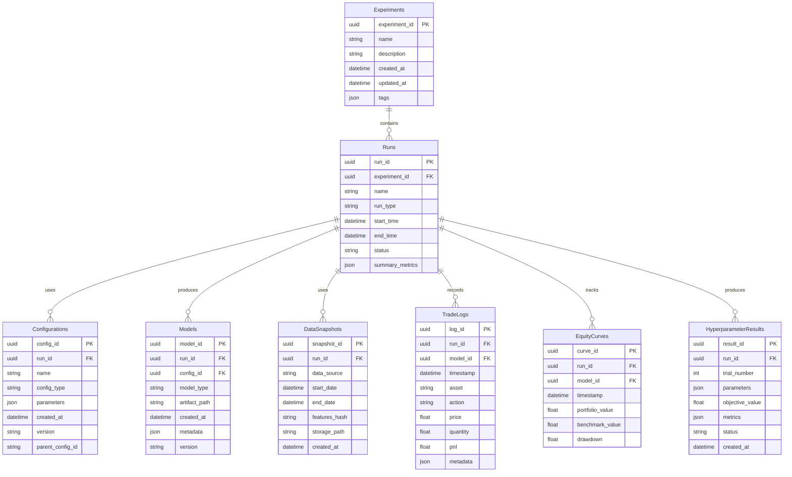

# Trading Model Optimization Pipeline: Technical Specification

## 1. Introduction

This document provides technical specifications for the Trading Model Optimization Pipeline, a comprehensive framework designed to develop, evaluate, optimize, and deploy trading models. The pipeline supports iterative model development, maintains comprehensive result history, and ensures reproducibility of experiments.

## 2. Component Diagram


## 3. Interface Definitions

### 3.1 Data Flow and Formats

#### 3.1.1 Data Management Module Interfaces

| Interface | Input | Output | Format | Description |
|-----------|-------|--------|--------|-------------|
| `fetch_market_data` | ticker, start_date, end_date | raw market data | Pandas DataFrame | Retrieves historical market data |
| `preprocess_data` | raw market data | processed data | Pandas DataFrame | Cleans and preprocesses raw data |
| `calculate_features` | processed data | feature data | Pandas DataFrame | Calculates technical indicators and features |
| `get_training_data` | feature data, config | training dataset | Dict of DataFrames | Prepares data for model training |
| `get_validation_data` | feature data, config | validation dataset | Dict of DataFrames | Prepares data for model validation |
| `save_data_snapshot` | feature data | snapshot_id | String | Creates a versioned snapshot of data for reproducibility |

**Data Format Standards:**
- Time-series data stored as Pandas DataFrames with DateTime index
- Feature data includes OHLCV and calculated indicators
- Binary serialization using Parquet format for efficient storage
- Metadata in JSON format for data provenance and versioning

#### 3.1.2 Training Module Interfaces

| Interface | Input | Output | Format | Description |
|-----------|-------|--------|--------|-------------|
| `train_model` | training_data, config | trained_model | Model object | Trains a model using specified configuration |
| `save_model` | trained_model, metadata | model_id | String | Saves trained model with metadata |
| `load_model` | model_id | trained_model | Model object | Loads a previously trained model |
| `compile_model` | trained_model, target_platform | compiled_model | Binary | Optimizes model for specific deployment target |

### 3.2 Configuration Management

#### 3.2.1 Configuration Schema

Configuration files use YAML format with the following structure:

```yaml
# Example configuration schema
version: "1.0"
experiment:
  name: "momentum_strategy_optimization"
  description: "Optimizing momentum-based trading strategy"
  tags: ["momentum", "optimization", "short-term"]
  
data:
  tickers: ["SPY", "QQQ", "IWM"]
  start_date: "2020-01-01"
  end_date: "2024-01-01"
  features:
    - "rsi"
    - "macd"
    - "bollinger_bands"
    - "atr"
  normalization: "z_score"
  
model:
  type: "dqn"
  network:
    architecture: "mlp"
    hidden_layers: [128, 64]
    activation: "relu"
    dropout: 0.2
  training:
    batch_size: 64
    learning_rate: 0.0001
    optimizer: "adam"
    episodes: 1000
    
hyperparameter_tuning:
  algorithm: "bayesian"
  metric: "sharpe_ratio"
  search_space:
    learning_rate: 
      range: [0.00001, 0.01]
      distribution: "log_uniform"
    hidden_layers:
      values: [[64, 32], [128, 64], [256, 128, 64]]
    dropout:
      range: [0.0, 0.5]
      distribution: "uniform"
  scheduler:
    type: "asha"
    max_iterations: 100
    grace_period: 10
    
evaluation:
  metrics: ["sharpe_ratio", "sortino_ratio", "max_drawdown", "win_rate"]
  walk_forward:
    window_size: 90
    step_size: 30
    windows: 5
  out_of_sample:
    test_size: 0.2
    recent_period: "1Y"
    
risk_management:
  max_drawdown_limit: 0.15
  position_sizing: "kelly"
  stop_loss_pct: 0.05
  max_leverage: 2.0
  
monitoring:
  comparison_frequency: "daily"
  alert_threshold: 0.1
  metrics_to_monitor: ["pnl", "drawdown", "win_rate"]
  
paper_trading:
  capital: 100000
  simulation_days: 30
  evaluation_criteria:
    min_sharpe: 1.0
    max_drawdown: 0.1
    min_trades: 20
    
transition:
  requirements:
    min_paper_trading_days: 30
    max_deviation_backtest: 0.15
    min_profitability_ratio: 1.2
  approval_flow: ["risk_review", "performance_review"]
```

#### 3.2.2 Configuration Management Interfaces

| Interface | Input | Output | Format | Description |
|-----------|-------|--------|--------|-------------|
| `load_config` | config_path | config_object | Dict | Loads configuration from file |
| `validate_config` | config_object | validation_result | Bool/Errors | Validates configuration against schema |
| `save_config` | config_object | config_id | String | Saves configuration with unique ID |
| `update_config` | config_id, updates | updated_config | Dict | Updates specific configuration parameters |
| `get_experiment_configs` | experiment_id | list of configs | List[Dict] | Retrieves all configurations for an experiment |

### 3.3 Common Metric Calculations

#### 3.3.1 Metric Calculation Interfaces

| Interface | Input | Output | Format | Description |
|-----------|-------|--------|--------|-------------|
| `calculate_performance_metrics` | trade_history, portfolio_values | performance_metrics | Dict | Calculates common performance metrics |
| `calculate_risk_metrics` | trade_history, portfolio_values | risk_metrics | Dict | Calculates risk-related metrics |
| `calculate_trading_metrics` | trade_history | trading_metrics | Dict | Calculates trading-specific metrics |
| `compare_metrics` | metrics_a, metrics_b | comparison | Dict | Compares two sets of metrics |
| `aggregate_metrics` | list_of_metrics | aggregated_metrics | Dict | Aggregates metrics across multiple runs |

#### 3.3.2 Standard Metrics

**Performance Metrics:**
- Sharpe Ratio
- Sortino Ratio
- CAGR (Compound Annual Growth Rate)
- Total Return
- Alpha
- Beta

**Risk Metrics:**
- Maximum Drawdown
- Value at Risk (VaR)
- Conditional Value at Risk (CVaR)
- Volatility
- Downside Deviation

**Trading Metrics:**
- Win Rate
- Profit Factor
- Average Win/Loss Ratio
- Expected Payoff
- Number of Trades

### 3.4 Result Storage and History Tracking

#### 3.4.1 Result Storage Interfaces

| Interface | Input | Output | Format | Description |
|-----------|-------|--------|--------|-------------|
| `save_experiment_run` | experiment_data | run_id | String | Saves experiment run details |
| `save_training_results` | run_id, training_metrics | success | Bool | Saves training metrics for a run |
| `save_evaluation_results` | run_id, evaluation_metrics | success | Bool | Saves evaluation metrics for a run |
| `save_hyperparameter_results` | run_id, hyperparameter_results | success | Bool | Saves hyperparameter optimization results |
| `save_trade_log` | run_id, trade_history | success | Bool | Saves detailed trade history |
| `save_equity_curve` | run_id, equity_curve | success | Bool | Saves portfolio equity curve |
| `get_experiment_history` | experiment_id | experiment_history | Dict | Retrieves full experiment history |
| `get_model_history` | model_id | model_history | Dict | Retrieves model evolution history |

## 4. Technical Requirements

### 4.1 Database Schema for Results Tracking

The database schema is designed to efficiently store and query experiment results, model configurations, and performance metrics.



### 4.2 Parallelization Approach for Compute-Intensive Components

The trading model optimization pipeline leverages parallel and distributed computing frameworks to accelerate compute-intensive tasks:

#### 4.2.1 Ray Framework Integration

- **Task Parallelism**: Uses Ray's task parallelism for independent tasks (feature calculation, model evaluation)
- **Actor Model**: Implements stateful computations as Ray Actors
- **Resource Management**: Configures CPU and GPU allocation for efficient hardware utilization
- **Fault Tolerance**: Leverages Ray's fault tolerance capabilities for long-running tasks

#### 4.2.2 Hyperparameter Tuning Parallelization

- **Parallel Trials**: Runs multiple hyperparameter configurations simultaneously
- **ASHA Scheduler**: Implements Asynchronous Successive Halving Algorithm to terminate underperforming trials
- **Bayesian Optimization**: Uses concurrent Bayesian optimization for efficient hyperparameter search
- **Checkpointing**: Saves training progress for fault tolerance and resume capability

#### 4.2.3 Walk-Forward Analysis Parallelization

- **Independent Windows**: Processes walk-forward windows in parallel
- **Model Training Distribution**: Distributes model training across available cores
- **Dynamic Task Scaling**: Scales tasks based on available computational resources
- **Result Aggregation**: Efficiently combines results from parallel evaluations

#### 4.2.4 Containerization Strategy

- **Docker Containers**: Packages components with dependencies for consistent environments
- **Container Orchestration**: Coordinates containers for distributed workloads
- **State Management**: Handles state persistence between container deployments
- **Image Versioning**: Maintains versioned container images for reproducibility

### 4.3 Visualization/Dashboard Requirements

The visualization system provides intuitive interfaces for analyzing model performance, hyperparameter effects, and trading patterns:

#### 4.3.1 Dashboard Features

- **Experiment Browser**: Navigate and filter experiments, runs, and models
- **Performance Dashboard**: Display key performance metrics and equity curves
- **Hyperparameter Analysis**: Visualize hyperparameter importance and correlations
- **Trade Analysis**: Analyze individual trades and trading patterns
- **Comparison Tool**: Compare performance across multiple models
- **Risk Analysis**: Visualize risk metrics and drawdown periods
- **Sensitivity Analysis**: Display model sensitivity to parameter changes
- **Paper vs. Backtest Comparison**: Compare paper trading results with backtest projections

#### 4.3.2 Visualization Components

- **Interactive Charts**: Time-series charts with zoom, pan, and selection
- **Heatmaps**: Parameter correlation and sensitivity visualization
- **Scatter Plots**: Performance metric relationships
- **Histograms**: Distribution of returns, trade sizes, and other metrics
- **Equity Curves**: Portfolio value over time with benchmark comparison
- **Drawdown Charts**: Visualize drawdown periods and recovery
- **Parameter Importance Plots**: Display feature and hyperparameter importance
- **Decision Analysis**: Visualize model decision boundaries and thresholds

#### 4.3.3 Dashboard Architecture

- **Frontend**: Interactive web interface built with React and D3.js
- **Backend API**: RESTful API for data retrieval and transformation
- **Caching Layer**: Redis-based caching for frequent queries
- **Authentication**: Secure access control for dashboard users
- **Real-time Updates**: WebSocket functionality for live monitoring
- **Export Capability**: Export visualizations and reports in various formats

## 5. Data Flow Diagrams

### 5.1 Training and Hyperparameter Tuning Flow


### 5.2 Model Evaluation and Deployment Flow


## 6. Configuration Schema

### 6.1 Experiment Configuration Schema

The following JSON Schema defines the structure for experiment configuration files:

```json
{
  "$schema": "http://json-schema.org/draft-07/schema#",
  "title": "Trading Model Optimization Pipeline Configuration",
  "type": "object",
  "required": ["version", "experiment", "data", "model"],
  "properties": {
    "version": {
      "type": "string",
      "description": "Configuration schema version"
    },
    "experiment": {
      "type": "object",
      "required": ["name"],
      "properties": {
        "name": {
          "type": "string",
          "description": "Name of the experiment"
        },
        "description": {
          "type": "string",
          "description": "Detailed description of the experiment"
        },
        "tags": {
          "type": "array",
          "items": {
            "type": "string"
          },
          "description": "Tags for categorizing the experiment"
        }
      }
    },
    "data": {
      "type": "object",
      "required": ["tickers", "start_date", "end_date"],
      "properties": {
        "tickers": {
          "type": "array",
          "items": {
            "type": "string"
          },
          "description": "List of ticker symbols to use"
        },
        "start_date": {
          "type": "string",
          "format": "date",
          "description": "Start date for data collection (YYYY-MM-DD)"
        },
        "end_date": {
          "type": "string",
          "format": "date",
          "description": "End date for data collection (YYYY-MM-DD)"
        },
        "features": {
          "type": "array",
          "items": {
            "type": "string"
          },
          "description": "List of technical indicators to calculate"
        },
        "normalization": {
          "type": "string",
          "enum": ["none", "min_max", "z_score", "robust"],
          "description": "Data normalization method"
        }
      }
    },
    "model": {
      "type": "object",
      "required": ["type"],
      "properties": {
        "type": {
          "type": "string",
          "enum": ["dqn", "ppo", "a2c", "sac", "custom"],
          "description": "Type of reinforcement learning algorithm"
        },
        "network": {
          "type": "object",
          "properties": {
            "architecture": {
              "type": "string",
              "enum": ["mlp", "lstm", "cnn", "transformer", "custom"],
              "description": "Neural network architecture"
            },
            "hidden_layers": {
              "type": "array",
              "items": {
                "type": "integer",
                "minimum": 1
              },
              "description": "Number of units in each hidden layer"
            },
            "activation": {
              "type": "string",
              "enum": ["relu", "leaky_relu", "tanh", "sigmoid", "elu"],
              "description": "Activation function for hidden layers"
            },
            "dropout": {
              "type": "number",
              "minimum": 0.0,
              "maximum": 1.0,
              "description": "Dropout rate for regularization"
            }
          }
        },
        "training": {
          "type": "object",
          "properties": {
            "batch_size": {
              "type": "integer",
              "minimum": 1,
              "description": "Batch size for training"
            },
            "learning_rate": {
              "type": "number",
              "minimum": 0,
              "description": "Learning rate for optimizer"
            },
            "optimizer": {
              "type": "string",
              "enum": ["adam", "rmsprop", "sgd"],
              "description": "Optimization algorithm"
            },
            "episodes": {
              "type": "integer",
              "minimum": 1,
              "description": "Number of training episodes"
            }
          }
        }
      }
    },
    "hyperparameter_tuning": {
      "type": "object",
      "properties": {
        "algorithm": {
          "type": "string",
          "enum": ["random", "grid", "bayesian", "hyperband", "asha"],
          "description": "Hyperparameter optimization algorithm"
        },
        "metric": {
          "type": "string",
          "description": "Metric to optimize"
        },
        "search_space": {
          "type": "object",
          "description": "Definition of the hyperparameter search space"
        },
        "scheduler": {
          "type": "object",
          "properties": {
            "type": {
              "type": "string",
              "enum": ["fifo", "hyperband", "asha", "pbt"],
              "description": "Type of trial scheduler"
            },
            "max_iterations": {
              "type": "integer",
              "minimum": 1,
              "description": "Maximum number of iterations for each trial"
            },
            "grace_period": {
              "type": "integer",
              "minimum": 1,
              "description": "Minimum iterations before early stopping"
            }
          }
        }
      }
    },
    "evaluation": {
      "type": "object",
      "properties": {
        "metrics": {
          "type": "array",
          "items": {
            "type": "string"
          },
          "description": "List of metrics to calculate during evaluation"
        },
        "walk_forward": {
          "type": "object",
          "properties": {
            "window_size": {
              "type": "integer",
              "minimum": 1,
              "description": "Size of training window in days"
            },
            "step_size": {
              "type": "integer",
              "minimum": 1,
              "description": "Step size for rolling window in days"
            },
            "windows": {
              "type": "integer",
              "minimum": 1,
              "description": "Number of windows to evaluate"
            }
          }
        },
        "out_of_sample": {
          "type": "object",
          "properties": {
            "test_size": {
              "type": "number",
              "minimum": 0.0,
              "maximum": 1.0,
              "description": "Fraction of data to use for testing"
            },
            "recent_period": {
              "type": "string",
              "description": "Use most recent period (e.g., '1Y') for testing"
            }
          }
        }
      }
    },
    "risk_management": {
      "type": "object",
      "properties": {
        "max_drawdown_limit": {
          "type": "number",
          "minimum": 0.0,
          "maximum": 1.0,
          "description": "Maximum allowable drawdown"
        },
        "position_sizing": {
          "type": "string",
          "enum": ["fixed", "percent", "kelly", "optimal_f"],
          "description": "Position sizing method"
        },
        "stop_loss_pct": {
          "type": "number",
          "minimum": 0.0,
          "description": "Stop loss percentage"
        },
        "max_leverage": {
          "type": "number",
          "minimum": 1.0,
          "description": "Maximum allowed leverage"
        }
      }
    },
    "monitoring": {
      "type": "object",
      "properties": {
        "comparison_frequency": {
          "type": "string",
          "enum": ["hourly", "daily", "weekly"],
          "description": "Frequency for comparing paper trading vs backtest"
        },
        "alert_threshold": {
          "type": "number",
          "minimum": 0.0,
          "description": "Threshold for alerting on discrepancies"
        },
        "metrics_to_monitor": {
          "type": "array",
          "items": {
            "type": "string"
          },
          "description": "List of metrics to monitor"
        }
      }
    },
    "paper_trading": {
      "type": "object",
      "properties": {
        "capital": {
          "type": "number",
          "minimum": 0.0,
          "description": "Initial capital for paper trading"
        },
        "simulation_days": {
          "type": "integer",
          "minimum": 1,
          "description": "Number of days to run paper trading"
        },
        "evaluation_criteria": {
          "type": "object",
          "description": "Criteria for evaluating paper trading performance"
        }
      }
    },
    "transition": {
      "type": "object",
      "properties": {
        "requirements": {
          "type": "object",
          "description": "Requirements for transitioning to live trading"
        },
        "approval_flow": {
          "type": "array",
          "items": {
            "type": "string"
          },
          "description": "Steps in the approval flow for live trading"
        }
      }
    }
  }
}
```

## 7. Conclusion

This technical specification document outlines the architecture for a comprehensive trading model optimization pipeline. The modular design promotes extensibility and maintainability, while clear interfaces between components ensure seamless integration. The architecture supports iterative model development through a systematic approach to hyperparameter tuning, evaluation, and deployment, with emphasis on maintaining comprehensive result history and ensuring reproducibility of experiments.

The documented component diagram, interface definitions, data flow diagrams, and configuration schema provide developers with a clear blueprint for implementation. By following this architecture, the trading model optimization pipeline will facilitate efficient development, evaluation, and deployment of high-performance trading strategies.