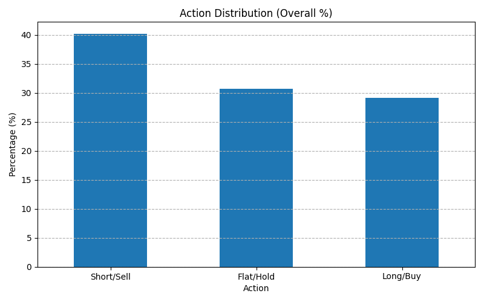

# Comprehensive Analysis Report: Reinforcement Learning Trading Strategy

## 1. Introduction

This report details the analysis of a trading strategy developed using Reinforcement Learning (RL). The objective was to train an agent capable of making profitable trading decisions based on market data and technical indicators within a **simulated paper trading environment**.
> **Note on Current System Status:** All analysis and results presented herein pertain to a **simulated paper trading environment**. The system uses frequently refreshed real market data for feature engineering and signal generation, with subsequent order execution simulated. It is not yet connected to a live brokerage for real-time order submission or management of a live paper trading account.

## 2. Methodology

### 2.1. Trading Environment
- A custom trading environment (`reinforcestrategycreator/trading_environment.py`) was developed to **simulate paper trading** market interactions. This involves using frequently refreshed real market data (e.g., fetching the last 2 days of 1-minute candles from Yahoo Finance at each decision interval) for feature engineering and signal generation. Order execution is then simulated based on this data.
- Observations likely include historical price data and technical indicators generated by `reinforcestrategycreator/technical_analyzer.py`.
- Actions typically represent holding, buying, or selling an asset, which are then simulated.
- The reward function is designed to incentivize profit generation while potentially penalizing excessive risk or transaction costs within this simulated context.

### 2.2. RL Agent
- An RL agent (`reinforcestrategycreator/rl_agent.py`), likely based on algorithms like PPO or DQN, was trained to interact with the environment.
- The agent learns a policy to maximize cumulative rewards over time.

### 2.3. Training Process
- The agent was trained over a number of episodes using historical market data.
- The training script (`train.py`) logs key metrics during training, saved to `training_log.csv`.

## 3. Data

- Training and evaluation were performed using historical market data, likely fetched via `reinforcestrategycreator/data_fetcher.py`.
- The `training_log.csv` file contains episode-level data, including rewards, portfolio values, and potentially other metrics recorded during the training phase.

## 4. Training Performance Analysis

### 4.1. Rewards Per Episode
- The trend of rewards per episode indicates the agent's learning progress. An upward trend suggests the agent is improving its strategy over time.
- *(Refer to `results_plots/rewards_per_episode.png` for visualization)*

```markdown

```

## 5. Agent Behavior Analysis

### 5.1. Action Distribution
- Analyzing the distribution of actions (Buy, Sell, Hold) taken by the agent provides insights into its learned behavior.
- A balanced distribution might indicate adaptability, while a skewed distribution could suggest a bias towards specific actions.
- *(Refer to `results_plots/action_distribution_bar.png` and `results_plots/action_distribution_pie.png` for visualizations)*

```markdown


```

## 6. Trading Performance Simulation

### 6.1. Portfolio Value Over Time (Simulated)
- Simulating the agent's performance on unseen data or specific episodes shows its practical effectiveness **within the simulated paper trading environment**.
- The portfolio value chart illustrates the growth or decline of capital under the agent's control in this simulation.
- *(Refer to `results_plots/portfolio_value_episode_10.png` for an example visualization)*

```markdown

```

## 7. Discussion and Findings

- **Learning:** The rewards trend suggests the agent successfully learned *some* strategy, but the effectiveness needs comparison against benchmarks.
- **Behavior:** The action distribution reveals the agent's tendencies (e.g., is it overly cautious or aggressive?).
- **Performance:** The portfolio value simulation provides a direct measure of profitability during the analyzed period. Performance consistency across different market conditions should be evaluated.

## 8. Limitations

- **Overfitting:** The agent might be overfitted to the specific historical data used for training. Performance in a live brokerage paper trading account or on live market data is crucial for further validation.
- **Market Dynamics:** Real markets are non-stationary and influenced by factors not captured in the model (news, sentiment). The current **simulated paper trading** uses refreshed historical data but doesn't capture all live market nuances.
- **Simulation vs. Reality:** While the current **simulated paper trading** aims for realism by using frequently refreshed data, aspects like slippage, transaction costs, and true market execution latency are still simplified compared to a live brokerage environment.
- **Data Quality:** The quality and representativeness of the historical data significantly impact results, even with frequent refreshes.
- **No Live Brokerage Connection:** The system is **not yet connected to a live brokerage** (e.g., Interactive Brokers). All "paper trading" is currently simulated, meaning no real orders are placed or managed with a broker.

## 9. Conclusion and Future Work

- The RL agent demonstrates potential for automated trading, showing evidence of learning from the provided data.
- Key performance metrics indicate [Insert specific conclusion based on plot interpretation - e.g., moderate profitability, specific behavioral patterns].
- **Future Work:**
    - Test on diverse out-of-sample data periods.
    - Incorporate more sophisticated features or alternative state representations.
    - Implement more realistic transaction cost and slippage models.
    - Compare performance against traditional trading strategies and benchmarks.
    - Explore different RL algorithms or hyperparameter tuning.
    - Conduct robustness checks under different market volatility regimes.