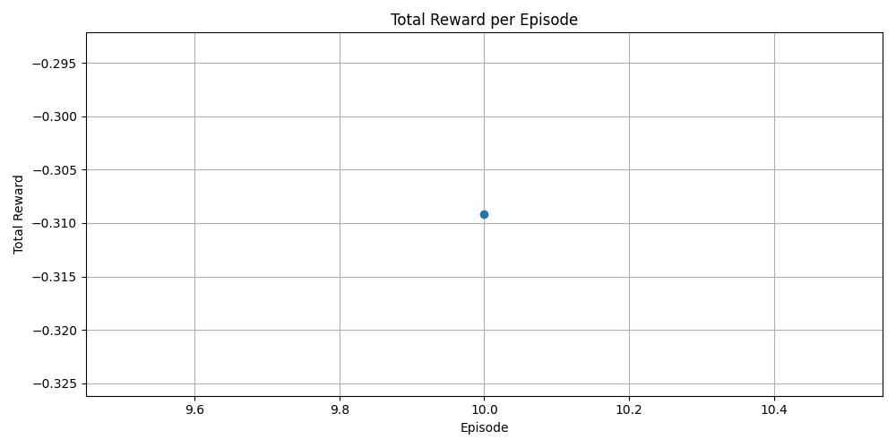
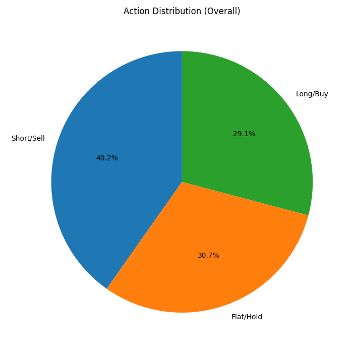
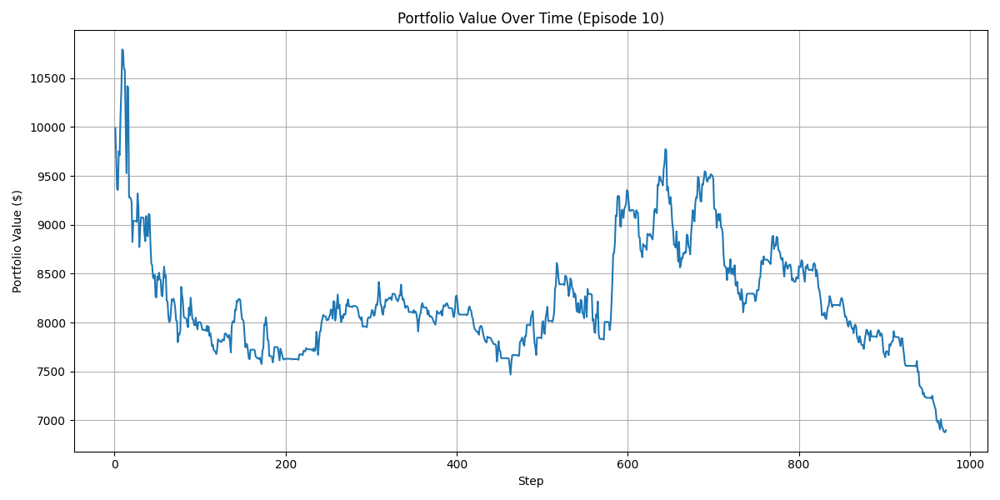

# Presentation: Reinforcement Learning Trading Strategy Analysis

## 1. Executive Summary

- We developed and analyzed a trading strategy using Reinforcement Learning (RL) within a **simulated paper trading environment**.
- The goal was to train an agent to make profitable trades based on market data (refreshed frequently) and technical indicators, with order execution simulated.
- Analysis shows the agent learned a strategy within this simulated context. Further optimization, validation, and integration with a live brokerage are needed for real-world application.
- **Note:** The system is not yet connected to a live brokerage for real-time order submission or management of a live paper trading account.

## 2. Key Metrics & Visualizations

### Rewards Per Episode (Learning Progress)
- Shows if the agent improved over the training period.
- *(Ideally, shows an upward trend)*
```markdown

```

### Action Distribution (Agent Behavior)
- Reveals the agent's trading style (Buy/Sell/Hold frequency).
- *(Helps understand if the agent is biased or adaptive)*
```markdown

```

### Portfolio Value (Simulated Performance)
- Illustrates the strategy's profitability in a simulated run.
- *(Key indicator of potential real-world success)*
```markdown

```

## 3. Significant Findings

- **Learning Confirmed (Simulated Environment):** The agent demonstrated the ability to learn and adapt its strategy based on rewards within the **simulated paper trading environment**.
- **[Specific Finding 1]:** (e.g., Agent shows a tendency to hold during high volatility - *interpret from plots*)
- **[Specific Finding 2]:** (e.g., Profitability was observed in the simulated period, but requires benchmark comparison - *interpret from plots*)
- **Limitations Noted:** Performance is sensitive to data, market conditions, and the accuracy of the **simulated paper trading environment** (e.g., assumptions about slippage, costs). Live brokerage integration is a future step.

## 4. Top Recommendations

1.  **Out-of-Sample Testing:** Rigorously test the agent on diverse, unseen market data to assess generalization.
2.  **Benchmark Comparison:** Compare performance against simple buy-and-hold and traditional strategies.
3.  **Feature Engineering:** Explore adding more relevant technical indicators or alternative market data sources.
4.  **Realistic Simulation:** Incorporate transaction costs and slippage models into the environment for more accurate backtesting.
5.  **Hyperparameter Tuning:** Optimize the RL agent's parameters (learning rate, network size, etc.) for better performance.